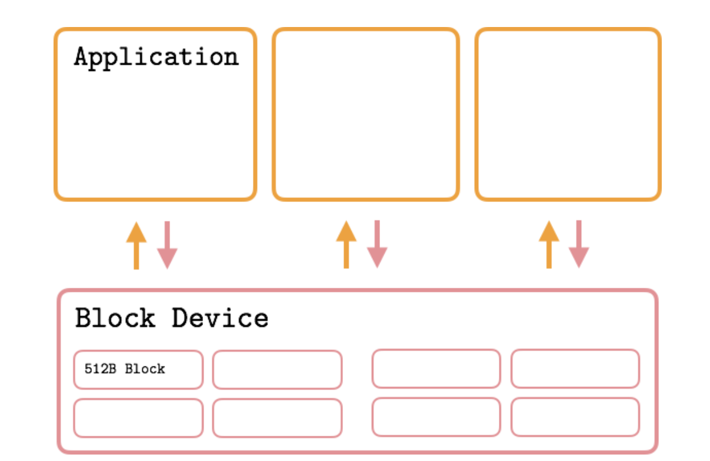
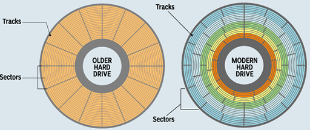
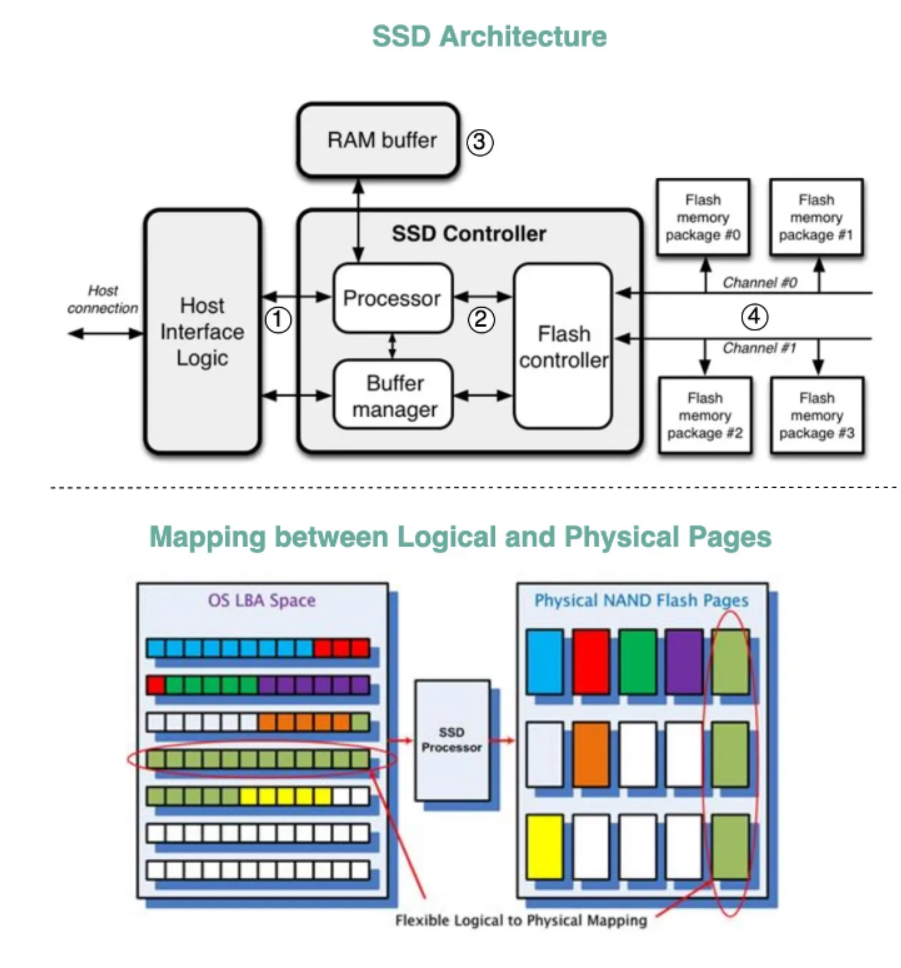

# disk

<!-- @import "[TOC]" {cmd="toc" depthFrom=1 depthTo=6 orderedList=false} -->
<!-- code_chunk_output -->

- [disk](#disk)
    - [概述](#概述)
      - [1.基础概念](#1基础概念)
        - [（1）sector: 块设备 的最小操作单元](#1sector-块设备-的最小操作单元)
        - [（2）block: 文件系统 的最小操作单元](#2block-文件系统-的最小操作单元)
        - [（3）page: 内存 的最小操作单元](#3page-内存-的最小操作单元)
      - [2.I/O相关概念](#2io相关概念)
        - [（1）I/O](#1io)
        - [（2）I/O Request Size](#2io-request-size)
      - [3.disk性能指标](#3disk性能指标)
      - [4.HDD (hard disk driver)](#4hdd-hard-disk-driver)
        - [(1) 基础概念](#1-基础概念)
        - [(2) 磁道和扇区](#2-磁道和扇区)
        - [(3) 磁盘容量](#3-磁盘容量)
        - [(4) 磁盘读写时间](#4-磁盘读写时间)
      - [5.SSD (solid state driver)](#5ssd-solid-state-driver)
        - [(1) 基础概念](#1-基础概念-1)

<!-- /code_chunk_output -->

### 概述

#### 1.基础概念

##### （1）sector: 块设备 的最小操作单元
* 一般为：512B

##### （2）block: 文件系统 的最小操作单元
* 为sector的整数倍，一般为：512B、1K、2K、4K

##### （3）page: 内存 的最小操作单元
* 为block的整数倍，一般为：4K

#### 2.I/O相关概念

[参考](./imgs/https://medium.com/databasss/on-disk-io-part-1-flavours-of-io-8e1ace1de017)

注意这里的I/O是指系统I/O，一次系统I/O可能会调用多次磁盘I/O，一次磁盘I/O会读取多个data block

##### （1）I/O
* 一次读写请求
  * 在linux中，一次I/O就是调用一次 write/read系统调用
  * 一般I/O操作都是**异步**的，为了提高性能
    * 即先 写入/读取 到内存中，所以`I/O request size < 可用内存的大小`

* I/O过程（经过内存，最普遍的模式）

* I/O过程（O_DIRECT模式）

##### （2）I/O Request Size
* 一次I/O的数据大小，由**应用程序指定**
  * 一般设为  512B 或者 4K （这样与磁盘比较吻合，能获取最好的性能)
  * 数据先 写入/读到 内存中，所以`I/O request size < 可用内存的大小`

#### 3.disk性能指标

[参考](https://louwrentius.com/understanding-storage-performance-iops-and-latency.html)

|指标|说明|意义|HDD合理的值|SSD（SATA）合理的值|
|-|-|-|-|-|
|IOPS|每秒进行的I/O操作次数|影响IOPS的因素比较多（延迟、吞吐量、bs等），所以通过这个值判断磁盘性能比较困难|55 - 180|3,000 – 40,000|
|throughout（Bandwidth ）|每秒最大的写入|`IOPS * I/O size`|80 ~ 160 MB/s|200 ~ 550MB/s|
|latency|完成一次I/O请求需要的时间|IOPS越多 或 一次I/O数据越多，会导致latency升高|`I/O size < 4k`: 10 ~ 20 ms|`I/O size < 4k`: 1 ~ 3 ms|
|time spent doing I/Os（单位：百分比）|查看磁盘的忙碌情况，对于并行的设备：比如ssd、raid，这个值参考意义不大||

#### 4.HDD (hard disk driver)

##### (1) 基础概念

* 圆盘  (platter)
  * 盘面 (surface)
    * 磁道 (track): 就是一个个同心圆，能够分割成多个扇区
      * 扇区 (sector)
        * 是磁盘读写的**基本单元**
      * 簇 (cluster)
        * 由多个**连续**的扇区组成
* 柱面 (cyliner)
  * 所有盘面 同一位置的磁道 组成的圆柱
* 读写臂 (arm)
  * 用于控制 磁头 指向 指定磁道的扇区
* 读写磁头 (head)
  * 用于读写扇区的数据

##### (2) 磁道和扇区

* 以前 一个磁道的扇区数是固定的

* 现在使用Zone bit recording技术，可以使外部磁道的扇区数更多

##### (3) 磁盘容量
磁盘容量 = 磁头 (盘面) 数 * 扇区数 * 每扇区大小

##### (4) 磁盘读写时间
* 寻道时间
  * 寻找磁道
* 旋转时间
  * 将读写头移动到指定扇区
* 传输时间

#### 5.SSD (solid state driver)

##### (1) 基础概念

* 文件系统访问的是SSD的LBA空间
* LBA的基本单元是 **sector** (扇区)
  * 大小是512B
