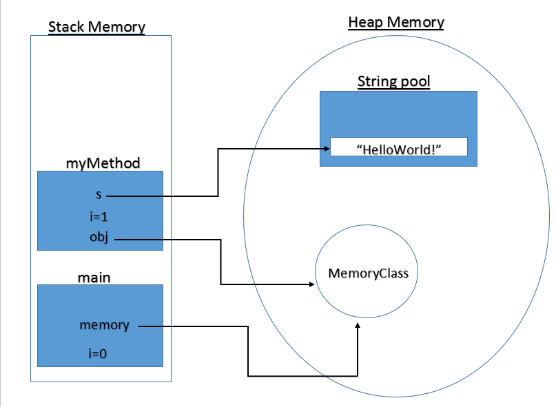

# memory

<!-- @import "[TOC]" {cmd="toc" depthFrom=1 depthTo=6 orderedList=false} -->
<!-- code_chunk_output -->

- [memory](#memory)
    - [基础概念](#基础概念)
      - [1.MMU（memory management unit）](#1mmumemory-management-unit)
        - [（1）功能：](#1功能)
        - [（2）管理方式：](#2管理方式)
      - [2.物理地址和逻辑地址](#2物理地址和逻辑地址)
        - [（1）物理地址](#1物理地址)
        - [（2）逻辑（虚拟）地址](#2逻辑虚拟地址)
      - [3.非连续内存分配](#3非连续内存分配)
        - [（1）连续内存分配的缺点](#1连续内存分配的缺点)
        - [（2）三种方式](#2三种方式)
        - [（3）页表](#3页表)
        - [（4）段页式存储](#4段页式存储)
      - [4.程序的内存分区（都是虚拟内存）](#4程序的内存分区都是虚拟内存)
        - [（1）static](#1static)
        - [（2）stack（栈，连续的内存空间，由cpu管理）](#2stack栈连续的内存空间由cpu管理)
        - [（3）heap（堆，非连续内存空间，由程序管理）](#3heap堆非连续内存空间由程序管理)
        - [（4）OS为什么要对stack的大小做限制（`ulimit -a`查看限制）](#4os为什么要对stack的大小做限制ulimit-a查看限制)
        - [（5）python heap和stack](#5python-heap和stack)
        - [（6）java heap和stack](#6java-heap和stack)
      - [5.内核空间和用户空间](#5内核空间和用户空间)
      - [6.解决内存不足的技术](#6解决内存不足的技术)
        - [（1）覆盖技术](#1覆盖技术)
        - [（2）交换技术（swap）](#2交换技术swap)
        - [（3）虚拟内存](#3虚拟内存)
      - [7.OOM（out of memory killer）](#7oomout-of-memory-killer)
      - [8.跟内存有关的系统调用](#8跟内存有关的系统调用)
        - [（1）`mmap()`](#1mmap)
        - [（2）`brk()`](#2brk)
    - [虚拟内存](#虚拟内存)
      - [1.虚拟页式存储（基本置换单位是页）](#1虚拟页式存储基本置换单位是页)
        - [（1）页表的结构](#1页表的结构)
      - [2.页面置换](#2页面置换)
        - [（1）页面置换算法](#1页面置换算法)
        - [（2）缺页异常（page fault）](#2缺页异常page-fault)
        - [（3）缺页率（page fault rate）](#3缺页率page-fault-rate)
        - [（4）抖动问题（thrashing）](#4抖动问题thrashing)
      - [3.WSS和RSS](#3wss和rss)
        - [（1）工作集（Working Set Size）](#1工作集working-set-size)
        - [（2）常驻集（Resident set size）](#2常驻集resident-set-size)
        - [（3）工作集和常驻集关系](#3工作集和常驻集关系)
      - [4.commit 和 overcommit](#4commit-和-overcommit)
      - [5.cpu利用率与并发进程数关系](#5cpu利用率与并发进程数关系)
    - [kernel memeory cache（缓存）](#kernel-memeory-cache缓存)
      - [1.cache包含几种](#1cache包含几种)
      - [2.清除cache](#2清除cache)
      - [3.Slab](#3slab)
      - [4.查看slab cache的情况](#4查看slab-cache的情况)

<!-- /code_chunk_output -->

### 基础概念

#### 1.MMU（memory management unit）

##### （1）功能：
* 抽象  
  * 将物理地址空间抽象为逻辑（虚拟）地址空间  
* 保护  
  * 每个进程拥有独立的地址空间  
* 共享  
  * 可以访问相同地址空间  
* 虚拟化  
  * 更大的地址空间  

##### （2）管理方式：
* 重定位（relocation）  
  * 直接使用物理地址，换台机器就需要重定位且一个进程的地址必须是连续的  

* 分段（segmentation）   
  * 将 逻辑地址空间 划分为 若干个段  
  * 每一段的地址必须是连续的  

* 分页（paging）  
  * 将 物理地址空间 划分为大小相同的基本单位（**页帧**，也叫帧，frame，大小为2^n）  
  * 将 逻辑地址空间 划分为大小相同的基本单位（**页面**，也叫页，page）  
  * **页表** 中存储 页面（逻辑地址）到 页帧（物理地址）的映射关系  

* 虚拟内存（virtual memory）  
  * 使用虚拟地址空间，且**基本单位是 页**  

#### 2.物理地址和逻辑地址

##### （1）物理地址
硬件支持的地址空间，起始地址0，最大地址为2^32-1（当有32条地址线时）

##### （2）逻辑（虚拟）地址
  进程看到的地址，起始地址为0

#### 3.非连续内存分配

##### （1）连续内存分配的缺点
  分配给程序的物理内存必须连续
  存在外碎片和内碎片（内存利用率低）

##### （2）三种方式
* 段式
* 页式
* 段页式

##### （3）页表
在页表中，每个逻辑页面，都有一个页表项
页表项的组成：**页帧号** 和 **页表项标志**
```shell
页表项标志：
  存在位（resident），表示存在一个页帧与该页面相对应
  修改位（dirty），表示这个页面中的内容已经修改
  引用位（clock/reference），表示是否访问过这个页面中的内容
```

##### （4）段页式存储
将 **逻辑地址空间** 划分为若干个段，将每个段划分为若干个大小相等的页


#### 4.程序的内存分区（都是虚拟内存）


##### （1）static
存放全局变量和静态变量

##### （2）stack（栈，连续的内存空间，由cpu管理）

静态内存分配，由编译器分配（用于存储局部变量、返回地址等）
* 多线程时，每个**线程**有**独立的stack**，但是会**共享heap**

##### （3）heap（堆，非连续内存空间，由程序管理）
动态内存分配，在程序运行时，由程序自己分配和释放（比如调用malloc函数）
* 所有的对象都分配在heap上
* GC（garbage collection）用于清理**heap**中**引用计数为0**的**对象**
* heap空间比stack大的多

#####（4）OS为什么要对stack的大小做限制（`ulimit -a`查看限制）
* 一般程序对栈的大小的要求不高
* 如果程序陷入死循环（比如调用递归函数），函数地址是存放在stack中，所以stack的大小会越来越大，当超过限制时，程序会崩溃，但不会影响整个操作系统

##### （5）python heap和stack
* python一切皆对象，所以python的数据都是分配在heap上
* CPython virtual machine分配在stack上

##### （6）java heap和stack
* 函数调用、局部变量、对象引用等分配在stack在
* 对象分配在heap在


#### 5.内核空间和用户空间
内存会被划分成两个区域：

|区域|执行内容|能够操作内存范围|代码执行级别|
|-|-|-|-|
|内核空间|执行内核代码|能够访问整个内存|ring 0|
|用户空间|执行用户进程（比如：init等）|只能访问用户空间内存<br>但是可以通过系统调用访问部分内核空间内存|ring 3|


#### 6.解决内存不足的技术

##### （1）覆盖技术
* 原理：将程序划分为若干个功能相对独立的模块，将不会同时执行的模块共享同一块内存区域（即可以相互覆盖）  
  * 必要部分（常用功能）的代码和数据 常驻内存
  * 可选部分（不常用功能）的代码和数据 只在需要用到时装入内存

##### （2）交换技术（swap）
* 原理：将暂时不能运行的程序放到外存  
  * 换入换出的基本单位：整个进程的地址空间

##### （3）虚拟内存
* 原理：分配出去的内存并非真实的物理内存，使用时才会分配真实的物理内存
  * 装载程序时，只将当前指令执行需要的部分页面或段加载到内存  
  * 指令执行中需要的指令或数据不在内存中（称为缺页或缺段）时，处理器通知操作系统将相应的页面或段调入内存
  * 操作系统将内存中暂时不用的页面或段保存至外存

#### 7.OOM（out of memory killer）
* 防止系统因为内存耗尽，而宕机
* 通过杀死相关程序，从而保证系统有足够的内存可用

#### 8.跟内存有关的系统调用

##### （1）`mmap()`
创建虚拟内存

##### （2）`brk()`
增加数据段的长度，即增加常驻集（RSS）中的内存

***

### 虚拟内存

分配出去的内存并非真实的物理内存，使用时才会分配真实的物理内存

#### 1.虚拟页式存储（基本置换单位是页）
原理：根据逻辑地址，查找到页表中的相应项，然后查看驻留位标志，如果驻留位为1，表示该内容在内存中，如果驻留位为0，表示该内容不在物理内存中，产生缺页异常，操作系统会将相应内容加载到物理内存中  

##### （1）页表的结构
* 驻留位：表示该页是否在内存中
* 修改位：表示在内存中的该页是否被修改过
* 访问位：表示该页面是否被访问过（读或写）
* 保护位：表示该页的允许访问方式（只读、可读写、可执行等）
* WT(write-through)：设为1即开启，设为0即为write-back

#### 2.页面置换

##### （1）页面置换算法
当产生缺页异常时，且内存已经满了，需要将内存中的某一页和访问的页进行置换。

局部页面置换算法：
* 最优页面置换算法（OPT：optimal）
需要预测未来，无法实现
* 先进先出算法（FIFO）
* 最近最久未使用算法（LRU：least recently used）
开销大
* 最不常用算法（LFU：least frequently used）

全局页面置换算法：
* 工作集置换算法
* 缺页率置换算法


##### （2）缺页异常（page fault）
当要访问的页不在内存中时产生缺页异常
产生缺页异常后，操作系统会去外存找到该页，读到内存中来

##### （3）缺页率（page fault rate）
```shell
缺页率 = 缺页次数 / 内存访问次数
#或
缺页率 = 缺页平均时间间隔的倒数
```

##### （4）抖动问题（thrashing）
页帧数太少，不能包含工作集，造成大量缺页，频繁置换

#### 3.WSS和RSS

##### （1）工作集（Working Set Size）
一个进程当前正在使用的**逻辑（虚拟）页面**集合

##### （2）常驻集（Resident set size）
在当前时刻，进程**实际驻留在内存**当中的**逻辑页面**集合（即操作系统分配给该进程的页帧数）

##### （3）工作集和常驻集关系
常驻集包含工作集时，缺页较少
工作集发生剧烈变动时，缺页较多

#### 4.commit 和 overcommit
commit就是将 部分内存页（虚拟内存） 加入到 常驻集
overcommit就是 物理内存不够，还继续commit，会导致OOM

#### 5.cpu利用率与并发进程数关系

出现这个问题的原因是，内存使用量会增加，之后cpu需要处理更多的页面置换

***

### kernel memeory cache（缓存）

#### 1.cache包含几种

* pagecache
  * dirty cache：数据存储在内存中，还未写入磁盘
  * clean cache：数据从磁盘加载到内存中，加快数据的访问
* slab cache
  * 包括dentries和inodes

#### 2.清除cache
无法清除dirty cache
```shell
#清除pagecache中的clean cache
echo 1 > /proc/sys/vm/drop_caches

#清除slab cache
echo 2 > /proc/sys/vm/drop_caches

#清除pagecache 中的clean cache和slab cache
echo 3 > /proc/sys/vm/drop_caches
```

#### 3.Slab
 The total amount of memory, in kilobytes, used by the kernel to cache data structures for its own use.

#### 4.查看slab cache的情况
```shell
slabtop
```
