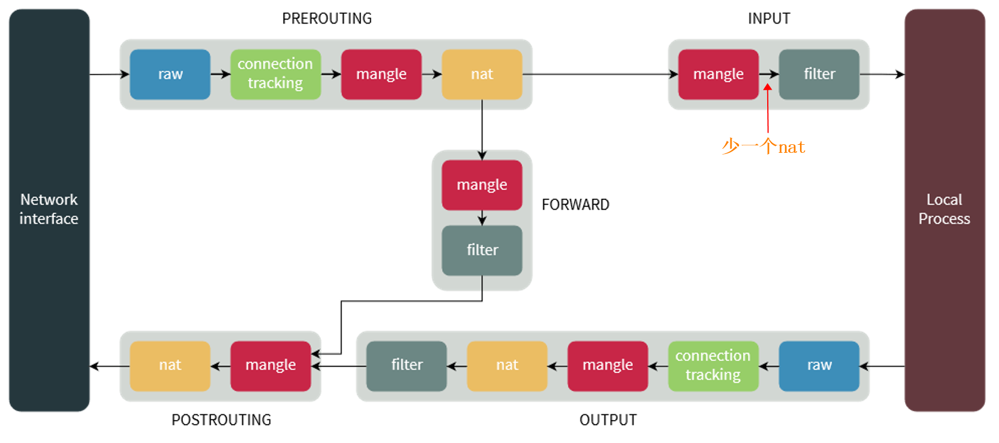
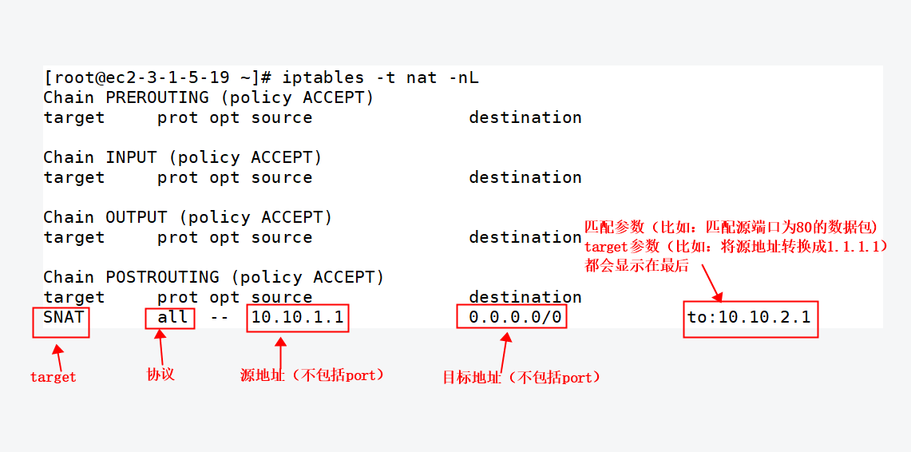

# iptables

<!-- @import "[TOC]" {cmd="toc" depthFrom=1 depthTo=6 orderedList=false} -->
<!-- code_chunk_output -->

- [iptables](#iptables)
    - [概述](#概述)
      - [1.特点](#1特点)
      - [2.相关术语](#2相关术语)
        - [（1）table](#1table)
        - [（2）chain](#2chain)
        - [（3）rule](#3rule)
        - [（4）target](#4target)
      - [3.相关文件](#3相关文件)
      - [4.四张表](#4四张表)
      - [5.五条链](#5五条链)
      - [6.常用target（不同的表支持不同的target）](#6常用target不同的表支持不同的target)
      - [7.数据包流程图](#7数据包流程图)
      - [8.`iptables -nL`格式解析](#8iptables-nl格式解析)
      - [9.跟踪数据包的状态（`conntrack`模块）](#9跟踪数据包的状态conntrack模块)
    - [使用](#使用)
      - [1.匹配规则](#1匹配规则)
      - [2.命令格式:](#2命令格式)
      - [3.常见选项](#3常见选项)
      - [4.通用条件](#4通用条件)
      - [5.扩展条件(需要指定模块):](#5扩展条件需要指定模块)
        - [（1）tcp模块：`-m tcp`](#1tcp模块-m-tcp)
        - [（2）icmp模块： `-m icmp`](#2icmp模块-m-icmp)
        - [（3）mac模块（匹配mac地址）：`-m mac`](#3mac模块匹配mac地址-m-mac)
        - [（4）multiport模块（匹配多端口）：`-m multiport`](#4multiport模块匹配多端口-m-multiport)
        - [（5）iprange模块（匹配IP范围）：`-m iprange`](#5iprange模块匹配ip范围-m-iprange)
      - [6.条件取反：`!`](#6条件取反)
      - [7.custom chains（自定义链）](#7custom-chains自定义链)
        - [（1）创建链](#1创建链)
        - [（2）往链中添加rule](#2往链中添加rule)
        - [（3）使用自定义链](#3使用自定义链)
        - [（4）删除自定义链](#4删除自定义链)
      - [8.通过文件批量修改iptables规则](#8通过文件批量修改iptables规则)
      - [9.持久化iptables规则](#9持久化iptables规则)
    - [调试iptables](#调试iptables)
      - [1.利用LOG target（建议）](#1利用log-target建议)
      - [2.利用TRACE target（终极办法）](#2利用trace-target终极办法)
        - [（1） 开启内核功能](#1-开启内核功能)
        - [（2） 添加跟踪规则（在raw表中添加）](#2-添加跟踪规则在raw表中添加)
        - [（3） 查看日志：`/var/log/messages`](#3-查看日志varlogmessages)
    - [相关应用](#相关应用)
      - [1.nat表的应用](#1nat表的应用)
      - [2.实现端口映射](#2实现端口映射)
      - [3.只允许访问外部，不允许外部访问（利用conntrack模块）](#3只允许访问外部不允许外部访问利用conntrack模块)
      - [3.捕捉端口扫描器](#3捕捉端口扫描器)

<!-- /code_chunk_output -->

### 概述

#### 1.特点
* iptables基于linux的netfilter实现包过滤
* 工作在网络层，firewalld底层还是调用的iptales

#### 2.相关术语

##### （1）table
表允许以一种特定的方式处理包
不同表的优先级不同，链也不同

##### （2）chain
链允许在特定阶段（比如：路由前、路由后等），对包进行处理
链描述了数据包的传播方向

##### （3）rule
设置规则，匹配数据包（比如：dstport=80等）
匹配原则：一条一条匹配
  * 匹配后，jump到指定target了
    * 匹配某些target，就不会继续匹配了，比如：ACCEPT、DROP、REJECT
    * 如果target为MARK，只是给包加个标记，所以还会继续匹配下面的规则
    * 所以并**不是匹配即停止**

##### （4）target
target描述了对包的处理过程（比如：DROP，会将匹配到的包丢弃）
如果匹配到包，会jump到 rule中指定的target，对包进行相应处理

#### 3.相关文件
* 主配置文件：`/etc/sysconfig/iptables-config`
* 规则文件：`/etc/sysconfig/iptables`

#### 4.四张表
|表名|说明|
|-|-|
|raw|状态跟踪表（应该支持所有的target）|
|mangle|修改数据包的头部|
|nat|地址转换表（不支持filter相关的target）|
|filter|过滤表（不支持nat相关的target）|

#### 5.五条链
|链名|说明|
|-|-|
|PREROUTING|路由前|
|POSTROUTING|选择路由后|
|INPUT|输入|
|OUTPUT|输出|
|FORWARD|路由（不会 与 输入和输出 出现在同一个表中）|

#### 6.常用target（不同的表支持不同的target）

target也可以是某条chain

|target|说明|Options|
|-|-|-|
|ACCEPT|接受该包||
|DROP|丢弃该包||
|REJECT|拒绝该包||
|DNAT|目标地址转换（可以转换port，`--to-destination 10.10.10.1:80`）|--to-destination|
|SNAT|源地址转换（可以转换port）|--to-source|
|MASQUERADE|源地址转换（转换成外出网卡的地址，不需要手动指定），同时也可以转换源端口|--to-ports|
|REDIRECT|端口重定向|--to-ports|
|LOG|用于记录日志，可以在DROP之前，进行LOG，进行查看DROP掉了哪些|
|RETURN|立即返回，不再匹配chain|

#### 7.数据包流程图


#### 8.`iptables -nL`格式解析



#### 9.跟踪数据包的状态（`conntrack`模块）
详情见 conntrack.md
|状态|说明|
|-|-|
|NEW|该数据包在conntrack表中，生成新的条目（一般都是发起请求的数据包）|
|ESTABLISHED|看到了双向的数据包，比如3.1.5.19:11给3.1.5.20:80发了一个数据包，3.1.5.20:80给3.1.5.19:11发了一个数据包</br>这里的ESTABLISHED状态和conntrack表中的ESTABLISHED状态不一样<br>（conntrack表中的ESTABLISHED是tcp的状态）|
|RELEATED|这个数据包会生成新的条目，并且和已存在的连接有关联，则这个数据包的状态就是RELATED|
|INVALID|无效的状态，可能的原因发生了错误等|
|UNTRACKED|未被conntrack跟踪的数据包，可以用NOTRACK target实现|
|DNAT|目标地址改变了的包|
|SNAT|源地址改变了的包|

***

### 使用

#### 1.匹配规则
* 不是匹配即停止
  * 如果target是ACCEPT之类的，因为数据包被ACCEPT了，所以不会往下面匹配了
* 如果没有匹配的规则,则使用默认策略

#### 2.命令格式:
```shell
iptables [-t <TABLE>] <OPTIONS> [<CHAIN>] [<CONDITIONS>] [-j <TARGET> [<TARGET_OPTIONS>] ]

#不指定表,默认为filter
#不指定链,默认为对应表的所有链
#j:jump
```

#### 3.常见选项

* 添加规则
```shell
-A      #在链的末尾追加一条规则
-I      #在链的开头插入一条规则
```

* 查看规则
```shell
-L [chain]   #如果不指定chain，则列出指定表的全部chain
-n           #numeric,查看规则时,以数字形式显示
--line-numbers      #查看规则时,显示规则的序号
```

* 删除规则
```shell
-D <int>      #删除链内指定序号的规则
-F [<chain>]  #flush，不指定chain则删除该表中的所有规则
```

* 默认策略
```shell
-P     #policy,为指定的链设置目标策略(即ACCEPT等)
       #如:iptables -t filter -P INPUT DROP
```

#### 4.通用条件
```shell
数字              #匹配第几条规则,从而进行插入（-I 和 -D可以使用）
-p 协议名         #支持 cat /etc/protocols 里面的所有协议
-s 源地址
-d 目标地址
-i 收数据的网卡
-o 发数据的网卡
```

#### 5.扩展条件(需要指定模块):

##### （1）tcp模块：`-m tcp`
```shell
--sport <source_port>
--dport <destination_port>

--tcp-flags <mask> <compared_flags>
#<mask>指明要检查哪些标志位
#<compared_flags>检查的结果与这里设置的比较，如果一样，表示匹配成功
#比如：--tcp-flags FIN,SYN,RST,ACK SYN
#检查FIN、SYN、RST、ACK这几个标志位，如果数据包只有SYN标志位设置了，其他标志位没有设置，则该数据包就被匹配
```

##### （2）icmp模块： `-m icmp`
```shell
-m icmp --icmp-type <ICMP_TYPE>   #如:echo-request
```

##### （3）mac模块（匹配mac地址）：`-m mac`
```shell
-m mac --mac-source MAC地址
```

##### （4）multiport模块（匹配多端口）：`-m multiport`
```shell
-m multiport --sports 源端口列表(逗号隔开)
-m multiport --dports 目标端口列表
```

##### （5）iprange模块（匹配IP范围）：`-m iprange`
```shell
-m iprange --src-range IP1-IP2
-m iprange --dst-range IP1-IP2
```

#### 6.条件取反：`!`
```shell
! -p tcp    #匹配不是tcp协议的数据包
-p tcp -m tcp ! --dport 80    #匹配tcp协议，但目标端口不是80的数据包  
```

#### 7.custom chains（自定义链）
* 自定义链没有默认策略

##### （1）创建链
```shell
iptables -N <NEW_CHAIN>
```

##### （2）往链中添加rule
```shell
iptables -A <NEW_CHAIN> ...
```

##### （3）使用自定义链
```shell
iptables ... -j <NEW_CHAIN>
```

##### （4）删除自定义链
需要先删除链中的规则
```shell
iptables -X <NEW_CHAIN>
```

#### 8.通过文件批量修改iptables规则
* 先导出rules
```shell
iptables-save > /tmp/iptables.rules
```

* 进行修改

* 导入rules（原先的rules会被清空）
```shell
iptables-restore < /tmp/iptables.rules
```

#### 9.持久化iptables规则
默认重启后，iptables就会清空
可以在redhat上安装`iptables-services`，在debian上安装`iptables-persistent`，从而能够实现iptables规则持久化（本质就是利用iptables save/restore命令）

***

### 调试iptables

#### 1.利用LOG target（建议）
```shell
#创建一个新的链，用于 DROP并记录日志
iptables -t raw -N DROP-LOGGING
iptables -t raw -A DROP-LOGGING -j LOG --log-prefix "iptables-dropped: " --log-level 6
iptables -t raw -A DROP-LOGGING -j DROP

#设置要DROP的条件
iptables -t raw -A PREROUTING ... -j DROP-LOGGING
```

#### 2.利用TRACE target（终极办法）

TRACE target会**标记数据包**（所以需要在最开始标记，所以在raw表中的PREROUTING链中标记是最合适的），如果某个rule匹配了该数据包，会在日志中进行记录

##### （1） 开启内核功能
```shell
modprobe nf_log_ipv4
sysctl net.netfilter.nf_log.2=nf_log_ipv4
```

##### （2） 添加跟踪规则（在raw表中添加）
```shell
iptables -t raw -A PREROUTING <这里填需要跟踪的包的条件> -j TRACE
```

##### （3） 查看日志：`/var/log/messages`

* e.g.
```shell
#会记录经过的表、链、具体哪条规则
# 第一日志：经过 raw表 的 PREROUTING链 的 第2条规则
Feb 20 16:46:28 master-3 kernel: TRACE: raw:PREROUTING:rule:2 IN=tunl0 OUT= MAC= SRC=10.244.205.192 DST=10.244.236.67 LEN=84 TOS=0x00 PREC=0x00 TTL=64 ID=33622 DF PROTO=ICMP TYPE=8 CODE=0 ID=24957 SEQ=1
Feb 20 16:46:28 master-3 kernel: TRACE: raw:cali-PREROUTING:rule:1 IN=tunl0 OUT= MAC= SRC=10.244.205.192 DST=10.244.236.67 LEN=84 TOS=0x00 PREC=0x00 TTL=64 ID=33622 DF PROTO=ICMP TYPE=8 CODE=0 ID=24957 SEQ=1
Feb 20 16:46:28 master-3 kernel: TRACE: raw:cali-PREROUTING:rule:4 IN=tunl0 OUT= MAC= SRC=10.244.205.192 DST=10.244.236.67 LEN=84 TOS=0x00 PREC=0x00 TTL=64 ID=33622 DF PROTO=ICMP TYPE=8 CODE=0 ID=24957 SEQ=1
Feb 20 16:46:28 master-3 kernel: TRACE: raw:cali-from-host-endpoint:return:1 IN=tunl0 OUT= MAC= SRC=10.244.205.192 DST=10.244.236.67 LEN=84 TOS=0x00 PREC=0x00 TTL=64 ID=33622 DF PROTO=ICMP TYPE=8 CODE=0 ID=24957 SEQ=1
Feb 20 16:46:28 master-3 kernel: TRACE: raw:cali-PREROUTING:return:6 IN=tunl0 OUT= MAC= SRC=10.244.205.192 DST=10.244.236.67 LEN=84 TOS=0x00 PREC=0x00 TTL=64 ID=33622 DF PROTO=ICMP TYPE=8 CODE=0 ID=24957 SEQ=1
Feb 20 16:46:28 master-3 kernel: TRACE: raw:PREROUTING:policy:3 IN=tunl0 OUT= MAC= SRC=10.244.205.192 DST=10.244.236.67 LEN=84 TOS=0x00 PREC=0x00 TTL=64 ID=33622 DF PROTO=ICMP TYPE=8 CODE=0 ID=24957 SEQ=1
Feb 20 16:46:28 master-3 kernel: TRACE: mangle:PREROUTING:rule:1 IN=tunl0 OUT= MAC= SRC=10.244.205.192 DST=10.244.236.67 LEN=84 TOS=0x00 PREC=0x00 TTL=64 ID=33622 DF PROTO=ICMP TYPE=8 CODE=0 ID=24957 SEQ=1
Feb 20 16:46:28 master-3 kernel: TRACE: mangle:cali-PREROUTING:rule:3 IN=tunl0 OUT= MAC= SRC=10.244.205.192 DST=10.244.236.67 LEN=84 TOS=0x00 PREC=0x00 TTL=64 ID=33622 DF PROTO=ICMP TYPE=8 CODE=0 ID=24957 SEQ=1
Feb 20 16:46:28 master-3 kernel: TRACE: mangle:cali-from-host-endpoint:return:1 IN=tunl0 OUT= MAC= SRC=10.244.205.192 DST=10.244.236.67 LEN=84 TOS=0x00 PREC=0x00 TTL=64 ID=33622 DF PROTO=ICMP TYPE=8 CODE=0 ID=24957 SEQ=1
Feb 20 16:46:28 master-3 kernel: TRACE: mangle:cali-PREROUTING:return:5 IN=tunl0 OUT= MAC= SRC=10.244.205.192 DST=10.244.236.67 LEN=84 TOS=0x00 PREC=0x00 TTL=64 ID=33622 DF PROTO=ICMP TYPE=8 CODE=0 ID=24957 SEQ=1
Feb 20 16:46:28 master-3 kernel: TRACE: mangle:PREROUTING:policy:2 IN=tunl0 OUT= MAC= SRC=10.244.205.192 DST=10.244.236.67 LEN=84 TOS=0x00 PREC=0x00 TTL=64 ID=33622 DF PROTO=ICMP TYPE=8 CODE=0 ID=24957 SEQ=1
Feb 20 16:46:28 master-3 kernel: TRACE: nat:PREROUTING:rule:1 IN=tunl0 OUT= MAC= SRC=10.244.205.192 DST=10.244.236.67 LEN=84 TOS=0x00 PREC=0x00 TTL=64 ID=33622 DF PROTO=ICMP TYPE=8 CODE=0 ID=24957 SEQ=1
Feb 20 16:46:28 master-3 kernel: TRACE: nat:cali-PREROUTING:rule:1 IN=tunl0 OUT= MAC= SRC=10.244.205.192 DST=10.244.236.67 LEN=84 TOS=0x00 PREC=0x00 TTL=64 ID=33622 DF PROTO=ICMP TYPE=8 CODE=0 ID=24957 SEQ=1
Feb 20 16:46:28 master-3 kernel: TRACE: nat:cali-fip-dnat:return:1 IN=tunl0 OUT= MAC= SRC=10.244.205.192 DST=10.244.236.67 LEN=84 TOS=0x00 PREC=0x00 TTL=64 ID=33622 DF PROTO=ICMP TYPE=8 CODE=0 ID=24957 SEQ=1
Feb 20 16:46:28 master-3 kernel: TRACE: nat:cali-PREROUTING:return:2 IN=tunl0 OUT= MAC= SRC=10.244.205.192 DST=10.244.236.67 LEN=84 TOS=0x00 PREC=0x00 TTL=64 ID=33622 DF PROTO=ICMP TYPE=8 CODE=0 ID=24957 SEQ=1
Feb 20 16:46:28 master-3 kernel: TRACE: nat:PREROUTING:rule:2 IN=tunl0 OUT= MAC= SRC=10.244.205.192 DST=10.244.236.67 LEN=84 TOS=0x00 PREC=0x00 TTL=64 ID=33622 DF PROTO=ICMP TYPE=8 CODE=0 ID=24957 SEQ=1
Feb 20 16:46:28 master-3 kernel: TRACE: nat:KUBE-SERVICES:return:124 IN=tunl0 OUT= MAC= SRC=10.244.205.192 DST=10.244.236.67 LEN=84 TOS=0x00 PREC=0x00 TTL=64 ID=33622 DF PROTO=ICMP TYPE=8 CODE=0 ID=24957 SEQ=1
Feb 20 16:46:28 master-3 kernel: TRACE: nat:PREROUTING:policy:4 IN=tunl0 OUT= MAC= SRC=10.244.205.192 DST=10.244.236.67 LEN=84 TOS=0x00 PREC=0x00 TTL=64 ID=33622 DF PROTO=ICMP TYPE=8 CODE=0 ID=24957 SEQ=1
Feb 20 16:46:28 master-3 kernel: TRACE: mangle:FORWARD:policy:1 IN=tunl0 OUT=calid7699f9826c MAC= SRC=10.244.205.192 DST=10.244.236.67 LEN=84 TOS=0x00 PREC=0x00 TTL=63 ID=33622 DF PROTO=ICMP TYPE=8 CODE=0 ID=24957 SEQ=1
Feb 20 16:46:28 master-3 kernel: TRACE: filter:FORWARD:rule:1 IN=tunl0 OUT=calid7699f9826c MAC= SRC=10.244.205.192 DST=10.244.236.67 LEN=84 TOS=0x00 PREC=0x00 TTL=63 ID=33622 DF PROTO=ICMP TYPE=8 CODE=0 ID=24957 SEQ=1
Feb 20 16:46:28 master-3 kernel: TRACE: filter:cali-FORWARD:rule:1 IN=tunl0 OUT=calid7699f9826c MAC= SRC=10.244.205.192 DST=10.244.236.67 LEN=84 TOS=0x00 PREC=0x00 TTL=63 ID=33622 DF PROTO=ICMP TYPE=8 CODE=0 ID=24957 SEQ=1
Feb 20 16:46:28 master-3 kernel: TRACE: filter:cali-FORWARD:rule:2 IN=tunl0 OUT=calid7699f9826c MAC= SRC=10.244.205.192 DST=10.244.236.67 LEN=84 TOS=0x00 PREC=0x00 TTL=63 ID=33622 DF PROTO=ICMP TYPE=8 CODE=0 ID=24957 SEQ=1
Feb 20 16:46:28 master-3 kernel: TRACE: filter:cali-from-hep-forward:return:1 IN=tunl0 OUT=calid7699f9826c MAC= SRC=10.244.205.192 DST=10.244.236.67 LEN=84 TOS=0x00 PREC=0x00 TTL=63 ID=33622 DF PROTO=ICMP TYPE=8 CODE=0 ID=24957 SEQ=1
Feb 20 16:46:28 master-3 kernel: TRACE: filter:cali-FORWARD:rule:4 IN=tunl0 OUT=calid7699f9826c MAC= SRC=10.244.205.192 DST=10.244.236.67 LEN=84 TOS=0x00 PREC=0x00 TTL=63 ID=33622 DF PROTO=ICMP TYPE=8 CODE=0 ID=24957 SEQ=1
Feb 20 16:46:28 master-3 kernel: TRACE: filter:cali-to-wl-dispatch:rule:1 IN=tunl0 OUT=calid7699f9826c MAC= SRC=10.244.205.192 DST=10.244.236.67 LEN=84 TOS=0x00 PREC=0x00 TTL=63 ID=33622 DF PROTO=ICMP TYPE=8 CODE=0 ID=24957 SEQ=1
Feb 20 16:46:28 master-3 kernel: TRACE: filter:cali-tw-calid7699f9826c:rule:3 IN=tunl0 OUT=calid7699f9826c MAC= SRC=10.244.205.192 DST=10.244.236.67 LEN=84 TOS=0x00 PREC=0x00 TTL=63 ID=33622 DF PROTO=ICMP TYPE=8 CODE=0 ID=24957 SEQ=1
Feb 20 16:46:28 master-3 kernel: TRACE: filter:cali-tw-calid7699f9826c:rule:4 IN=tunl0 OUT=calid7699f9826c MAC= SRC=10.244.205.192 DST=10.244.236.67 LEN=84 TOS=0x00 PREC=0x00 TTL=63 ID=33622 DF PROTO=ICMP TYPE=8 CODE=0 ID=24957 SEQ=1
Feb 20 16:46:28 master-3 kernel: TRACE: filter:cali-pri-kns.cattle-system:rule:1 IN=tunl0 OUT=calid7699f9826c MAC= SRC=10.244.205.192 DST=10.244.236.67 LEN=84 TOS=0x00 PREC=0x00 TTL=63 ID=33622 DF PROTO=ICMP TYPE=8 CODE=0 ID=24957 SEQ=1

```

***

### 相关应用

#### 1.nat表的应用

```shell
#选择路由之后，将源ip地址修改为网关的公网ip地址(SNAT:源地址转换)

iptables -t nat -A POSTROUTING -s <SRC_IP_OR_MASK>  -j SNAT --to-source <NEW_SRC_IP>
```
* 如果网关的公网ip不是固定的（指定转换成指定网卡的ip）
```shell
iptables -t nat -A POSTROUTING -s <SRC_IP> -o <INTERFACE> -j MASQUERADE
```

#### 2.实现端口映射
```shell
iptables -t nat -A PREROUTING -d <DST_IP> -p tcp --dport <DST_PORT> -j DNAT --to-destination <NEW_DST_IP>:<NEW_DST_PORT>
```

#### 3.只允许访问外部，不允许外部访问（利用conntrack模块）
```shell
iptables -A INPUT -p tcp -m conntrack --ctstate ESTABLISHED -j ACCEPT
iptables -A OUTPUT -p tcp -m conntrack --ctstate NEW,ESTABLISHED,RELATED -j ACCEPT
```

#### 3.捕捉端口扫描器
```shell
iptables -t raw -I PREROUTING -p tcp --dport 2222 -j LOG --log-prefix "iptables-scanner: " --log-level 6
```
