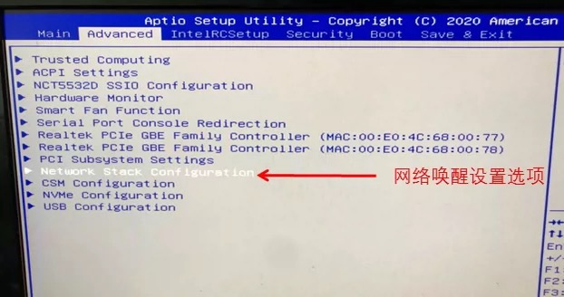
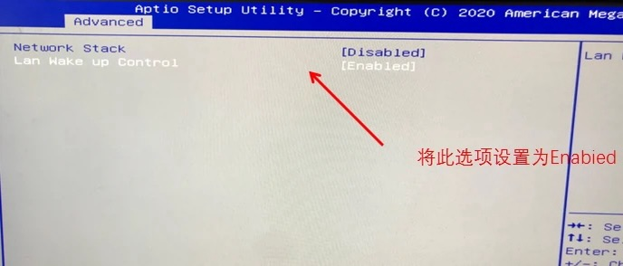
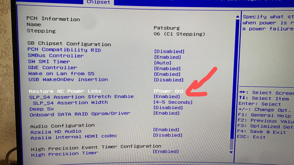

# wake on LAN

<!-- @import "[TOC]" {cmd="toc" depthFrom=1 depthTo=6 orderedList=false} -->

<!-- code_chunk_output -->

- [wake on LAN](#wake-on-lan)
    - [开启WOL功能](#开启wol功能)
      - [1.BIOS开启wake on LAN功能](#1bios开启wake-on-lan功能)
      - [2.网卡启用](#2网卡启用)
        - [(1) 网卡开启WOL功能 (一定要设置，即使检查没问题)](#1-网卡开启wol功能-一定要设置即使检查没问题)
        - [(2) 检查](#2-检查)
    - [客户端使用 (需要跟待唤醒的机器在同一局域网内)](#客户端使用-需要跟待唤醒的机器在同一局域网内)
      - [1.安装客户端软件](#1安装客户端软件)
      - [2.发送远程唤醒指令](#2发送远程唤醒指令)
    - [开启上电自启](#开启上电自启)
      - [1.进入BIOS开启recovery ac](#1进入bios开启recovery-ac)
      - [2.测试效果](#2测试效果)

<!-- /code_chunk_output -->

### 开启WOL功能

#### 1.BIOS开启wake on LAN功能



#### 2.网卡启用

##### (1) 网卡开启WOL功能 (一定要设置，即使检查没问题)

**注意**： 即使检查wake-on是开启的，这里还是需要配置，不然无法使用

* 临时开启
```shell
$ ethtool -s eth0 wol g

#add
ETHTOOL_OPTS="wol g"
```

* 永久开启

  * ubuntu
  ```shell
  $ vi /etc/network/interfaces

  auto eth0
  iface eth0 inet static
  address 192.168.1.1
  netmask 255.255.255.0
  gateway 192.168.1.254
          post-up /sbin/ethtool -s eth0 wol g
          post-down /sbin/ethtool -s eth0 wol g
  ```

  * redhat
  ```shell
  $ vi /etc/sysconfig/network-scripts/ifcfg-eth0
  ```

##### (2) 检查

```shell
$ ethtool eth0

...
Wake-on: g
...
```

***

### 客户端使用 (需要跟待唤醒的机器在同一局域网内)

[参考](https://www.cyberciti.biz/tips/linux-send-wake-on-lan-wol-magic-packets.html)

#### 1.安装客户端软件

```shell
apt install etherwake
#yum install net-tools
```

#### 2.发送远程唤醒指令
```shell
#etherwake <interface_mac>
wakeonlan <interface_mac>
```

***

### 开启上电自启

#### 1.进入BIOS开启recovery ac

* 比如


#### 2.测试效果

* 断电5-10分钟
  * 当断电时间过短，然后通电的话，可能不会启动

* 通电
  * 主机自动启动
