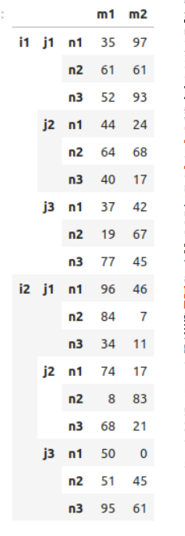

# pandas

<!-- @import "[TOC]" {cmd="toc" depthFrom=1 depthTo=6 orderedList=false} -->
<!-- code_chunk_output -->

- [pandas](#pandas)
    - [概述](#概述)
      - [1.pandas](#1pandas)
      - [2.支持从多种格式中读取数据](#2支持从多种格式中读取数据)
    - [使用](#使用)
      - [1.Series](#1series)
        - [(1) Series的创建](#1-series的创建)
        - [(2) index和values](#2-index和values)
        - [(3) 基本属性和方法](#3-基本属性和方法)
        - [(4) 运算](#4-运算)
      - [2.DataFrame](#2dataframe)
        - [(1) DataFrame的创建](#1-dataframe的创建)
        - [(2) 属性](#2-属性)
        - [(3) index和slice](#3-index和slice)
        - [(4) 运算](#4-运算-1)
      - [3.层次化索引](#3层次化索引)
        - [(1) 创建多层索引](#1-创建多层索引)
        - [(2) index和slice](#2-index和slice)
        - [(3) 索引的堆叠](#3-索引的堆叠)
      - [4.DataFrame进阶](#4dataframe进阶)
        - [(1) 聚合](#1-聚合)
      - [5.数据合并](#5数据合并)
        - [(1) concat](#1-concat)
        - [(2) append](#2-append)
        - [(3) merge (很重要)](#3-merge-很重要)
      - [1.读取数据](#1读取数据)
      - [3.使用数据](#3使用数据)

<!-- /code_chunk_output -->

### 概述

#### 1.pandas
提供二维表的分析能力

#### 2.支持从多种格式中读取数据
* csv（comma-separated values）

***

### 使用

```python
import numpy as np
import pandas as pd
```

#### 1.Series
一维数据结构
* 是dict和list的结合
  * index就是key，默认为0,1,2,...，可以修改为任何类型的

##### (1) Series的创建

* lsit -> Series
```python
list1 = [11,12,15,66]
s1 = pd.Series(list1)
```

* dict -> Series

* 其他参数
```python
list1 = [11,12,15,66]

#指定索引和名字
s1 = pd.Series(list1, index=["a","b","c",12], name="test")
```

##### (2) index和values
```python
print(s1)
"""
0    11
1    12
2    15
3    66
dtype: int64
"""

print(s1.index)
"""
RangeIndex(start=0, stop=4, step=1)
"""

print(s1.values)
"""
array([11, 12, 15, 66])
"""

s1.index=["a","b","c",12]
s1['a']
print(s1)
"""
a     11
b     12
c     15
12    66
dtype: int64
"""
```

* 显示索引和隐式索引
  * 显示索引就是指定的索引
  ```python
  s1["b"]

  #建议使用loc，在dataframe中有区别
  s1.loc["b"]
  ```
  * 隐式索引 即使指定了索引还是可以通过`iloc`(integer location-based indexing)方法使用0,1,2,...
  ```python

  s1.iloc[0]
  s1.iloc[0:2]
  ```

##### (3) 基本属性和方法
```python
s1.shape  #形状
s1.size   #长度

s1.head()
s1.tail()

s2 = pd.Series({"a": 1, "b":2, "c": np.nan})
s2.isnull()
"""
a    False
b    False
c     True
dtype: bool
"""
s2.notnull()

#取出为空的内容
s2[s2.isnull()]

#去除为空的内容
s2[~s2.isnull()]
```

##### (4) 运算
* 对应索引的值进行运算
```python
s3 + s4
#如果对应索引没有值，则返回nan
#可以使用函数填充
s3.add(s4,fill_value=0)
```

#### 2.DataFrame

二维的Series

##### (1) DataFrame的创建

* dict -> dataframe
```python
#一个key-value就是一列，key是列名
df = pd.DataFrame({
    "name": ["liyi", "lier", "lisan"],
    "age": [11,23, 21]
})

#index设置行索引
df = pd.DataFrame({
    "name": ["liyi", "lier", "lisan"],
    "age": [11,23, 21]
},index=['A','B','C'])
```

* 二维数组 -> dataframe
```python
df = pd.DataFrame(
  np.random.randint(1,10,size=(3,4)),
  index=['A','B','C'],
  columns=['a','b','c','d']
  )
```

##### (2) 属性

```python
df.values   #二维数组
df.index    #行索引
df.columns  #列索引
df.shape    #形状
```

##### (3) index和slice

```python
#列索引
df['a']
df.iloc[:,0]

#行索引
df.loc['A']
df.iloc[0]
```

* 切片
  * 切片是先对行进行切片
```python
df[1:3]
#等价于
df.iloc[1:3]

df.loc[['A','B']]
```

##### (4) 运算
* 对应索引的值进行运算
```python
df3 + df4
#如果对应索引没有值，则返回nan
#可以使用函数填充
df3.add(df4,fill_value=0)
```

* 与Series运算
```python
#匹配行索引，匹配进行运算
df.add(s, axis=0)
```

#### 3.层次化索引

DataFrame和Series都可以设置多层索引

##### (1) 创建多层索引

* 隐式构造

```python
data = np.random.randint(0,100,size=(6,6))
index = [
    ["i1","i1","i1","i2","i2","i2"],
    ["j1","j2","j3","j1","j2","j3"]
]
columns = [
    ["m1","m1","m1","m2","m2","m2"],
    ["n1","n2","n3","n1","n2","n3"]
]

df = pd.DataFrame(data,index=index,columns=columns)
```


* 显示构造
```python
#使用元组
index2 = [
    ("i1","j1"),("i1","j2"),("i1","j3"),("i2","j1"),("i2","j2"),("i2","j3")
]

pd.DataFrame(data,index=pd.MultiIndex.from_tuples(index2))

#使用笛卡积
index3 = [
    ["i1","i2"],
    ["j1","j2","j3"]
]

pd.DataFrame(data,index=pd.MultiIndex.from_product(index3))
```

##### (2) index和slice
```python
df.iloc[0,1]
df.loc[("i2", "j1"), 2]
```

##### (3) 索引的堆叠

将列索引变为最后一层行索引

```python
#将最后一层列索引变为最后一层行索引
df.stack()

#将第一层列索引变为最后一层行索引
df.stack(0)

#将最后一层行索引变为最后一层的列索引
df.unstack()

#填充为空的值
df.unstack(fill_value=0)
```

* 将最后一层列索引变为最后一层行索引


#### 4.DataFrame进阶

##### (1) 聚合
```python
#默认axis=0，对行这个方向求和，即求每列的和
df.sum(axis=0)
```

* 分组
```python
#使用第一层索引进行分组，然后再聚合
df.groupby(level=0).sum()
```

#### 5.数据合并


##### (1) concat
```python
#增加行，如果列的索引不配，会错开
pd.concat([df1,df2],axis=0)

#合并方向上：不保留原来的索引，使用新的索引0,1,2,...
pd.concat([df1,df2],ignore_index=True)

#合并后加一层索引，给df1数据加一层x索引，给df2数据加一层y索引
pd.concat([df1,df2],keys=['x','y'])

#默认是外连接outer
#内连接，显示交集
pd.concat([df1,df2],join='inner')
```

##### (2) append
```python
df1.append(df2)
```

##### (3) merge (很重要)

* 相同索引的列，值相同，就合并行
  ```python
  #相同索引的列，值相同，就合并行，从而得到一个列更多的行
  df1.merge(df2)
  ```

  * 一对一
  ```python


  df1 = pd.DataFrame({
      "id": [1,2,3,4],
      "name": ["liyi","lier","lisan","lisi"],
      "age": [11,13,11,10]
  })

  df2 = pd.DataFrame({
      "id": [2,3],
      "score": [99,77]
  })
  df1.merge(df2)
  ```
  

  * 多对多
  ```python
  df1 = pd.DataFrame({
      "id": [1,2,2,4],
      "name": ["liyi","lier","lisan","lisi"],
      "age": [11,13,11,10]
  })

  df2 = pd.DataFrame({
      "id": [2,2],
      "score": [99,77]
  })
  pd.merge(df1,df2)
  ```
  

* 指定列的值相同就合并: on
```python
df1.merge(df2,on=["id"])
```

* 不同列的值相同就合并: left_on, right_on
```python
df1.merge(df2, left_on=["id"], right_on=["id2"])
```

* 将行索引也看成一列
```python
df1.merge(df2, left_index=True, right_index=True)
df1.merge(df2, left_index=True, right_on=["id2"])
```

* 外连接、左外、右外
```python
#默认为内连接
#outer、left、right
df1.merge(df2, how='inner')
```

* 合并后，列名冲突
```python
#在冲突的列名后添加后缀
df1.merge(df2,on=["id"],suffixes=['_df1','_df2'])
```

#### 1.读取数据
```csv
name , liyi , lier , lisan
math_score , 89, 72, 90
sport_score , 91, 99, 100
english_score , 88, 89, 91
```

```python
#默认engine为c语言，sep就不能使用正则（修改为python后可以）
#sep要去掉空格，不然后面使用的话也需要相应的空格
data = pandas.read_csv("<filename>", engine = "python", sep = r"\s*,\s*")
```

#### 3.使用数据

* 读取后生成的数据结构

|name|liyi|lier|lisan|
|-|-|-|-|
|math_score|89|72|90|
|sport_score|91|99|100|
|english_score|88|89|91|

* 使用该数据结构

```python
data["liyi"]    #获取liyi这一列，list(data["liyi"])：[89, 91, 88]

data.columns    #获取所有的列名，list(data.columns)：['name', 'liyi', 'lier', 'lisan']
data.col[0]     #获取第一行数据，list(data.col[0])：['math_score', 89, 72, 90]
```
