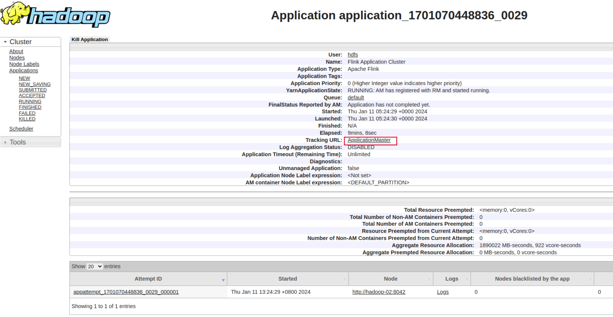

# deploy


<!-- @import "[TOC]" {cmd="toc" depthFrom=1 depthTo=6 orderedList=false} -->

<!-- code_chunk_output -->

- [deploy](#deploy)
    - [yarn](#yarn)
      - [1.pylink: yarn application模式](#1pylink-yarn-application模式)
        - [(1) 打包python虚拟环境](#1-打包python虚拟环境)
        - [(2) 上传java包的依赖](#2-上传java包的依赖)
        - [(3) 将虚拟环境和代码放到同一个目录下](#3-将虚拟环境和代码放到同一个目录下)
        - [(4) 提交任务](#4-提交任务)
        - [(5) 验证](#5-验证)
        - [(6) 优化：提前上传依赖到hdfs，避免每次提交上传](#6-优化提前上传依赖到hdfs避免每次提交上传)
        - [(7) 停止任务](#7-停止任务)
      - [2.yarn session模式 （适合开发测试）](#2yarn-session模式-适合开发测试)
        - [(1) 安装python依赖包（集群所有节点）](#1-安装python依赖包集群所有节点)
        - [(2) 设置环境变量（集群机器和本地客户端）](#2-设置环境变量集群机器和本地客户端)
        - [(3) 启动flink集群（集群）](#3-启动flink集群集群)
        - [(4) 提交任务到该flink集群中（本地客户端）](#4-提交任务到该flink集群中本地客户端)

<!-- /code_chunk_output -->


### yarn

#### 1.pylink: yarn application模式

[参考](https://nightlies.apache.org/flink/flink-docs-release-1.18/docs/deployment/cli/#submitting-pyflink-jobs)

##### (1) 打包python虚拟环境
* 为什么
    * 因为代码是在集群中解析的
    * 而session模式，则在client端解析，解析好后，将job发给jobmanager，
        * 所以不需要上传python环境，只需要client端有python环境即可
* 相关依赖包要下载好
    * 或者通过`-pyreq`上传到集群后下载
```shell
cd  ~/miniconda3/envs/
zip -r /tmp/venv.zip flink
```

##### (2) 上传java包的依赖
* 放在在venv的lib下不生效
```shell
cp /tmp/flink-sql-connector-kafka-3.0.2-1.18.jar /home/hdfs/flink-1.18.0/lib/
```

##### (3) 将虚拟环境和代码放到同一个目录下
```shell
mkdir /tmp/task1_files
cp /tmp/venv.zip /tmp/task1_files
cp /tmp/test.py /tmp/task1_files
```

##### (4) 提交任务

* 设置环境变量
```shell
export HADOOP_CLASSPATH=`/home/hdfs/hadoop-3.3.6/bin/hadoop classpath`
```

* 提交任务
```shell
#-pyfs task1_files -pym test 表示执行task1_files/test.py文件

./flink-1.18.0/bin/flink run-application -t yarn-application \
-Dyarn.ship-files=/tmp/task1_files \
-pyarch task1_files/venv.zip \
-pyclientexec venv.zip/flink/bin/python3 \
-pyexec venv.zip/flink/bin/python3 \
-pyfs task1_files \
-pym test
```

##### (5) 验证
* 跳转到flink web


##### (6) 优化：提前上传依赖到hdfs，避免每次提交上传
* 将flink目录下的lib目录和plugins目录上传到hdfs
```shell
hadoop fs -mkdir /flink-dist
cd /home/hdfs/flink-1.18.0/
hadoop fs -put lib/ /flink-dist
hadoop fs -put plugins/ /flink-dist
```
* 提交任务
```shell
./flink-1.18.0/bin/flink run-application ...\
-Dyarn.provided.lib.dirs="hdfs://hadoop-01:9000/flink-dist"
```

##### (7) 停止任务
```shell
flink stop <job_id> -yid <application_id>
#上面无效，使用该命令： flink cancel <job_id> -yid <application_id>
```

#### 2.yarn session模式 （适合开发测试）

##### (1) 安装python依赖包（集群所有节点）
```shell
pip install apache-flink==1.18.0
```

##### (2) 设置环境变量（集群机器和本地客户端）
```shell
$ vim vim hadoop-3.3.6/etc/hadoop/hadoop-env.sh
export JAVA_HOME=/usr/lib/jvm/java-8-openjdk-amd64/
export HADOOP_HOME=/home/liamlea/Workspace/big-data/hadoop-3.3.6

$ export HADOOP_CLASSPATH=`/home/liamlea/Workspace/big-data/hadoop-3.3.6/bin/hadoop classpath`
```

##### (3) 启动flink集群（集群）
```shell
./flink-1.18.0/bin/yarn-session.sh -d

#会输出jobmanager的地址：http://hadoop-03:43723
```

##### (4) 提交任务到该flink集群中（本地客户端）
```shell
# 会自动识别出jobmanager的地址，因为yarn-session命令会生成一个临时文件保存相关信息
#   如果不能识别，需要手动指定: -m <job_manager_url>

# --jarfile 上传job需要依赖的jar包

# -pyexec 指定worker节点使用的python
./flink-1.18.0/bin/flink run \
-m hadoop-03:43723 \
-py /home/liamlea/Workspace/codes/practices/python/flink_test/test.py \
-pyexec  /home/hdfs/miniconda3/envs/flink/bin/python \
--jarfile ~/Downloads/flink-sql-connector-kafka-3.0.2-1.18.jar \
-d
```