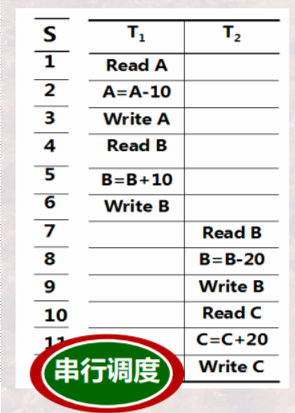
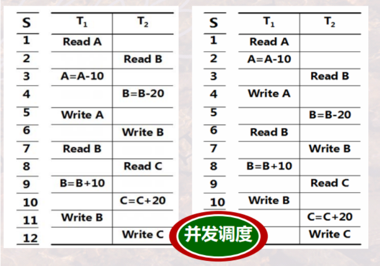
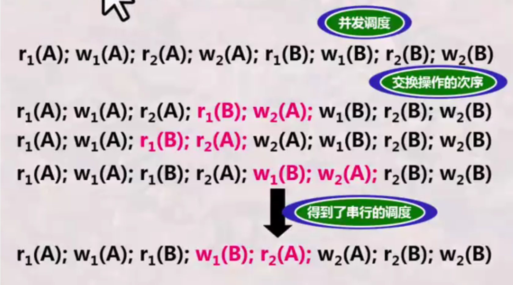
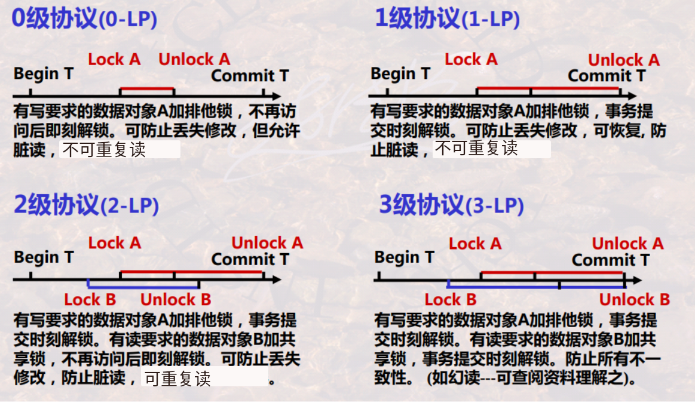
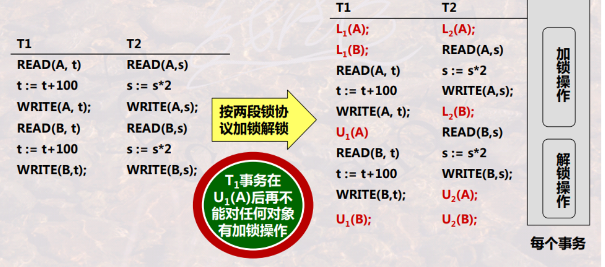
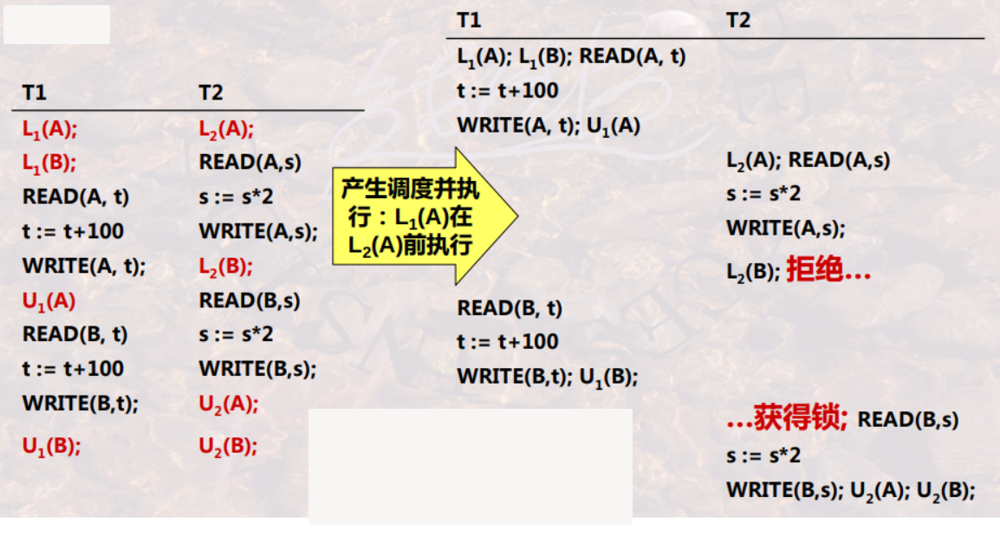
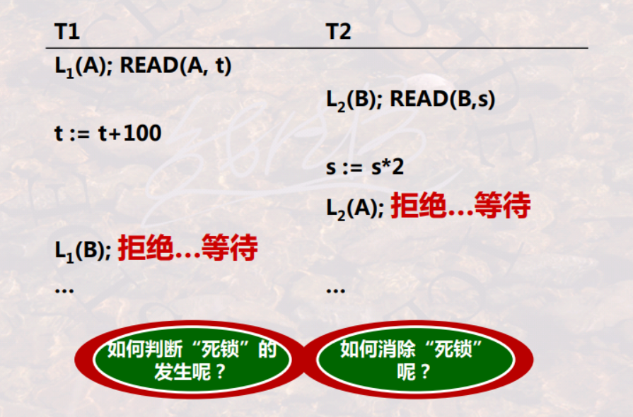

# transaction schedule

<!-- @import "[TOC]" {cmd="toc" depthFrom=1 depthTo=6 orderedList=false} -->

<!-- code_chunk_output -->

- [transaction schedule](#transaction-schedule)
    - [概述](#概述)
      - [1.transaction schedule (事务调度)](#1transaction-schedule-事务调度)
        - [(1) serial schedule (串行调度)](#1-serial-schedule-串行调度)
        - [(2) concurrent schedule (并发调度)](#2-concurrent-schedule-并发调度)
        - [(3) seriable schedule (可串行调度)](#3-seriable-schedule-可串行调度)
      - [2.seriable schedule (可串行调度)](#2seriable-schedule-可串行调度)
        - [(1) 表达事务调度的模型](#1-表达事务调度的模型)
        - [(2) 冲突](#2-冲突)
        - [(3) 冲突可串行性 (保证并发调度的正确性)](#3-冲突可串行性-保证并发调度的正确性)
        - [(4) 冲突可串行性判别算法](#4-冲突可串行性判别算法)
      - [3.基于锁的并发控制](#3基于锁的并发控制)
        - [(1) 锁的类型](#1-锁的类型)
        - [(2) 加锁/解锁的时机](#2-加锁解锁的时机)
        - [(3) SQL隔离级别](#3-sql隔离级别)
        - [(4) 锁的粒度 (locking granularity)](#4-锁的粒度-locking-granularity)
      - [4.两段锁协议 (基于锁的并发控制)](#4两段锁协议-基于锁的并发控制)
        - [(1) 2LP (two-phase locking protocol)](#1-2lp-two-phase-locking-protocol)
        - [(2) 满足冲突可串行性](#2-满足冲突可串行性)
        - [(3) 可能产生死锁](#3-可能产生死锁)
      - [5.基于时间戳的并发控制](#5基于时间戳的并发控制)
        - [(1) 概述](#1-概述)
        - [(2) 解决冲突](#2-解决冲突)
        - [(3) 解决脏读问题](#3-解决脏读问题)
      - [6.基于有效性确认的并发控制](#6基于有效性确认的并发控制)
        - [(1) 概述](#1-概述-1)
        - [(2) 解决冲突](#2-解决冲突-1)
      - [7.基于多版本的并发控制](#7基于多版本的并发控制)
        - [(1) MVCC（multi-version concurrency control）](#1-mvccmulti-version-concurrency-control)

<!-- /code_chunk_output -->

### 概述

#### 1.transaction schedule (事务调度)

用于描述 多个事务 的执行顺序，即 多个事务中的操作是如何交错执行的

##### (1) serial schedule (串行调度)
* 事务按顺序一个一个执行

##### (2) concurrent schedule (并发调度)
* 多个事务从宏观上看是并行执行的
    * 但其微观上的基本操作(读、写)则是交叉执行的

* 并发调度的**正确性**
    * 当并发调度是可串行的，则称该并发调度是正确的
    * 判断方法： 判断并发调度是否具有**冲突可串行性**

##### (3) seriable schedule (可串行调度)
* 一个调度对数据库状态的影响都和某个串行调度相同，则称可串行调度
* 可串行化调度一定是正确的并行调度

#### 2.seriable schedule (可串行调度)

##### (1) 表达事务调度的模型
* 事务表达：
    * $r_T(A)$: 事务T读A
    * $w_T(A)$: 事务T写A
* 事务调度表达，比如:
    * 事务1的调度
        * $T_1:r_1(A);w_1(A);r_1(B);w_1(B)$
    * 事务2的调度
        * $T_2:r_2(A);w_2(A);r_2(B);w_2(B)$
    * 事务1和2的调度
        * $r_1(A);w_1(A)；r_2(A);w_2(A);$

##### (2) 冲突
* 调度中一对连续的动作，如果他们的顺序交换，那么涉及的事务中至少有一个事务的行为会改变

* 存在以下几种冲突情况
    * 同一事务的任何两个操作都是冲突的
        * $r_i(X);w_i(Y)$
        * $w_i(X);r_i(Y)$
    * 不同事务对同一元素的两个写操作是冲突的
        * $w_i(X);w_j(Y)$
    * 不同事务对同一元素的一读一写操作是冲突的
        * $r_i(X);w_j(X)$
        * $w_i(X);r_j(X)$

##### (3) 冲突可串行性 (保证并发调度的正确性)
* 一个调度，如果通过交换相邻两个**无冲突**的操作能够转换到某一个**串行**的调度，则称此调度为冲突可串行化的调度

##### (4) 冲突可串行性判别算法
* 构造一个前驱图(有向图)
* 结点是每一个事务Ti
* 如果Ti的一个操作与Tj的一个操作发生冲突 且Ti在Tj前执行
    * 则绘制一条边，由Ti指向Tj, 表征Ti要在Tj前执行
* 测试检查: 如果此有向图没有环，则是冲突可串行化的

#### 3.基于锁的并发控制

##### (1) 锁的类型

* 排他锁 X (exclusive locks)
    * 只有一个事务能读、写
* 共享锁 S (shared locks)
    * 所有事务都可以读，但任何事务都不能写
* 更新锁 U (update locks)
    * 初始读，以后可升级为写
* 增量锁 I (incremental locks)
    * 对于一部分数据库，对数据库的操作仅仅只涉及加与减操作。这样针对这种情况，我们引入增量锁
    * inc(A,c)
        * A - 为属性的值
        * c - 为增加的量（c可以为负数）

* 锁的相容性

|持有的锁 \ 申请的锁|S|X|U|
|-|-|-|-|
|S|Y|N|Y|
|X|N|N|N|
|U|N|N|N|

##### (2) 加锁/解锁的时机

* 读未提交 (read uncommitted) ---相当于0级协议
* 读已提交 (read committed) ---相当于1级协议
* 可重复读(repeatable read) ---相当于2级协议
* 可串行化(serializable) ---相当于3级协议

##### (3) SQL隔离级别

* 脏读 (dirty reads)
    * 读到**未提交**的数据
* 可重复读 (repeatable reads)
    * 在一个事务中，**多次**读**同一条记录**，数据都一样，不会因为中途另一个事务的提交而导致读的数据不一样
* 幻读 (phantom reads)
    * 在一个事务中，能够读取另一个并发事务**新增或删除**的**记录**

|隔离级别|脏读|不可重复读|幻读|
|-|-|-|-|
|读未提交 (read uncommitted)|Y|Y|Y|
|读提交 (read committed)|N|Y|Y|
|可重复读 (repeatable read)|N|N|Y（mysql在这个隔离级别，解决了幻读的问题）|
|串行化 (serializable)|N|N|N|

##### (4) 锁的粒度 (locking granularity)

* 属性值、元组、元组集合、整个关系、整个DB某索引项、整个索引
    * 由前往后:  并发度小，锁的开销小

#### 4.两段锁协议 (基于锁的并发控制)

##### (1) 2LP (two-phase locking protocol)
* 在一个事务中
* 读写数据之前一定要获得锁
* 所有加锁请求 先于 任何一个 解锁请求
    * 即分为两个阶段：加锁段和解锁段

* 按照2LP加锁举例:

##### (2) 满足冲突可串行性
* 两段封锁协议是可以保证冲突可串行性的
* 所以是正确的并发控制

* 两个按照2LP加锁的事务 并发调度 举例

* 如果将L1(B)这个锁放在U1(A)后面，则T2的事务可能在T1的中间（即U1(A)）后面执行完，由于T1和T2中对B的操作有冲突，所以不符号冲突可串行性，所以这不是一个正确的并发调度

##### (3) 可能产生死锁

#### 5.基于时间戳的并发控制

##### (1) 概述
借助于时间戳，强制使一组并发事务的交叉执行
* 特定顺序：时间戳由小到大 (时间戳小的先执行)
* 如何强制顺序：执行时判断冲突
    * 如无冲突，予以执行
    * 如有冲突，则撤销事务，并重启该事务
        * 此时该事务获得了一个更大的时间戳，表明是后执行的事务
* 有哪些冲突
    * 读-读无冲突
    * 读-写或写-读冲突
    * 写-写冲突

##### (2) 解决冲突
* 对DB中的每个数据元素x，保留最大的时间戳（即最后操作的时间）
    * RT(x)
        * 读过该数据事务中最大的时间戳 (即最后读x的事务的时间戳)
    * WT(x)
        * 写过该数据事务中最大的时间戳 (即最后写x的事务的时间戳)
    * TS(T)
        * 事务T启动的时间戳

* 读-写并发
    * T事务读x，则将TS(T)与WT(x)比较
        * 若TS(T) > WT(x)，则允许T操作，并且更改RT(x)=max{TS(T),RT(x)}
        * 否则，有冲突，撤回T，重启T
    * T事务写x，则将TS(T)与RT(x)比较
        * 若TS(T) > RT(x)，则允许T操作，并且更改WT(x)=max{TS(T),WT(x)}
        * 否则，有冲突，撤回T，重启T

* 写-写并发
    * T事务写x，则将TS(T)与WT(x)比较
        * 若TS(T) > WT(x)，则允许T操作，并更改WT(x)=TS(T)
        * 否则，有冲突，撤回T，重启T

    * 优化： 托马斯写规则
        * 过时的写操作可直接被忽略，而无需撤销过时的事务，因为后面的写已经执行会覆盖，所以前面的写已经不必执行

##### (3) 解决脏读问题
* C(x): x的提交位
    * 该位为真，当且仅当最近写x的事务已经提交
* 添加上述指标后，冲突的解决的方法也需要调整，这里不再详述

#### 6.基于有效性确认的并发控制

##### (1) 概述
* 事务在启动时刻被赋予唯一的时间戳，以示其启动顺序
* 每一事务读写数据的**集合**，
    * RS(T)：事务T读数据的集合
    * WS(T)：事务T写数据的集合
* 事务分三个阶段进行
    * 读阶段
        * 事务从数据库中读取读集合中的所有元素
    * 有效性确认阶段
        * 调度器通过比较该事务与其它事务的读写集合来确认该事务的有效性
    * 写阶段
        * 事务往数据库中写入其写集合中元素的值

##### (2) 解决冲突
* 调度器维护三个集合
    * START(T)
        * 已经开始但尚未完成有效性确认的事务集合
        * 调度器维护START(T)，即事务T开始的时间
    * VAL(T)
        * 已经确认有效性但尚未完成第3阶段写的事务
        * 调度器维护START(T)和VAL(T)，即T确认的时间
    * FIN(T)
        * 已经完成第3阶段的事务
        * 调度器记录START(T), VAL(T)和FIN(T)，即T完成的时间

* 有效性确认规则
    * 若START(T) < FIN(U) 且 RS(T)和WS(U)有交集（即有冲突）
        * 对事务T不予确认
    * 若VAL(T) < FIN(U) 且 WS(T)和WS(U)有交集（即有冲突）
        * 对事务T不予确认

#### 7.基于多版本的并发控制

##### (1) MVCC（multi-version concurrency control）

* 版本链

* 读已提交
  * 事务会根据其id，找到读取的相应版本
  * 当找不到对应版本时，会根据该事务维护的未提交的事务id（如果其他事务提交了，这里也会更新），找到版本链中最近一个提交的事务id

* 可重复读
  * 事务会根据其id，找到读取的相应版本
  * 当找不到对应版本时，会根据该事务维护的未提交的事务id（注意这里有区别，即使其他事务提交了，这里维护的未提交的事务id也跟最开始一样），找到版本链中最近一个提交的事务id