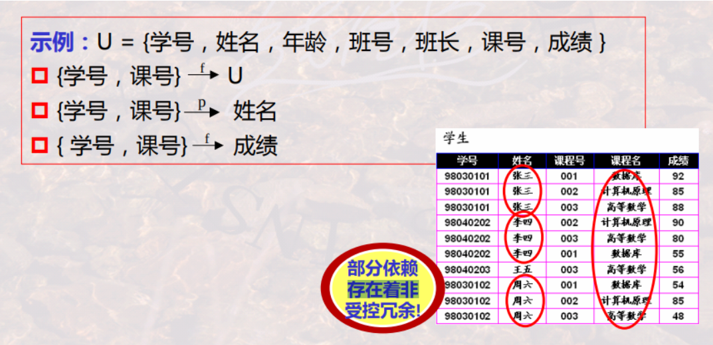

# data dependence

<!-- @import "[TOC]" {cmd="toc" depthFrom=1 depthTo=6 orderedList=false} -->

<!-- code_chunk_output -->

- [data dependence](#data-dependence)
    - [概述](#概述)
      - [1.数据依赖（函数依赖）](#1数据依赖函数依赖)
        - [(1) 定义](#1-定义)
        - [(2) 完全或部分 函数依赖](#2-完全或部分-函数依赖)
        - [(3) 传递函数依赖](#3-传递函数依赖)
      - [2.函数依赖基本概念](#2函数依赖基本概念)
        - [(1) 候选键、主键和外键](#1-候选键-主键和外键)
        - [(2) 逻辑蕴含 (logical implication)](#2-逻辑蕴含-logical-implication)
        - [(3) 闭包 (closure)](#3-闭包-closure)
      - [3.函数依赖的公理和定理](#3函数依赖的公理和定理)
        - [(1) 公理](#1-公理)
        - [(2) 定理](#2-定理)
        - [(3) 属性闭包](#3-属性闭包)
      - [4.函数依赖的覆盖 (cover)](#4函数依赖的覆盖-cover)
        - [(1) 覆盖](#1-覆盖)
        - [(2) 定理](#2-定理-1)
        - [(3) 最小覆盖](#3-最小覆盖)

<!-- /code_chunk_output -->

### 概述

#### 1.数据依赖（函数依赖）

##### (1) 定义
* 设关系$R(A_1,A_2,...,A_n)$，X和Y均为$(A_1,A_2,...,A_n)$的子集
    * 任意两元组u、v中对应的X属性相等，
    * 则有u、v中对应的Y属性也相等
* 则称X函数决定Y（或Y依赖于X）
* 记为$X\rightarrow Y$

* 举例

##### (2) 完全或部分 函数依赖
* 对于关系$R(A_1,A_2,...,A_n)$，有函数依赖$X\rightarrow Y$
    * 若对于X的真子集X'都有$X'\nrightarrow Y$
        * 则称Y完全函数依赖于X，记作$X\xrightarrow{f} Y$
        * 否则称Y部分函数依赖于X，记作$X\xrightarrow{p} Y$

* 举例

##### (3) 传递函数依赖

* 对于关系$R(A_1,A_2,...,A_n)$，有函数依赖$X\rightarrow Y$，$Y\rightarrow Z$
    * 且$Y\nsubseteq X$，$Z\nsubseteq X$，$Z\nsubseteq Y$，$Y\nrightarrow X$
    * 则$X\rightarrow Z$，则称Z传递函数依赖于X

* 举例

#### 2.函数依赖基本概念

##### (1) 候选键、主键和外键
通过函数依赖的角度定义（本质和数据库中定义的一样）
* 设K为R(U)中的属性组，若$K\xrightarrow{f} U$
    * 则称K是R(U)上的候选建

* 可任选一个候选键作为R的主键
* 包含在候选键中的属性称为主属性，其他属性称为非主属性
* 关系R中的一个属性组，它不是R的候选键，是另一个关系S的候选键

##### (2) 逻辑蕴含 (logical implication)

* 设F是关系模式R(U)中的一个函数依赖集合，X，Y是U的属性子集
    * 如果从 F中的函数依赖 能够推导出 $X\rightarrow Y$
    * 则称F逻辑蕴涵$X\rightarrow Y$
    * 记作$F\models X\rightarrow Y$

##### (3) 闭包 (closure)

* 设F是关系模式R(U)中的一个函数依赖集合
    * 被F逻辑蕴涵的所有函数依赖集合
    * 称为F的必包，记作$F^+$

#### 3.函数依赖的公理和定理

##### (1) 公理
* 设关系$R(U)$，其中U是属性集$(A_1,A_2,...,A_n)$，F为R(U)的一个函数依赖集，记为R(U,F)
    * 自反律
        * 若$Y\subseteq X\subseteq U$，则F逻辑蕴涵$X\rightarrow Y$
    * 增广律
        * 若F中包括$X\rightarrow Y$，且$Z\subseteq U$，则F逻辑蕴涵$XZ\rightarrow YZ$
    * 传递律
        * 若F中包括$X\rightarrow Y$，且$Y\rightarrow Z$，则F逻辑蕴涵$X\rightarrow Z$

##### (2) 定理
* 合并律
    * 若$X\rightarrow Y$且$X\rightarrow Z$，则$X\rightarrow YZ$
* 伪传递律
    * 若$X\rightarrow Y$且$WY\rightarrow Z$，则$XW\rightarrow Y$
* 分解律
    * 若$X\rightarrow Y$且$Z\subseteq Y$，则$X\rightarrow Z$

##### (3) 属性闭包
* 对于R(U, F)，其中U是属性集$(A_1,A_2,...,A_n)$，F为R(U)的一个函数依赖集
    * $X^+_{F}=\{A_i|其中A_i是U中的单属性，X\subseteq U，且能够根据上述几个公理从F推导出X\rightarrow A_i\}$
    * 则称$X^+_{F}$是X关于F的属性闭包

* 计算方式

#### 4.函数依赖的覆盖 (cover)

##### (1) 覆盖
* 对R(U)上的两个函数依赖集合F、G,
    * 如果$F^+=G^+$
    * 则称F和G是等价的，也称F覆盖G 或者 G覆盖F

##### (2) 定理
* 每个函数依赖集F 可被 一个 其右端只有一个属性 的函数依赖之集G 覆盖
    * 其右端只有一个属性 的函数依赖之集G，形如: $G=\{A\rightarrow XX, B\rightarrow XX, C \rightarrow XX\}$

##### (3) 最小覆盖
* 函数依赖集F为最小覆盖需要满足：
    * F中每个函数依赖的右部是单个属性
    * 对于任何$(X\rightarrow A) \in F$，有$F-\{X\rightarrow A\}$不等价于F
    * 对于任何$(X\rightarrow A) \in F$，$Z\subset X$，$(F-\{X\rightarrow A\})\cup \{Z\rightarrow A\}$不等价于F