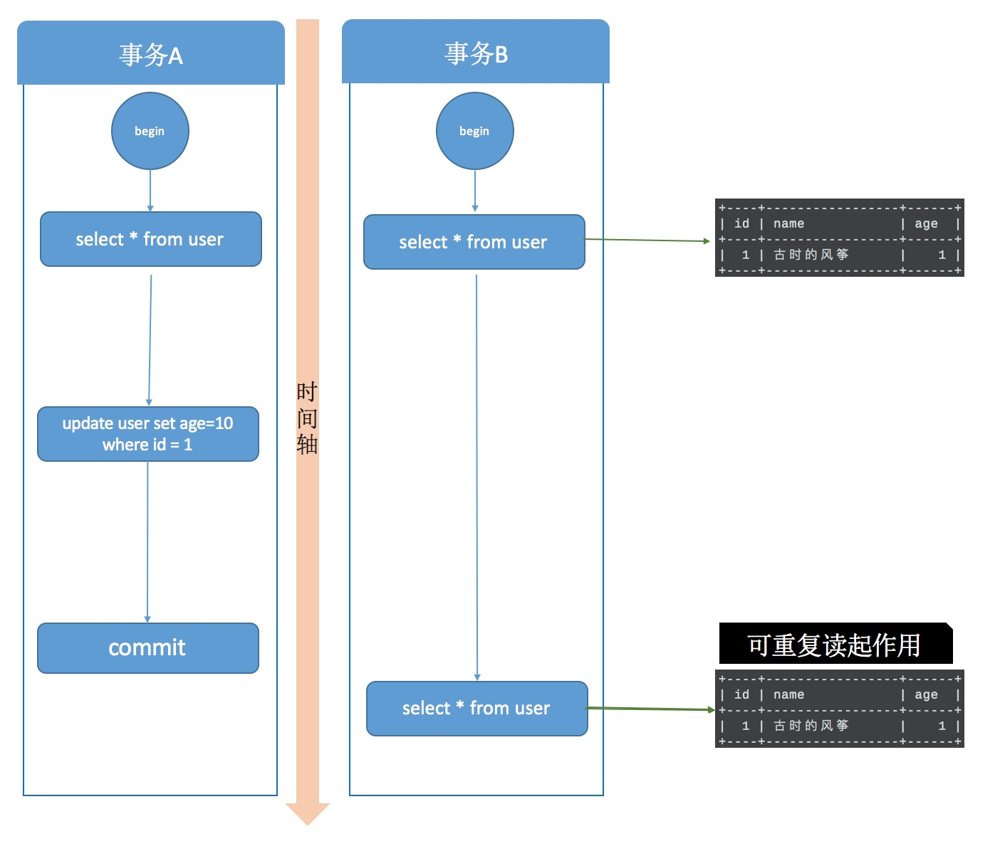
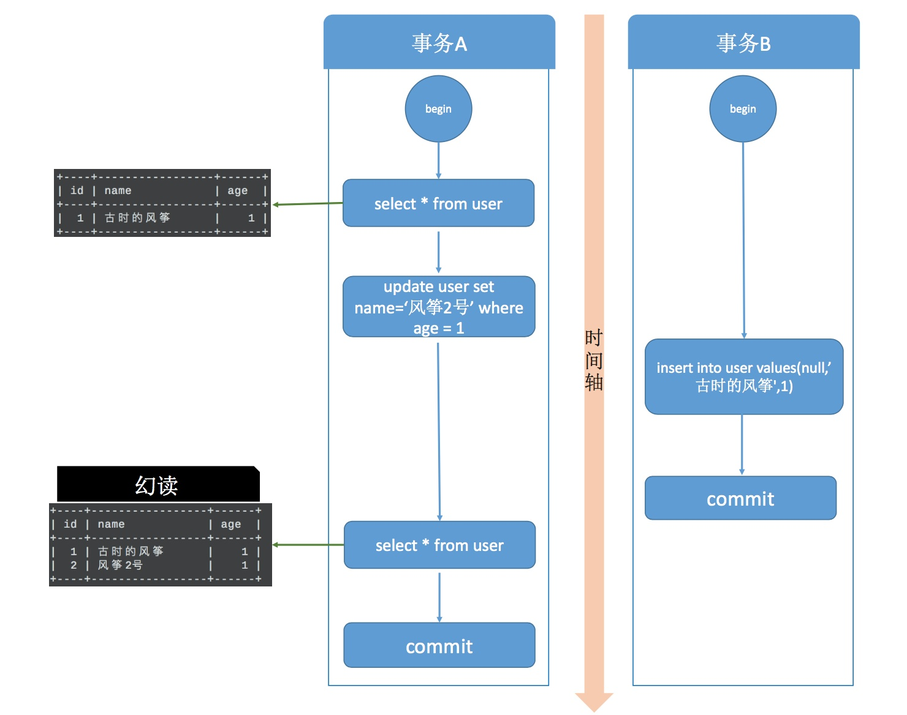
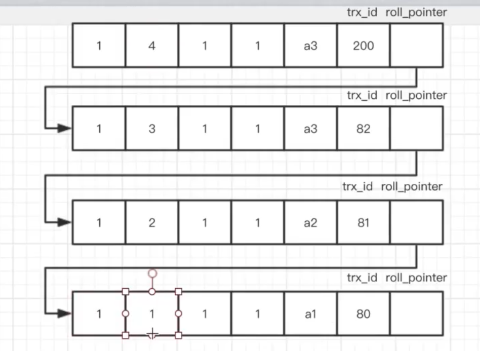

# transactions

[toc]

### 概述

#### 1.transactions（事务）
一个工作单元，即执行**一组SQL语句**，这个操作是**原子**的

#### 2.ACID

#####  （1）Atomicity（原子性）

##### （2）Consistency（一致性）
* 数据需要满足一定的规则
比如从A账号转200到B账号
当A账号减掉200的同时，B账号必须同时增加200（因为需要满足A+B的值不变的规则）
当A账号不足200时，该操作必须失败（因为需要满足>=0的规则）
 
* 实现一致性的方式：
  * 通过AID保证C，即AID是手段，C是目的

##### （3）Isolation（隔离性）
事务的结果通常对其他事务不可见，直到该事务完成为止。

##### （4）Durability（持久性）
事务的更改是永久的，即使在事务完成的瞬间，服务器宕机了，数据也不会丢失

#### 3.事务隔离级别

|隔离级别|脏读|不可重复读|幻读|
|-|-|-|-|
|读未提交|可能|可能|可能|
|读提交|不可能|可能|可能|
|可重复读|不可能|不可能|可能（mysql在这个隔离级别，解决了幻读的问题）|
|串行化|不可能|不可能|不可能|

##### （1） 读未提交
* 性能最好，因为没有加任何锁
* 问题：脏读
  * 当事务b修改了一个值，事务a读到了新的值，可是事务b由于某些原因回滚了

##### （2）读提交
* 问题：不可重复读，在同一个事务中，不同时刻读取到的值不一样
  * 事务b读取某一个值后，事务a执行完毕，修改了该值，然后事务b再次读取时，两次的值不一样

##### （3）可重复读
* 事务不会读到其他事务对已有数据的修改，即使其他事务已提交
* 实现：MVCC（multi-version concurrency control）
* 问题：幻读
  * 事务开始时读到的已有数据是什么，在事务提交前的任意时刻，这些数据的值都是一样的。但是，对于其他事务新插入的数据是可以读到的，这也就引发了幻读问题。

##### （4）串行化
* 它将事务的执行变为顺序执行，与其他三个隔离级别相比，它就相当于单线程，后一个事务的执行必须等待前一个事务结束

#### 4.MVCC（multi-version concurrency control）
* 版本链

* 读已提交
  * 事务会根据其id，找到读取的相应版本
  * 当找不到对应版本时，会根据该事务维护的未提交的事务id（如果其他事务提交了，这里也会更新），找到版本链中最近一个提交的事务id

* 可重复读
  * 事务会根据其id，找到读取的相应版本
  * 当找不到对应版本时，会根据该事务维护的未提交的事务id（注意这里有区别，即使其他事务提交了，这里维护的未提交的事务id也跟最开始一样），找到版本链中最近一个提交的事务id
