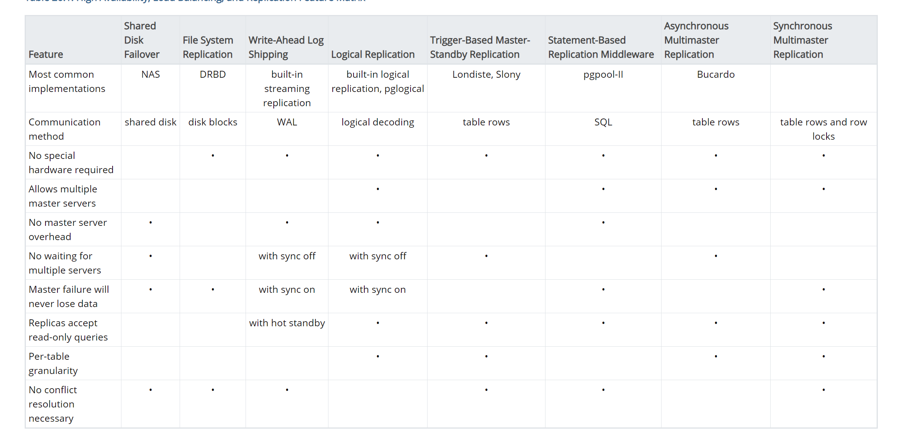

[toc]
### 概述

#### 1.数据库的高可用

##### （1）面临的问题
* 对于只读的数据库，高可用很容易实现
* 对于可读写的数据库，**同步**是最大的问题（即两个数据库的内容要保持一致）

##### （2）解决思路
* 设置多个数据库，只有一个primary，其他都是standby，写操作只能在primary上执行
* **同步**解决方案，即只有当**所有server**都commit transaction，才认为该tansaction被commit了
* **异步**解决方案，提交时间和传播到其他服务器 之间存在一定的延迟
  * 可能导致：切换到备份服务器时，数据丢失
  * 当 同步方式 很慢时，采用异步方式

#### 2  .备份类型
* warm standby
warm standby的服务器不能被连接，直到该服务器成为primary服务器

* host standby
host standby的服务器能够接收只读的请求

***

### 高可用解决方案对比

该图是以pg为视角

#### 1.shared disk failover
多个数据库共享同一个磁盘
缺点：
* 当磁盘出问题，所有database都不可用

#### 2.file system（block device）replication
每个server上都有一个内容相同的文件系统（或块设备）
* 需要保证的是数据一致性

#### 3.write-ahead log shipping
A standby server can be implemented using file-based log shipping (Section 26.2) or streaming replication (see Section 26.2.5), or a combination of both. For information on hot standby, see Section 26.5.

#### 4.logical replication
类似于WAL log方式，这里可以通过TCP连接，直接读取变化
发送stream of data modification到另一台服务器

#### 5.trigger-based master-standby replication
standby服务器会发送all data modification queries到master服务器
master服务器会异步的将变化发送给standby服务器

#### 6.statement-based replication middleware
中间件会拦截所有sql，将只读语句发送到其中一个服务器，当写语句发送到所有所有服务器

#### 7.synchronous multimaster replication
每个server既是master又是standby
写请求会发送到其中一台server，然后该server会发送到其他server
只有所有server都完成commit，才认为commit成功

#### 8.asynchronous multimaster replication
每个server既是master又是standby
写请求会发送到其中一台server，然后该server会发送到其他server
不会等所有server都commit
所以会存在数据冲突的问题，所以需要定期解决数据冲突

#### 9.data partitioning（数据分片）
将**表**划分多个集合，每个集合只能被一个server修改

#### 10.Multiple-Server Parallel Query Execution
多个服务器处理一个查询
通过将**数据**在服务器间切分
