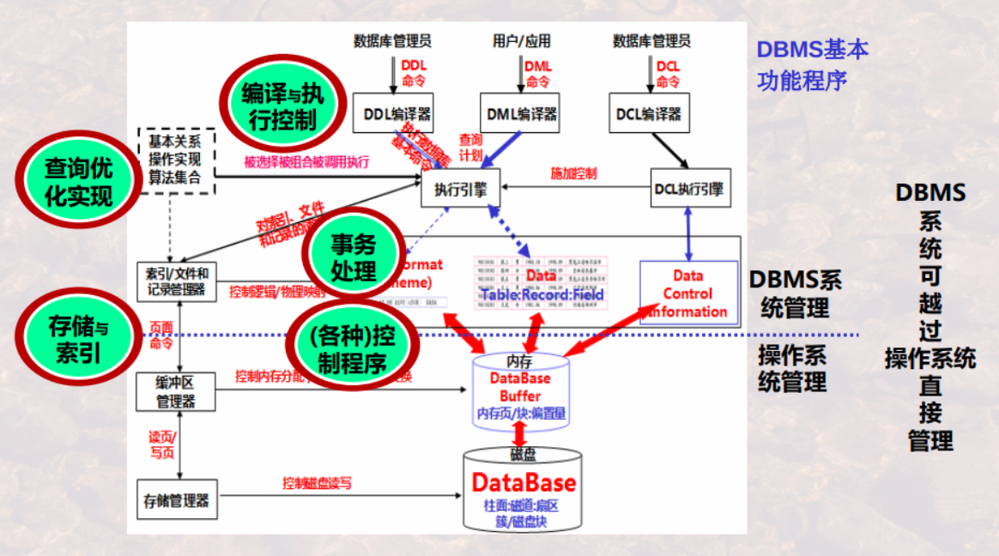
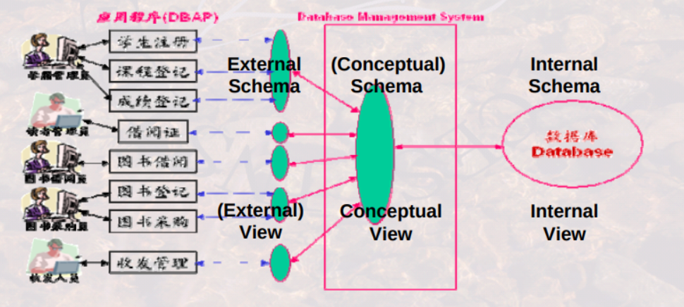
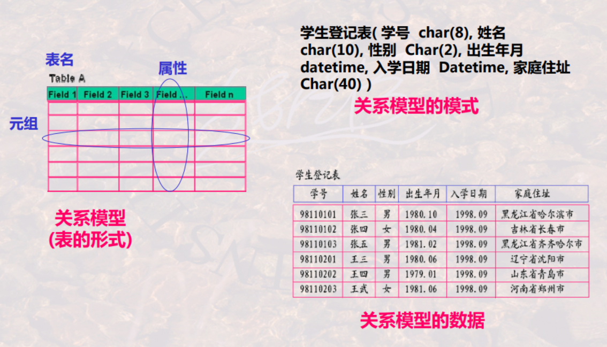
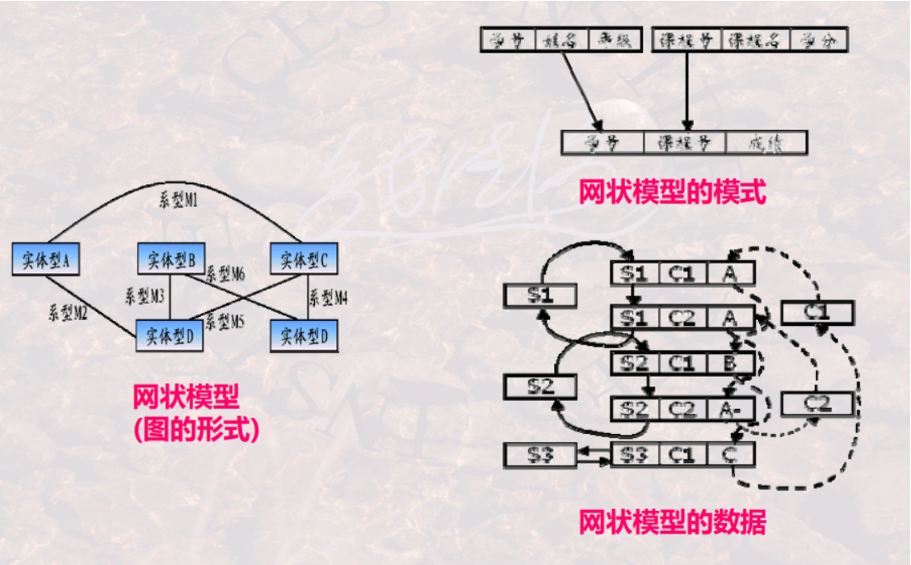

# overview

<!-- @import "[TOC]" {cmd="toc" depthFrom=1 depthTo=6 orderedList=false} -->

<!-- code_chunk_output -->

- [overview](#overview)
    - [概述](#概述)
      - [1.基本概念](#1基本概念)
        - [(1) table](#1-table)
        - [(2) database (DB)](#2-database-db)
        - [(3) database management system (DBMS)](#3-database-management-system-dbms)
        - [(4) database application (DBAP)](#4-database-application-dbap)
        - [(5) database system (数据库系统)](#5-database-system-数据库系统)
        - [(6) SQL (structured query language)](#6-sql-structured-query-language)
      - [2.数据库系统的标准结构](#2数据库系统的标准结构)
        - [(1) 模式和视图](#1-模式和视图)
        - [(2) 三级模式和视图](#2-三级模式和视图)
        - [(3) 两层映射](#3-两层映射)
        - [(4) 逻辑数据独立性 和 物理数据独立性](#4-逻辑数据独立性-和-物理数据独立性)
      - [3.数据模型](#3数据模型)
        - [(1) 关系模型定义](#1-关系模型定义)
        - [(2) 三大经典数据模型](#2-三大经典数据模型)
    - [relational model](#relational-model)
      - [1.三要素](#1三要素)
        - [(1) 基本结构](#1-基本结构)
        - [(2) 基本操作](#2-基本操作)
        - [(3) 完整性约束](#3-完整性约束)

<!-- /code_chunk_output -->

### 概述

#### 1.基本概念

##### (1) table

* 表名
* 表标题（格式）
* 表内容（值）
* 行/元组/记录 (row/tuple/record)
* 列/字段/属性/数据项 (column/field/attribute/data item)

* 关系模式: 
    * 表名 + 表标题
* 表/关系: 
    * 表名 + 表标题 + 表内容

##### (2) database (DB)
有关联关系的表的集合

##### (3) database management system (DBMS)
管理数据库的系统软件，比如：mysql、oracle等
* 功能（用户角度）:
    * DDL: data definition language (数据定义语言)
    * DML: data manipulation language (数据操纵语言)
    * DCL: data control language (数据控制语言)
        * 权限控制等
    * 数据库维护
        * 包括转储、恢复、性能检测等
* 功能（系统角度）:

##### (4) database application (DBAP)
数据库应用（即使用数据库的应用程序）

##### (5) database system (数据库系统)
DBMS + DBAP

##### (6) SQL (structured query language)

DDL + DML + DCL

#### 2.数据库系统的标准结构

##### (1) 模式和视图

* schema (视图，也称为数据的结构)
    * 对数据库中数据所进行的一种结构性的描述
* view (视图) / data (数据)
    * 数据库中的数据

* 模式是对视图的抽象
* 视图是某种模式展现形式下的数据

##### (2) 三级模式和视图

* external schema 和 external view
    * 也称为用户模式、子模式和用户视图、子视图
    * 用来描述用户能够看到的数据
* conceptual schema 和 conceptual view
    * 也称为逻辑模式、全局模式和逻辑视图、全局视图
    * 用来描述全局角度理解/管理的数据，含有相应的关联约束
* internal schema 和 internal view
    * 也称为物理模式、存储模式和物理视图、存储视图
    * 用来描述存储在介质上的数据，含存储路径、存储方式 、索引方式等

##### (3) 两层映射

* E-C mappinng: external schema 和 conceptual schema的映射
    * 将外模式映射为概念模式
    * 便于用户观察和使用
* C-I mapping: conceptual schema 和 internal schema的映射
    * 将概念模式映射为内模式
    * 便于计算机进行存储和处理

##### (4) 逻辑数据独立性 和 物理数据独立性

* 逻辑数据独立性
    * 当概念模式变化时，可以不改变外部模式(只需改变E-C Mapping)，从而无需改变应用程序
* 物理数据独立性
    * 当内部模式变化时，可以不改变概念模式(只需改变C-I Mapping) ，从而不改变外部模式

#### 3.数据模型

##### (1) 关系模型定义

* 规定 模式的统一描述方式，包括：数据结构、操作和约束
* 模型是对模式的抽象，模式是对数据的抽象
* 比如：关系模型
    * 所有模式都可为抽象表(Table)的形式 [数据结构]
        * 而每一个具体的模式都是拥有不同列名的具体的表
    * 对这种表形式的数据有哪些[操作]和[约束]

    

##### (2) 三大经典数据模型

* 关系模型
    * **表**的形式组织数据
* 层次模型
    * **树**的形式组织数据
    
* 网状模型
    * **图**的形式组织数据
    

***

### relational model

#### 1.三要素

##### (1) 基本结构
relation (即table)

##### (2) 基本操作
关系运算，基本的： $\cup 、- 、\cap、\times (广义积)、\div、 \pi(投影)、\sigma(选择)$

##### (3) 完整性约束
* 实体完整性
* 参照完整性
* 用户自定义的完整性