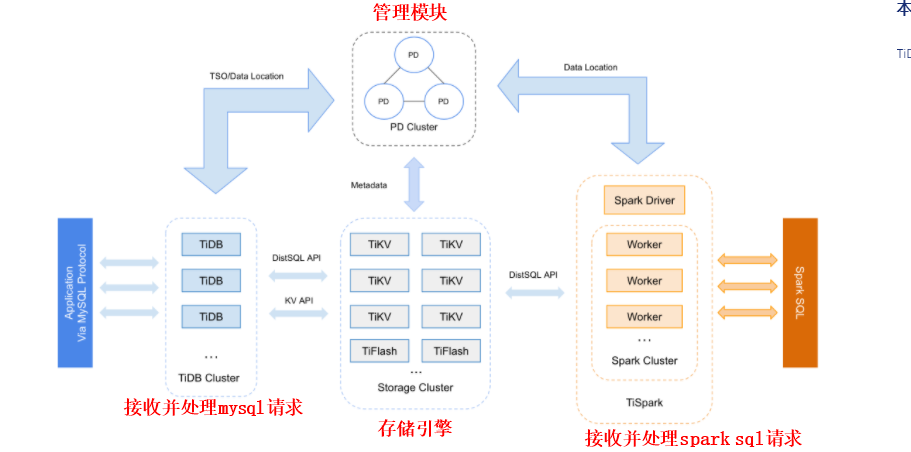
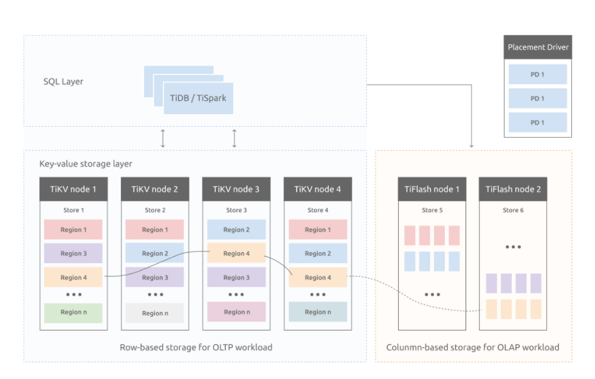

# TiDB

<!-- @import "[TOC]" {cmd="toc" depthFrom=1 depthTo=6 orderedList=false} -->
<!-- code_chunk_output -->

- [TiDB](#tidb)
    - [概述](#概述)
      - [1.架构](#1架构)
        - [（1） TiDB server](#1-tidb-server)
        - [（2）PD server（PD：placement driver）](#2pd-serverpdplacement-driver)
        - [（3）存储节点](#3存储节点)
      - [2.存储](#2存储)
        - [（1）存储形式：key-value pairs（键值对）](#1存储形式key-value-pairs键值对)
        - [（2）存储引擎：RocksDB](#2存储引擎rocksdb)
        - [（3）一致性协议：Raft](#3一致性协议raft)
        - [（4）最小单位：region](#4最小单位region)
        - [（5）MVCC（multi-version concurrency control，多版本并发控制）](#5mvccmulti-version-concurrency-control多版本并发控制)

<!-- /code_chunk_output -->

### 概述

#### 1.架构

##### （1） TiDB server
SQL层，对外暴露mysql协议的连接，负责接收客户端的连接，**解析SQL**，映射成Key-Value 操作，将实际的数据读取请求转发给存储节点TiKV

##### （2）PD server（PD：placement driver）
PD 是 TiDB 集群的管理模块，同时也负责集群数据的实时调度

##### （3）存储节点
* TiKV server
  * 负责存储数据，是一个分布式的提供事务的 Key-Value 存储引擎
  * 存储单位：region，每个TiKV节点会负责多个region
    * 每个 Region 负责存储一个 Key Range（从 StartKey 到 EndKey 的左闭右开区间）的数据
  * TiKV 中的数据都会自动维护多副本（默认为三副本），天然支持高可用和自动故障转移
 
* TiFlash
  * TiFlash 是一类特殊的存储节点
  * 数据是以列式的形式进行存储，主要的功能是为分析型的场景加速

#### 2.存储

##### （1）存储形式：key-value pairs（键值对）

##### （2）存储引擎：RocksDB
* TiKV 没有选择直接向磁盘上写数据，而是把数据保存在 RocksDB 中，具体的数据落地由 RocksDB 负责
* RocksDB 是由 Facebook 开源的一个非常优秀的单机 KV 存储引擎

##### （3）一致性协议：Raft
通过 Raft，将数据复制到多台机器上，以防单机失效

##### （4）最小单位：region
* 对于一个 KV 系统，将数据分散在多台机器上有两种比较典型的方案（tidb采用的是第二种）：
  * Hash：按照 Key 做 Hash，根据 Hash 值选择对应的存储节点
  * Range：按照 Key 分 Range，某一段连续的 Key 都保存在一个存储节点上
 
* 一个 Region 的多个 Replica 会保存在不同的节点上，构成一个 Raft Group。其中一个 Replica 会作为这个 Group 的 Leader，其他的 Replica 作为 Follower
  * Leader 负责读/写，Follower 负责同步 Leader 发来的 Raft log

##### （5）MVCC（multi-version concurrency control，多版本并发控制）
通过多版本并发控制，就不需要上锁了
