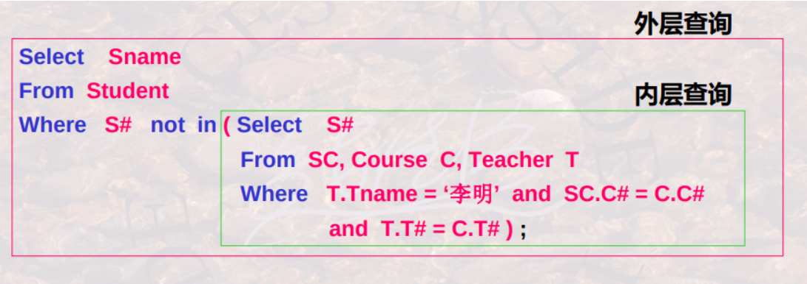

# SQL


<!-- @import "[TOC]" {cmd="toc" depthFrom=1 depthTo=6 orderedList=false} -->

<!-- code_chunk_output -->

- [SQL](#sql)
    - [概述](#概述)
      - [1.SQL(structed query language)](#1sqlstructed-query-language)
        - [(1) DDL (data definition language)](#1-ddl-data-definition-language)
        - [(2) DML (data manipulation language)](#2-dml-data-manipulation-language)
        - [(3) DCL (data control language)](#3-dcl-data-control-language)
      - [2.查询操作](#2查询操作)
        - [(1) 去重](#1-去重)
        - [(2) 排序](#2-排序)
        - [(3) 模糊查询](#3-模糊查询)
        - [(4) 多表联合查询](#4-多表联合查询)
        - [(5) 连接自身表（重命名）](#5-连接自身表重命名)
        - [(6) theta-连接](#6-theta-连接)
        - [(7) 子查询概述](#7-子查询概述)
        - [(8) IN-子查询](#8-in-子查询)

<!-- /code_chunk_output -->

### 概述

#### 1.SQL(structed query language)

##### (1) DDL (data definition language)
* 创建数据库
    ```SQL
    create database <database>;
    ```
* 切换和关闭数据库
    ```SQL
    use <db>;
    close <db>
    ```

* 创建表
    ```SQL
    create table 表名( 列名 数据类型 [Primary key Primary key | Unique] [Not null]
        [, 列名 数据类型 [Not null] , … ]);

    #Primary key: 主键约束，每个表只能创建一个主键约束
    #Unique: 唯一性约束（候选键），每个表可以有多个唯一性约束
    #Not null: 非空约束
    ```

* 修改表结构
    ```SQL
    alter table tablename
    [add {colname datatype, …}]
    [drop {完整性约束名}]
    [modify {colname datatype, …}] 
    ```

* 删除表
    ```SQL
    drop table 表名
    ```

##### (2) DML (data manipulation language)

* 插入数据
    * 单一元组新增命令形式
        ```SQL
        insert into insert into 表名[ (列名 [, 列名 ]… ]
            values values (值 [, 值] , …) ;
        ```
    * 批数据新增命令形式
        ```SQL
        insert into 表名 [(列名[，列名]…)]
        子查询;
        ```
        * 举例
            ```SQL
            Insert Into St (Sn, Sname)
            Select Sn, Sname From Student
            Where Sname like ‘%伟 ’ ;
            ```

* 删除操作
    ```SQL
    Delete From Student Where D# in
        ( Select D# From Dept Where Dname = ‘自动控制’);
    ```

* 更新操作
    ```SQL
    Update 表名
    Set 列名 = 表达式 | (子查询)
    [ [ , 列名 = 表达式 | (子查询) ] … ]
    [ Where 条件表达式] ;
    ```

##### (3) DCL (data control language)

#### 2.查询操作
* $\pi_{A_{i1},A_{i2},...}(\sigma_{con}(R))$
```SQL
SELECT A1,A2,...
FROM R
WHERE con
```

##### (1) 去重
```SQL
select DISTINCT ...;
```

##### (2) 排序
```SQL
select ... order by 列名 [asc|desc]
```

##### (3) 模糊查询
```SQL
列名 [not] like "字符串"

#% 匹配零个或多个字符
#_ 匹配任意单个字符
#\ 转义字符
```

##### (4) 多表联合查询

* $\pi_{A_{i1},A_{i2},...}(\sigma_{con}(R_1\times R_2\times,...))$
```SQL
SELECT A1,A2,...
FROM R1,R2,...
WHERE con
```

##### (5) 连接自身表（重命名）
* 求年龄有差异的任意两位同学的姓名
```SQL
Select S1.Sname as Stud1, S2.Sname as Stud2
From Student S1, Student S2
Where S1.Sage > S2.Sage ;
```

##### (6) theta-连接
* 求既学过“001”号课又学过 “002”号课的所有学生的学号
    * 通过学号相等进行连接（即theta-连接）
```SQL
Select S1.Sn From SC S1, SC S2
Where S1.Sn = S2.Sn and S1.Cn=‘001’
and S2.Cn=‘002 ;
```

##### (7) 子查询概述


* 非相关子查询
    * 内层查询独立进行，没有涉及任何外层查询相关信息的子查询
* 相关子查询
    * 内层查询需要依靠外层查询的某些参量作为限定条件才能进行的子查询
    ```SQL
    Select Sname
    From Student Stud
    Where Sn in ( Select Sn
    From SC
    Where Sn = Stud.Sn and Cn = ‘001’ ) ;
    ```

##### (8) IN-子查询
* 判断某一表达式的值是否在子查询的结果中
```SQL
表达式 [not ] in (子查询)
```
* 举例
    * 列出没学过李明老师讲授课程的所有同学的姓名
    ```SQL
    Select Sname From Student
    Where Sn not in ( Select Sn From SC, Course C, Teacher T
    Where T.Tname = ‘李明’ and SC.Cn = C.Cn
    and T.Tn = C.Tn );
    ```