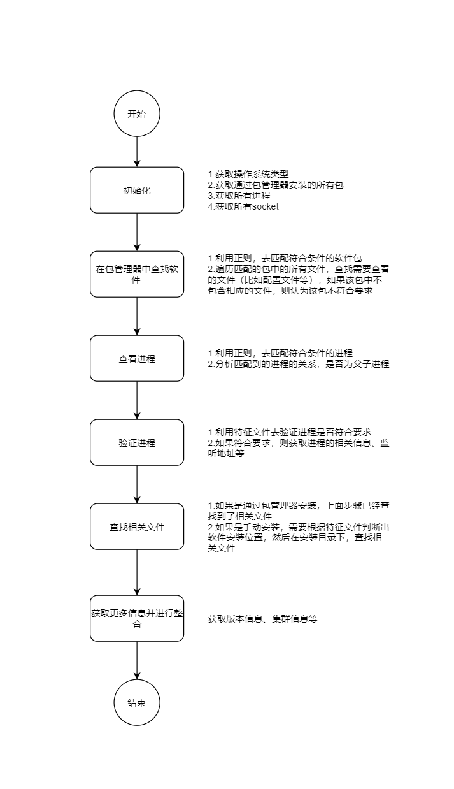

# 自动发现设计

<!-- @import "[TOC]" {cmd="toc" depthFrom=1 depthTo=6 orderedList=false} -->
<!-- code_chunk_output -->

- [自动发现设计](#自动发现设计)
    - [1.流程图](#1流程图)
    - [2.软件解析](#2软件解析)
      - [2.1 Apache](#21-apache)
        - [（1）软件包匹配模式](#1软件包匹配模式)
        - [（2）特征文件](#2特征文件)
        - [（3）进程匹配模式](#3进程匹配模式)
        - [（4）需要扫描的文件](#4需要扫描的文件)
      - [2.2 Nginx](#22-nginx)
        - [（1）软件包匹配模式](#1软件包匹配模式-1)
        - [（2）特征文件](#2特征文件-1)
        - [（3）进程匹配模式](#3进程匹配模式-1)
        - [（4）需要扫描的文件](#4需要扫描的文件-1)
      - [2.3 Tomcat](#23-tomcat)
        - [（1）软件包匹配模式](#1软件包匹配模式-2)
        - [（2）特征文件](#2特征文件-2)
        - [（3）进程匹配模式](#3进程匹配模式-2)
        - [（4）需要扫描的文件](#4需要扫描的文件-2)
      - [2.4 MySQL](#24-mysql)
        - [（1）软件包匹配模式](#1软件包匹配模式-3)
        - [（2）特征文件](#2特征文件-3)
        - [（3）进程匹配模式](#3进程匹配模式-3)
        - [（4）需要扫描的文件](#4需要扫描的文件-3)
      - [2.5 Oracle](#25-oracle)
        - [（1）软件包匹配模式](#1软件包匹配模式-4)
        - [（2）特征文件](#2特征文件-4)
        - [（3）进程匹配模式](#3进程匹配模式-4)
        - [（4）需要扫描的文件](#4需要扫描的文件-4)
      - [2.6 PostgreSQL](#26-postgresql)
        - [（1）软件包匹配模式](#1软件包匹配模式-5)
        - [（2）特征文件](#2特征文件-5)
        - [（3）进程匹配模式](#3进程匹配模式-5)
        - [（4）需要扫描的文件](#4需要扫描的文件-5)
      - [2.7 Weblogic](#27-weblogic)
        - [（1）软件包匹配模式](#1软件包匹配模式-6)
        - [（2）特征文件](#2特征文件-6)
        - [（3）进程匹配模式](#3进程匹配模式-6)
        - [（4）需要扫描的文件](#4需要扫描的文件-6)
    - [3.集群解析](#3集群解析)
      - [3.1 Nginx集群](#31-nginx集群)
        - [（1）集群方式](#1集群方式)
        - [（2）获取集群信息](#2获取集群信息)
        - [（3）计算集群的uuid](#3计算集群的uuid)
      - [3.2 MySQL主备集群](#32-mysql主备集群)
        - [（1）集群方式](#1集群方式-1)
        - [（2）获取集群信息](#2获取集群信息-1)
        - [（3）计算集群的uuid](#3计算集群的uuid-1)
      - [3.3 Oracle集群](#33-oracle集群)
        - [（1）集群方式](#1集群方式-2)
        - [（2）获取集群信息](#2获取集群信息-2)
        - [（3）计算集群的uuid](#3计算集群的uuid-2)
      - [3.4 PostgreSQL集群](#34-postgresql集群)
        - [（1）集群模式](#1集群模式)
        - [（2）获取集群信息](#2获取集群信息-3)
        - [（3）计算集群的uuid](#3计算集群的uuid-3)
    - [4.已测试的版本](#4已测试的版本)
    - [5.数据整合](#5数据整合)
      - [（1）前提](#1前提)
      - [（2）执行时机](#2执行时机)
      - [（3）整合原子信息](#3整合原子信息)
      - [（4）建立集群关系](#4建立集群关系)
      - [（5）完善集群关系](#5完善集群关系)
      - [（6）整合集群信息](#6整合集群信息)
    - [5.采集信息变更](#5采集信息变更)
      - [5.1 基础概念](#51-基础概念)
      - [5.2 原子系统变更概述](#52-原子系统变更概述)
        - [（1） 原子系统信息变更](#1-原子系统信息变更)
        - [（2） 原子系统减少](#2-原子系统减少)
      - [5.3 集群变更概述](#53-集群变更概述)
        - [（1） 集群节点变少](#1-集群节点变少)
        - [（2） 集群宕机或者删除](#2-集群宕机或者删除)
      - [5.4 处理流程](#54-处理流程)
      - [5.5 主机采集失败](#55-主机采集失败)

<!-- /code_chunk_output -->

### 1.流程图


### 2.软件解析

软件的uuid通过，对监听的`ip+port`进行排序，计算md5值

#### 2.1 Apache

##### （1）软件包匹配模式
```python
{
    "name": "apache",
    "pattern": "(^httpd-[0-9.]+)|(^apache2$)"
}
```

##### （2）特征文件
```python
[
    {
        "name": "httpd",
        "pattern": "(.*bin/httpd$)|(.*bin/apache2$)",   #判断进程是否加载了特征文件到内存中，如果没有，则该进程不符合要求
        "dir_depth": 2,     #用于定位安装目录，如果该软件是手动安装的，通过特征文件定位到安装目录
        "attribute": "x"    #标识该特征文件的属性，x代表是可执行文件
    },
]
```

##### （3）进程匹配模式
```python
"httpd|apache2"
```

##### （4）需要扫描的文件
```python
{
  "version_file": [
      {
          "name": "httpd",
          "pattern": r"(.*bin/httpd$)|(.*bin/apache2ctl$)",
          "dir_depth": 2,
          "attribute": "x",
          "package_manager": True   #如果package_manager为True，表示，如果通过包管理器安装的软件，一定能找到该文件，如果找不到，表示该软件包不符合要求
      }
  ],
  "conf_file": [
      {
          "name": "httpd.conf",
          "pattern": r"(.*conf/httpd\.conf$)|(.*/apache2\.conf$)",
          "dir_depth": 2,
          "attribute": "f",
          "package_manager": True
      }
  ]
}
```

#### 2.2 Nginx

##### （1）软件包匹配模式
```python
{
    "name": "nginx",
    "pattern": r"^nginx-[0-9.]+"
}
```

##### （2）特征文件
```python
[
    {
        "name": "nginx",
        "pattern": r".*bin/nginx$",
        "dir_depth": 2,
        "attribute": "x"
    },
]
```

##### （3）进程匹配模式
```python
"nginx"
```

##### （4）需要扫描的文件
```python
{
  "version_file": [
      {
          "name": "nginx",
          "pattern": r".*bin/nginx$",
          "dir_depth": 2,
          "attribute": "x",
          "package_manager": True
      }
  ],
  "conf_file": [
      {
          "name": "nginx.conf",
          "pattern": r".*((nginx)|(conf))/nginx\.conf$",
          "dir_depth": 2,
          "attribute": "f",
          "package_manager": True
      }
  ]
}
```

#### 2.3 Tomcat

##### （1）软件包匹配模式
```python
{
    "name": "tomcat",
    "pattern": r"^tomcat.(server.)?[0-9.]*"
}
```

##### （2）特征文件
```python
[
    {
        "name": "catalina.jar",
        "pattern": r"(.*lib/catalina.jar$)",
        "dir_depth": 2,
        "attribute": "f"
    },
]
```

##### （3）进程匹配模式
```python
"tomcat"
```

##### （4）需要扫描的文件
```python
{
    "version_file": [
        {
            "name": "catalina.sh",
            "pattern": r"(.*bin/catalina.sh)",
            "dir_depth": 2,
            "attribute": "x"
        }
    ],
    "conf_file": [
        {
            "name": "server.xml",
            "pattern": r".*conf/server\.xml$",
            "dir_depth": 2,
            "attribute": "f"
        },
        {
            "name": "context.xml",
            "pattern": r".*conf/context\.xml$",
            "dir_depth": 2,
            "attribute": "f"
        }
    ]
}
```

#### 2.4 MySQL
##### （1）软件包匹配模式
```python
{
    "name": "mysql",
    "pattern": r"^mysql-(community-)?server-[0-9]+"
}
```

##### （2）特征文件
```python
[
    {
        "name": "mysqld",
        "pattern": r".*bin/mysqld$",
        "dir_depth": 2,
        "attribute": "x"
    },
]
```

##### （3）进程匹配模式
```python
"mysqld"
```

##### （4）需要扫描的文件
```python
{
    "version_file": [
        {
            "name": "mysqld",
            "pattern": r".*bin/mysqld$",
            "dir_depth": 2,
            "attribute": "x",
            "package_manager": True
        },
    ],

    "conf_file": [
        {
            "name": "my.cnf",
            "pattern": r".*/my\.cnf$",
            "dir_depth": 2,
            "attribute": "f",
            "package_manager": True
        }
    ]
}
```

#### 2.5 Oracle

##### （1）软件包匹配模式
```python
{
    "name": "oracle",
    "pattern": r"^oracle-server-[0-9.]+"
}
```

##### （2）特征文件
```python
[
    {
        "name": "oracle",
        "pattern": r"^((?!grid).)*bin/oracle$",
        "dir_depth": 5,
        "attribute": "x"
    },
]
```

##### （3）进程匹配模式
```python
"pmon"
```

##### （4）需要扫描的文件
```python
{
    "version_file": [
        {
            "name": "tnsping",
            "pattern": r".*bin/tnsping$",
            "dir_depth": 2,
            "attribute": "x"
        }
    ],
    "log_file": [
        {
            "name": "log",
            "pattern": r".*alert_\S+\.log$",
            "dir_depth": 4,
            "attribute": "f"
        }
    ],
    "conf_file": [
        {
            "name": "listener.ora",
            "pattern": r".*admin/listener.ora$",
            "dir_depth": 5,
            "attribute": "f"
        }
    ]
}
```

#### 2.6 PostgreSQL

##### （1）软件包匹配模式
```python
{
    "name": "pg",
    "pattern": r"^postgresql[0-9]+-server-[0-9.]+"
}
```

##### （2）特征文件
```python
[
    {
        "name": "postgres",
        "pattern": r".*bin/postgres",
        "dir_depth": 2,
        "attribute": "x"
    },
]
```

##### （3）进程匹配模式
```python
"postmaster|postgres"
```

##### （4）需要扫描的文件
```python
{
    "version_file": [
        {
            "name": "postmaster",
            "pattern": r".*bin/postmaster$",
            "dir_depth": 2,
            "attribute": "x",
            "package_manager": True
        }
    ]
}
```

#### 2.7 Weblogic

##### （1）软件包匹配模式
```python
{
    "name": "weblogic",
    "pattern": r"^weblogic.(server.)?[0-9.]*"
}
```

##### （2）特征文件
```python
[
    {
        "name": "weblogic.jar",
        "pattern": r".*lib/weblogic\.jar$",
        "dir_depth": 4,
        "attribute": "f"
    },
]
```

##### （3）进程匹配模式
```python
"weblogic"
```

##### （4）需要扫描的文件
```python
{
  "version_file": [
      {
          "name": "weblogic.jar",
          "pattern": r".*lib/weblogic\.jar$",
          "dir_depth": 4,
          "attribute": "f"
      }
  ],
  "conf_file": [
      {
          "name": "config.xml",
          "pattern": r".*config/config\.xml$",
          "dir_depth": 2,
          "attribute": "f"
      }
  ],
  "log_file": [
      {
          "name": "access.log",
          "pattern": r".*logs/access\.log$",
          "dir_depth": 3,
          "attribute": "f"
      },
      {
          "name": "domain.log",
          "pattern": r".*logs/<DOMAIN>\.log$",
          "dir_depth": 3,
          "attribute": "f"
      },
      {
          "name": "admin.log",
          "pattern": r".*/(.*)/logs/\1\.log$",
          "dir_depth": 3,
          "attribute": "f"
      }
  ]
}
```

### 3.集群解析

#### 3.1 Nginx集群

##### （1）集群方式
通过keepalived方式，实现nginx集群

##### （2）获取集群信息
* 解析配置文件
```python
vrrp_instance <CUSTOME_NAME> {
  unicast_peer {              
    <IP>      #获取其他成员ip
  }
  virtual_ipaddress {
    <IP>      #获取vip
  }
}
```

##### （3）计算集群的uuid
根据 **vip** 计算md5值

#### 3.2 MySQL主备集群

##### （1）集群方式
主备模式，通过自身的配置实现

##### （2）获取集群信息
通过`mysqld --verbose --help`命令，获取`master-info-file`参数设置的值，如果未找到，则默认为`master.info`，即集群配置文件
* 该文件的第4行为 主节点的ip地址或主机名
* 该文件的第7行为 主节点的端口号

##### （3）计算集群的uuid

根据 `主节点的ip:port` 计算md5值

#### 3.3 Oracle集群

##### （1）集群方式
RAC模式

##### （2）获取集群信息
利用提高的集群管理套件，获取集群信息
* 获取集群名称
```shell
cemutlo -n
```

* 获取集群节点
```shell
crsctl status server
```

* 获取集群数据库信息
```shell
crsctl config database
```

* 获取实例信息
```shell
srvctl status instance
```

* 获取节点的ip信息
```shell
crsctl status ip -A <NODE>
srvctl status vip -n <NODE>
```

* 获取scan_ip
```shell
srvctl config scan
```

##### （3）计算集群的uuid
利用 **scan_ip** 计算uuid

#### 3.4 PostgreSQL集群

##### （1）集群模式
主备模式

##### （2）获取集群信息
12版本之前，集群配置在`<DATA_DIR>/recovery.conf`文件中
12版本，集群配置在conf_file参数指定的配置文件中
```shell
primary_conninfo = 'host=192.168.41.163 port=5432 user=replicator password=kangpaas application_name=pg02'
```

##### （3）计算集群的uuid
根据 `主节点的ip:port` 计算md5值

### 4.已测试的版本
|软件名|软件版本|操作系统版本|
|-|-|-|
|Apache|2.4.6</br>2.4.7|centos7|
|Nginx|1.16.1</br>1.18.0|centos7|
|Tomcat|7.0</br>8.0</br>9.0|centos7|
|mysql|5.6</br>5.7|centos7|
|pg|11|centos7|
|oracle|11g</br>12c|centos7|
|weblogic|10g</br>11g</br>12c|centos7|

### 5.数据整合

#### （1）前提
原子表中需要加上task_id
集群关系表需要加上task_id

#### （2）执行时机
在每个批次（子任务）扫描任务完成后

#### （3）整合原子信息
在原子表中找出task_id不是最新的原子，将该原子的base_info["status"]改为"DOWN"

#### （4）建立集群关系
根据cluster[0]["instance"]["listen"][0]去匹配原子的listen字段，从而初步建立集群关系

#### （5）完善集群关系
遍历cmdb_software_cluster_node表中的原子并且task_id必须为当前的，根据instance["listen"][0]去匹配原子表中的listen字段而且task_id必须为当前task_id，匹配后往集群关系表中插入该记录（如果不存在）

#### （6）整合集群信息
查询cmdb_software_cluster_node表（只处理当前的task_id）
每次处理的最小单位为一个cluster，根据cluster_id，找出其所有的原子，进行数据整合
每次处理的逻辑：
* 创建一个临时列表list1，用于存放instance，临时变量v1
* 遍历找出来的原子，先找出cluster字段为空的原子，存放在临时列表list2中
* 遍历找出来的原子，再找出cluster字段不为空的原子
  * v1=cluster[0]
  * 遍历该原子的cluster[0]["instance"]
    * 如果base_info["listen"][0] in instance["listen"],将该instance添加到临时列表中
    * 遍历List2中的原子，如果为空的原子的base_info["listen"][0] in instance["listen"]，则将instance["listen"] = base_info["listen"] 和 instance["status"] = "UP"，然后将该instance添加到临时列表中，并且将该原子从临时列表list2剔除
* v1["instance"]=list1
* 遍历找出来的原子，将cluster[0] = v1

### 5.采集信息变更

#### 5.1 基础概念
* 每次采集以 **一台主机** 为基本采集单位，每一次都能采集到该主机上的**所有原子系统**，能采集**部分或全部的集群信息**
* 每个原子系统都有一个uuid，这里用 **atom_uuid** 表示
* 每个集群都有一个uuid，这里用 **cluster_uuid** 表示
* 每台主机都有一个uuid，这里用 **host_uuid** 表示


#### 5.2 原子系统变更概述

##### （1） 原子系统信息变更
根据原子系统的uuid，更新相应的原子系统

##### （2） 原子系统减少
* 部署一台主机，会采集该机器上，所有的原子系统
* 根据host_uuid，匹配该主机上，已经入库的所有原子系统
* 利用扫描到的原子系统，匹配根据host_uuid查到的所有原子系统
* 根据host_uuid查出来的 没有被匹配到的原子系统，则该原子系统的状态是DOWN

#### 5.3 集群变更概述

##### （1） 集群节点变少
* 集群与节点关系表中，需要增加一个host_uuid字段，标识该集群关系从哪台主机上采集到的
* 扫描到集群信息，根据host_uuid查询集群和节点关系
* 集群和节点关系没有被匹配的，需要删除该条关系

##### （2） 集群宕机或者删除
* 当一个集群没有节点关系了，则认为该集群宕机或被删除了

#### 5.4 处理流程


#### 5.5 主机采集失败
发送一个采集结果到kafka，处理流程如上述流程图
```json
[
  {
    "host_uuid": "xx"   //其他内容都没空
  }
]
```
