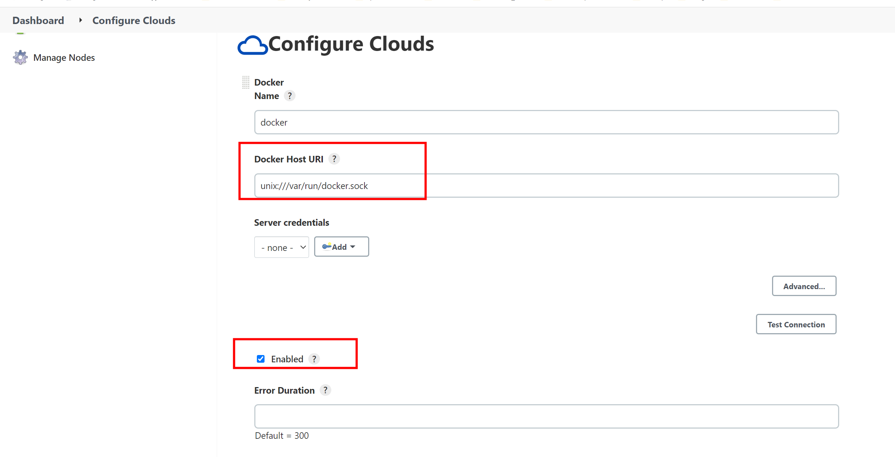
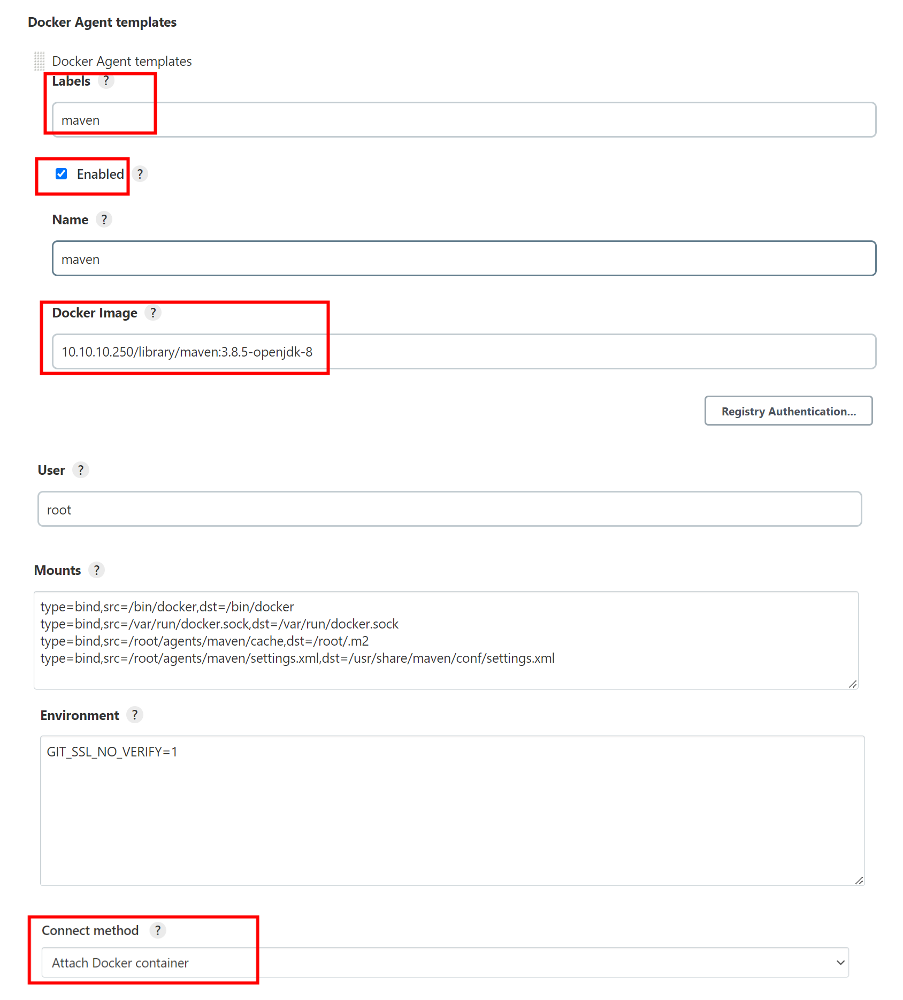

# usage

[toc]

### 安装jenkins（docker)

```shell
mkdir /root/jenkins-data
mkdir /root/jenkins-docker-certs
chown -R 1000 /root/jenkins-data
chown -R 1000 /root/jenkins-docker-certs

docker run --restart always -p 8080:8080 -itd -v /root/jenkins-data:/var/jenkins_home -v /root/jenkins-docker-certs:/certs/client:ro -v /bin/docker:/bin/docker -v /var/run/docker.sock:/var/run/docker.sock --group-add <docker_group_id> 10.10.10.250/library/jenkins/jenkins:2.332.2-jdk11
```

***

### 使用jenkins agent

agent用于执行controller下发的任务，安装好jenkins后，默认有一个build-in agent（即本地的agent）

#### 1.传统的静态agent（不建议）
agent需要一直运行着，并与controller保持连接，通过ssh或者其他相关协议

#### 2.基于云（docker或者k8s）的动态agent
* 需要安装：docker和kuberntes插件

需要创建agent模板，当指定用该agent执行任务时，会自动创建agent（即容器或者pod）去执行任务，当任务执行完成会自动删除该agent

#### 3.常用agent镜像（必须安装好了java）

* 能够方面使用，需要添加以下参数：
  * 能够使用docker: `-v /bin/docker:/bin/docker -v /var/run/docker.sock:/var/run/docker.sock -u root`
  * git支持unauthorized ca: `-e GIT_SSL_NO_VERIFY=1`

|agent image|description|extra args|env|
|-|-|-|-|
|`maven:3.8.5-openjdk-8`|提供maven|`-v /root/agents/maven/cache:/root/.m2 -v /root/agents/maven/settings.xml:/usr/share/maven/conf/settings.xml`||

#### 4.demo: 基于docker配置maven agent
注意-v源目录是docker所在机器得目录，所以即使jenkins是运行在容器内，-v源目录也是宿主机的目录

* 在docker所在机器上创建相关目录和文件
```shell
mkdir -p /root/agents/maven/cache
```
* 准备好配置文件：`/root/agents/maven/settings.xml`
```xml
<!-- 添加下面的配置 -->

<!-- 设置私库的账号密码 -->
<servers>
  <server>
    <id>maven-public</id>
    <username>admin</username>
    <password>cangoal</password>
  </server>
  <server>
    <id>kangpaas-release</id>
    <username>admin</username>
    <password>cangoal</password>
  </server>
  <server>
    <id>kangpaas-snapshot</id>
    <username>admin</username>
    <password>cangoal</password>
  </server>
</servers>

<!-- 设置中央仓库的地址 -->
<mirrors>
  <mirror>
     <id>central</id>
     <mirrorOf>central</mirrorOf>
     <name>central</name>
     <url>http://maven.aliyun.com/nexus/content/groups/public</url>
  </mirror>
</mirrors>

<!-- 注释下面内容，否则不能使用http协议连接私库 -->
<!--<mirror>
  <id>maven-default-http-blocker</id>
  <mirrorOf>external:http:*</mirrorOf>
  <name>Pseudo repository to mirror external repositories initially using HTTP.</name>
  <url>http://0.0.0.0/</url>
  <blocked>true</blocked>
</mirror>-->
```

* 配置maven agent
```shell
#docker host uri:
unix:///var/run/docker.sock

#image:
10.10.10.250/library/maven:3.8.5-openjdk-8

#voluems:
type=bind,src=/bin/docker,dst=/bin/docker
type=bind,src=/var/run/docker.sock,dst=/var/run/docker.sock
type=bind,src=/root/agents/maven/cache,dst=/root/.m2
type=bind,src=/root/agents/maven/settings.xml,dst=/usr/share/maven/conf/settings.xml

#env:
GIT_SSL_NO_VERIFY=1
```


