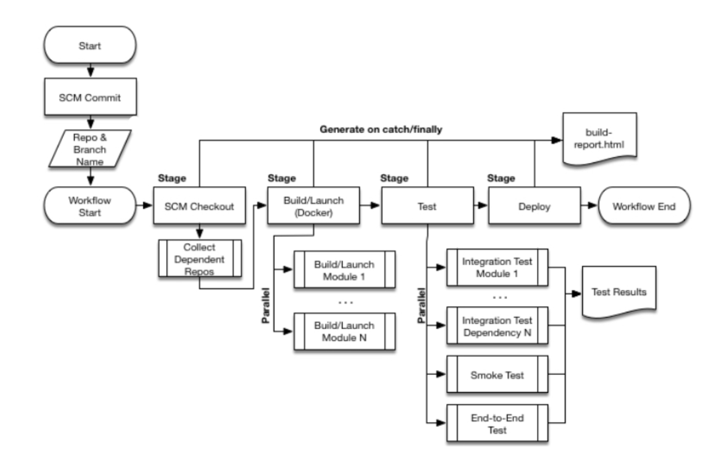

# pipeline

<!-- @import "[TOC]" {cmd="toc" depthFrom=1 depthTo=6 orderedList=false} -->
<!-- code_chunk_output -->

- [pipeline](#pipeline)
    - [概述](#概述)
      - [1.pipeline](#1pipeline)
        - [（1）两种语法：declarative 和 scripted](#1两种语法declarative-和-scripted)
      - [2.常用的CD场景](#2常用的cd场景)
      - [3.使用建议](#3使用建议)
    - [语法](#语法)
      - [1.单引号和双引号：](#1单引号和双引号)
        - [（1）需要转义的符合（当使用双引号时）](#1需要转义的符合当使用双引号时)
      - [2.基本格式](#2基本格式)
        - [（1）指定具体的计算单元：agent](#1指定具体的计算单元agent)
        - [（2）根据执行结果执行相应任务：post](#2根据执行结果执行相应任务post)
        - [（3）指定基础配置: options](#3指定基础配置-options)
        - [（4）设置环境变量](#4设置环境变量)
        - [（5）常用内置变量](#5常用内置变量)
        - [（6）设置参数](#6设置参数)
      - [3.steps常用语句](#3steps常用语句)
        - [（1）基础语句](#1基础语句)
        - [（2）执行shell命令: `sh`](#2执行shell命令-sh)
        - [（3）使用script语法](#3使用script语法)
        - [（4）同一个pipeline、同一次run中 不同agent数据共享：stash](#4同一个pipeline-同一次run中-不同agent数据共享stash)
        - [（5）不同pipeline、不同run共享文件: archiveArifacts和copyArtifacts](#5不同pipeline-不同run共享文件-archivearifacts和copyartifacts)
        - [（6）git](#6git)
        - [（7）在指定container中执行任务（当使用k8s agent时）](#7在指定container中执行任务当使用k8s-agent时)

<!-- /code_chunk_output -->

### 概述

#### 1.pipeline
是一系列任务的集合，将任务 **代码化**，用于 **CD（continuous delivery）** 通过 **Jenkinsfile** 文件定义

##### （1）两种语法：declarative 和 scripted
||decalrative（建议）|scripted|
|-|-|-|
|可读性|较高|较复杂|

#### 2.常用的CD场景


#### 3.使用建议
* Think of Pipeline as a tool to accomplish a build rather than the core of a build
pipeline中的基础语句主要作用是连接各个actions，不要过度使用，尽量使用一个sh完成多步操作

***

### 语法

[参考](https://www.jenkins.io/doc/book/pipeline/syntax/)

#### 1.单引号和双引号：
* 当需要传递`${...}`时，使用单引号，否则使用双引号
  * 比如：`sh("echo ${params.v1}")`，如果不使用双引号，`${params.v1}`会被传递给shell，但是这个明明是pipeline中设置的参数
  * 当使用双引号时，想把`${...}`传递给shell时，`\${...}`

  ```groovy
  //$v1会传递给shell
  //$v2不会传递给shell
  sh("""
    set -ex
    echo \$v1   
    echo $v2
  """)
  ```

##### （1）需要转义的符合（当使用双引号时）

|symbol|escape|
|-|-|
|`$`|`\$`|

#### 2.基本格式

* 基础语法

```groovy
//括号可以省略或者用空格替换，但是如果后面是一个文件块（{...}），不能省略
//所以建议括号都不要省略
<directive>(<arg1>: <value1>, <arg2>:<value2>)

//当只有一个参数时，参数名可以省略
<directive>(<value>)
```

|key|description|
|-|-|
|agent|能够执行任务的agent（通常是一个计算单元，比如节点、容器等）|
|stages|一个stage是一个任务子集（即包含多个steps）|
|steps|执行的最小单元|
|options|设置一些基础配置（比如超时时间等）|
|environment|设置环境变量，作用于全局或者某个stage（不仅能在pipeline中引用，还能在系统中引用该变量）|
|parameters|设置参数，用户执行pipeline时需要设置参数值（如果不设置，则用默认的）|
|when|设置执行的条件|
|parallel|设置并行执行|
|matrix|也可以并行（较复杂，通过设置参数，参数的组合决定了并行数，所以每个并行，参数值也不相同）|
|script|可以插入Scripted Pipeline，比较符合编程语言，有些地方使用比较方便|

* 基础结构
```groovy
pipeline {
    agent(any)             //选择执行的节点，这里表示可以在任何节点上
    options {
      timeout(time: 10, unit: 'MINUTES')  //如果该pipeline 10min还没执行完，则超时
      timestamps()    //控制台输出会加上时间
    }
    stages {              
        stage('Build') {  //定义Build stage
            steps {       
                //执行一些steps
            }
        }
        stage('Test') {
            steps {
                //执行一些steps
            }
        }
        stage('Deploy') {
            steps {
                //执行一些steps
            }
        }
    }
}
```

##### （1）指定具体的计算单元：agent
```groovy
//必须有一个全局的agent，也可以放在某个具体的stage中指定使用的agent
agent(<value>)
```
指定agent：

* any: `agent(any)`
* none: `agent(none)`
  * 一般全局的这样设置，表示不指定默认的agent
* label: `agent {label '<label1> &&  <label2>'}`
  * agent的名称也属于label
* node: `agent { node { label '<label1>' }  }`
* 不建议：
  * docker（需要agent存在docker命令）
  * dockerfile
  * kubernetes（需要配置好k8s cloud）
  ```groovy
  agent {
    kubernetes {
        defaultContainer 'kaniko'
        yaml '''
  kind: Pod
  spec:
    containers:
    - name: kaniko
      image: gcr.io/kaniko-project/executor:debug
      imagePullPolicy: Always
      command:
      - sleep
      args:
      - 99d
      volumeMounts:
        - name: aws-secret
          mountPath: /root/.aws/
        - name: docker-registry-config
          mountPath: /kaniko/.docker
    volumes:
      - name: aws-secret
        secret:
          secretName: aws-secret
      - name: docker-registry-config
        configMap:
          name: docker-registry-config
  '''
     }
  }
  ```
* 建议：使用cloud-based agent，即创建好agent template，然后指定该agent，即可实现动态agent

通用选项

```groovy
agent {
    node {
        label('<label>')   //用于匹配agent
        //customWorkspace('<path>')  //指定工作目录（绝对或相对路径），不指定使用默认的
    }
}
```

##### （2）根据执行结果执行相应任务：post
根据post所在的位置，决定当整个pipeline 或 某个stage 执行完，执行一些额外的任务
* 可以根据执行的结果（`<condition>`），决定是否执行，常用condition:
  * always  总是执行
  * changed 当这次执行结果与上次不同
  * fixed  当这次执行结果成功，上次执行结果failed或者unstable
```groovy
pipeline {
    ...
    //当整个pipeline执行完，执行下面的任务
    post {
        <condition> {
            echo('I will always say Hello again!')
        }
    }
}
```

##### （3）指定基础配置: options

* 全局的options
* stage中的options

##### （4）设置环境变量

* 设置环境变量（全局或stage）
```groovy
pipeline {
  agent any

  environment {
      v2="dsdssd"
  }

  stages {
    stage('Stage 1') {

        steps {

            //使用变量（注意单引号和双引号的区别）
            echo("$v2")
            echo('$v2')

            //注意使用的是双引号
            echo("${env.v2}")
        }
    }
  }
}
```

* 设置动态环境变量
```groovy
pipeline {
    agent any
    environment {
        // Using returnStdout
        CC = """${sh(
                returnStdout: true,
                script: 'echo "clang"'
            )}"""
        // Using returnStatus
        EXIT_STATUS = """${sh(
                returnStatus: true,
                script: 'exit 1'
            )}"""
    }
    stages {
        stage('Example') {
            environment {
                DEBUG_FLAGS = '-g'
            }
            steps {
                sh 'printenv'
            }
        }
    }
}

//输出结果：
//  ...
//  CC=clang
//  EXIT_STATUS=1
//  DEBUG_FLAGS=-g
```

##### （5）常用内置变量
[参考](https://www.jenkins.io/doc/book/pipeline/jenkinsfile/#using-environment-variables)

##### （6）设置参数
```groovy
pipeline {
    agent any
    parameters {

        //定义参数Greeing，默认值为：'Hello'
        string(name: 'Greeting', defaultValue: 'Hello', description: 'How should I greet the world?')
    }
    stages {
        stage('Example') {
            steps {

                //使用参数（注意双引号）
                echo "${params.Greeting} World!"
            }
        }
    }
}
```

#### 3.steps常用语句

[全部语法](https://www.jenkins.io/doc/pipeline/steps/)

##### （1）基础语句
[参考](https://www.jenkins.io/doc/pipeline/steps/workflow-basic-steps/)

```groovy
steps {

  echo('hello world')

  sleep(time: 1, unit: 'SECONDS')

  //切换目录执行部分steps（如果没有该目录会自动创建）
  dir('<path>') {
    echo("hello work")
  }

  //判断文件是否存在
  script {
    if (fileExists('src/main/rersources/index.html') {
        echo("File src/main/rersources/index.html found!")
    }
  }
}
```

##### （2）执行shell命令: `sh`
通过`set -e`：只要某个命令执行失败，脚本就会以失败退出（不加这个的话，即使命令失败，脚本还是往下执行，jenkins上显示也是执行成功）
```groovy
steps {
    //注意使用的双引号
    sh("""#!/bin/bash
        set -ex  
        echo 'Hello world!'
        ls /tmp/
    """)
}
```

##### （3）使用script语法
可以实现判断，定义变量等

```groovy
steps {
  script {
    def v1="aaa"
    echo "$v1"
    if (v1=="aaa") {
      echo "yes"
    }
    else {
      echo "no"
    }
  }
}
```

##### （4）同一个pipeline、同一次run中 不同agent数据共享：stash
```groovy
stages {
    stage('Stage 1') {

        agent {
            node {
                label('busybox')
                customWorkspace('/home/test')
            }
        }

        steps {
            dir(path: 'new') {
                sh('''#!/bin/bash
                    set -ex
                    echo 'hello world' > a.txt
                ''')
            }

            //将工作目录下的文件（包含所有子目录下的文件）都暂存到data
            //如果要暂存指定的目录，比如：stash(name: 'data', includes: 'dir1/**')
            stash(name: 'data', includes: '**')

        }
    }

    stage('Stage 2') {

        agent {
            node {
                label('maven')
                customWorkspace('/home/lil')
            }
        }

        steps {
            //恢复data中的文件到当前工作目录
            unstash(name: 'data')

            sh("""#!/bin/bash
                set -ex
                cat new/a.txt
            """)
        }
    }
}
```

##### （5）不同pipeline、不同run共享文件: archiveArifacts和copyArtifacts

* 首先保存arifacts: archiveArifacts
  * project: test-3
```groovy
//保存在controller上的<workspace>/下
stages {
    stage('Stage 1') {

        steps {
            dir(path: 'new') {
                sh("""#!/bin/bash
                    set -ex
                    echo 'hello world' > a.txt
                """)
            }

            archiveArtifacts(artifacts: '**')
        }
    }
}
```

* 其它pipeline获取arifacts: copyArtifacts
  * 需要安装copyArtifacts插件
```groovy
stages {
    stage('Stage 1') {
        steps {
            copyArtifacts(projectName: 'test-3', filter: '**', target: 'new-1')
            sh("""#!/bin/bash
                set -ex
                ls
                cat new-1/new/a.txt
            """)
        }
    }
}
```

##### （6）git

```groovy
steps {
  //拉取代码到当前目录（即.git在当前目录）
  git(url:'<url>', branch:'<branch>')
  //或：checkout($class: 'GitSCM', url:'<url>', branch:'<branch>')
}
```

##### （7）在指定container中执行任务（当使用k8s agent时）
* 如果不指定容器，默认使用jnlp这个容器执行任务
```groovy
steps {
  //如果不指定容器，默认使用jnlp这个容器执行任务
  sh("""#!/bin/bash
    set -ex
    echo "aaaa"
  """)

  //指定在nodejs这个容器中运行下面的任务
  container('nodejs') {
    sh("""#!/bin/bash
      set -ex
      echo "bbbb"
    """)
  }
}
```
