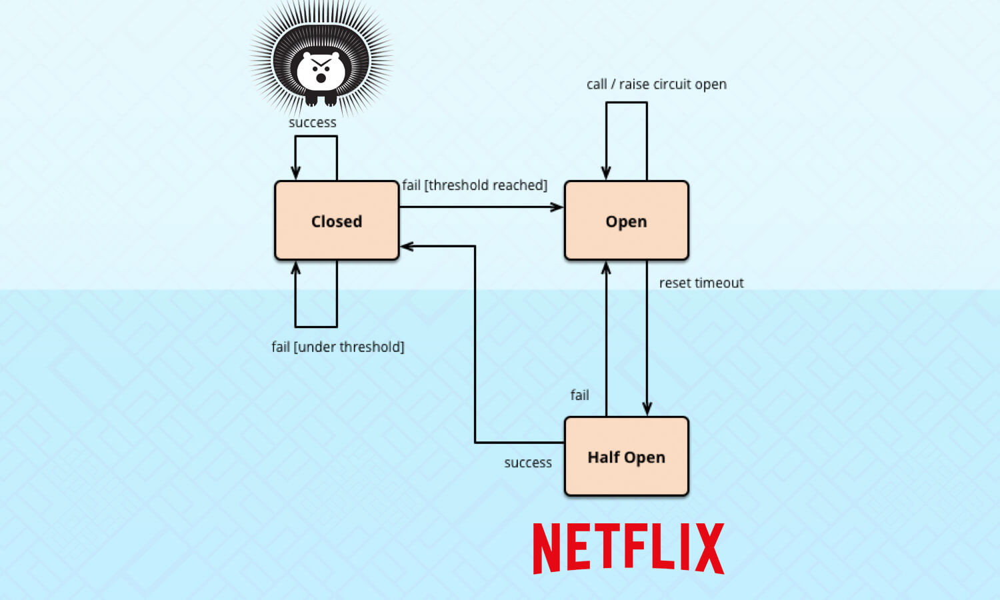

# servie fault tolerance

[toc]

### 概述

#### 1.servie fault tolerance

##### （1）what
用于处理分布式系统的 延迟 和 容错
能够保障一个依赖出问题的情况下，不会导致整体服务失败，避免级联故障，以提高分布式系统的弹性

* 服务降级（fallback）
* 服务熔断（circuit break）
* 服务限流（flowlimit）

##### （2）why

* 场景一：
  用户同时调用 A、B、C、D这几个服务，其中C服务响应非常慢，会导致整个系统的性能下降，从而导致其他服务的性能下降
* 场景二：
  用户调用A，A->B->C->D，其中C服务响应非常慢，当有更多用户请求过来时，会将A和B的资源占满，导致系统崩溃

#### 2.原则：设置在消费侧（即调用方）

#### 3.服务降级（fallback）

##### （1）发生的条件
* 运行异常
* 超时
* 服务熔断触发服务降级
* 线程池/信号量打满触发服务降级

#### 4.服务熔断（circuit breaker）
当链路的某个微服务出错或或者响应时间过长，会进行服务的降级，进而熔断该节点微服务的调用，快速返回错误的响应信息
当检测到该服务调用响应正常后，恢复调用链路

##### （1）断路器状态

|断路器状态|说明|
|-|-|
|closed|断路器关闭，允许所有请求通过|
|open|断路器打开，直接返回fallback方法，不去调用服务端|
|half-open|经过一段时间，让一个请求通过，如果成功，则切换为closed状态，如果失败，则切换为open状态|

##### （2）断路器相关参数（以hystrix为例子)
* 快照时间窗
  * 统计在这个时间窗内的请求和错误数据，从而决定断路器的状态
  * 默认10s: default_metricsRollingStatisticalWindow = 10000
* 请求总数阈值
  * 在快照时间窗内，必须满足请求总数阈值才有资格熔断
  * 默认为20: default_circuitBreakerRequestVolumeThreshold = 20
* 错误百分比阈值
  * 错误率达到这个阈值，才会打开断路器
  * 默认为50%: default_circuitBreakerErrorThresholdPercentage = 50
* 睡眠时间
  * open状态，经过这么长时间，会进入half-open状态，允许一个请求通过
  * 默认5s: default_circuitBreakerSleepWindowInMilliseconds = 5000

##### （3）断路器工作原理

* 断路器初始为closed状态
* closed状态下
  * 失败的情况 超过 设置的阈值 则将断路器切换为open状态
  * 否则一直处于closed状态
* open状态下
  * 经过一段时间切换为half-open状态
* half-open状态下
  * 会允许一个请求通过
  * 如果该请求成功，则切换为closed状态
  * 如果该请求失败，则切换为open状态
