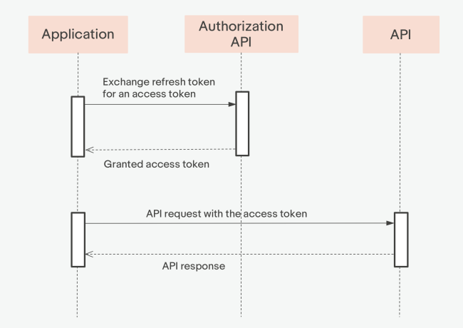

 # oauth2.0

[toc]

### 概述

#### 1.oatuh2.0
是一种授权协议

#### 2.基础概念

|概念|说明|通过微信登录百度的场景|
|-|-|-|
|Authrization server|授权服务|
|Resource server|资源服务|
|UserDetails、ResourceOwner|用户|微信号|
|ClientDetails、Client|客户端（即应用，不是所有客户端都能去授权服务申请授权，只有在授权服务中注册的客户端才能去申请授权）|百度在微信中的唯一索引（百度在微信中注册的），这样微信才能知道是百度来申请授权了|
|authenticate_code|临时授权码|
|access_toke|访问令牌|
|scope|权限范围|比如只有获取微信用户信息的权限，没有获取微信朋友圈的权限|
|redirect_uri|授权服务，将应用重定向到这个地址，并传递认证信息等到这个地址|

#### 3.oauth2.0 流程


* client向 资源所有者 申请授权
  * 资源所有者进行授权
* client向 授权服务 申请令牌
  * 授权服务返回令牌
* client用令牌向 资源服务 申请受保护的资源
  * 资源服务返回受保护的资源

#### 4.grant types

##### （1）authorization_code
* 临时授权码的作用：
  * 让用户知道该client从授权服务请求了哪些信息 并且 让用户进行确认，
  * 如果用户确认了，授权码会返回client，client可以利用该授权码获取token
  * 如果用户拒绝了，则授权码不会返回给client
* 所以授权码是一次性的


* 1: 用户 访问应用
* 2：应用 将用户重定向到 授权服务，让用户输入认证信息
* 3: 授权服务 收到用户认证信息
* 4: 授权服务 发送 授权码 给应用
* 5：应用 用授权码向授权服务申请token
* 6: 授权服务 给 应用 发放token

##### （2）client_credentials


* 不需要用户的参与

##### （3）refresh_token
* 当认证成功后，refresh_token会伴随着access_token一起返回
* 当access_token快过期时，利用refresh_token申请新的token



***

### 使用

#### 1.授权服务（uaa: User Account and Authentication）

##### （1）依赖
```xml
<dependency>
    <groupId>org.springframework.boot</groupId>
    <artifactId>spring-boot-starter-security</artifactId>
</dependency>
<dependency>
    <groupId>org.springframework.security.oauth</groupId>
    <artifactId>spring-security-oauth2</artifactId>
    <version>2.3.4.RELEASE</version>
</dependency>
<dependency>
    <groupId>org.springframework.security</groupId>
    <artifactId>spring-security-jwt</artifactId>
    <version>1.0.9.RELEASE</version>
</dependency>
```

##### （2）配置
```yml
server:
  servlet:
    context-path: /uaa
  port: 8100
spring:
  application:
    name: uaa-service
```

##### （3）代码

* 主程序

```java
@SpringBootApplication
@EnableAuthorizationServer
@EnableGlobalMethodSecurity(securedEnabled = true)
public class UaaServer {
    public static void main(String[] args) {
        SpringApplication.run(UaaServer.class, args);
    }
}
```

* 用户管理服务: `service/MyUserDetailsService.java`
```java
@Service
public class MyUserDetailsService implements UserDetailsService {
    @Override
    public UserDetails loadUserByUsername(String username) throws UsernameNotFoundException {
        /**
         * 这里可以根据用户输入的用户，然后查询数据库，获取其他信息（比如：密码、角色等）
         * 进行后续的认证
         **/

        //设置角色
        List<GrantedAuthority> auths = AuthorityUtils.commaSeparatedStringToAuthorityList("ROLE_admin");

        //User包含：用户名、密码、角色 三个信息
        //这里 返回的信息 会和 用户输入的信息 进行对比，从而确定该用户的权限
        return new User("liyi", new BCryptPasswordEncoder().encode("123456"), auths);
    }
}
```

* web配置: `config/MyWebSecurityConfig.java`
```java
@Configuration
@EnableWebSecurity
public class MyWebSecurityConfig extends WebSecurityConfigurerAdapter {

    //注入用户处理器
    @Autowired
    private UserDetailsService myUserDetailsService;

    //注入密码加密器
    @Bean
    public PasswordEncoder passwordEncoder() {
        return new BCryptPasswordEncoder();
    }

    //注入认证管理器
    @Bean
    public AuthenticationManager authenticationManagerBean() throws Exception {
        return super.authenticationManagerBean();
    }

    //uaa服务的web访问控制
    @Override
    public void configure(HttpSecurity http) throws Exception {
        http.csrf().disable()
                .authorizeRequests()
                .anyRequest().authenticated()
                .and()
                .formLogin();
    }
}
```

* 认证服务配置: `config/MyAuthorizationConfig.java`
```java
@Configuration
public class MyAuthorizationConfig extends AuthorizationServerConfigurerAdapter {

    //加载认证管理器
    @Autowired
    private AuthenticationManager authenticationManager;
    //加载用户处理器
    @Autowired
    private UserDetailsService userDetailsService;
    //加载客户端处理器
    @Autowired
    private ClientDetailsService clientDetailsService;


    //配置客户端信息
    @Override
    public void configure(ClientDetailsServiceConfigurer clients) throws Exception {
        clients.inMemory()
                .withClient("c1")  //client id
                .secret(new BCryptPasswordEncoder().encode("secret"))   //客户端密码
                .resourceIds("salary")  //客户端拥有的资源列表
                .authorizedGrantTypes("authorization_code","password","client_credentials","refresh_token") //支持的grant type
                .scopes("all")  //允许的授权范围
                .autoApprove(false) //跳转到授权页面
                .redirectUris("http://www.baidu.com");  //回调地址
    }

    //配置认证服务的endpoints
    @Override
    public void configure(AuthorizationServerEndpointsConfigurer endpoints) throws Exception {
        endpoints
//                .pathMapping("/oauth/xx", "/my/xx")     //修改oauth默认的path
                .authenticationManager(authenticationManager)           //管理认证的服务
                .userDetailsService(userDetailsService)                 //管理用户的服务
                .authorizationCodeServices(authorizationCodeServices()) //管理授权码的服务
                .tokenServices(tokenServices())                         //管理token的服务
                .allowedTokenEndpointRequestMethods(HttpMethod.POST);   //只接受POST请求
    }

    //配置endpoint的安全（即访问控制）
    @Override
    public void configure(AuthorizationServerSecurityConfigurer security) throws Exception {
        security
                .tokenKeyAccess("permitAll()")      // oauth/token_key 这个endpoint所有人都可以访问
                .checkTokenAccess("permitAll()")   // oauth/check_token 这个endpoint所有人都可以访问，当token不携带信息时，资源服务需要到这里验证收到的token
                .allowFormAuthenticationForClients();   //如何接受参数，默认通过url中的params，这里也允许通过表单也行
    }

    //配置令牌存储方式（比如：inmemory、redis、jwt等）
    @Bean
    public TokenStore tokenStore(){
        //使用基于内存的普通令牌
        return new InMemoryTokenStore();
    }

    //设置如何管理token
    public AuthorizationServerTokenServices tokenServices(){
        DefaultTokenServices service = new DefaultTokenServices();
        service.setClientDetailsService(clientDetailsService);
        service.setSupportRefreshToken(true);
        service.setTokenStore(tokenStore());
        service.setAccessTokenValiditySeconds(7200);
        service.setRefreshTokenValiditySeconds(259200);
        return service;
    }

    //设置授权码（authoriation_code模式下）的存储方式
    @Bean
    public AuthorizationCodeServices authorizationCodeServices(){
        return new InMemoryAuthorizationCodeServices();
    }
}
```


#### 2.测试认证服务器

##### （1）使用client_credentials方式
* 需要关注的参数
  * `client_id=c1&client_secret=secret`
  * `grant_type=client_credentials`
```shell
POST /uaa/oauth/token?client_id=c1&client_secret=secret&grant_type=client_credentials HTTP/1.1
Host: 127.0.0.1:8100
```
* 返回结果
```json
{
    "access_token": "08620b91-9915-4317-a0ed-12b2b836f293",
    "token_type": "bearer",
    "expires_in": 7171,
    "scope": "all"
}
```

##### （2）使用password方式
* 需要关注的参数
  * `client_id=c1&client_secret=secret`
  * `grant_type=password`
  * `username=liyi&password=123456`

```shell
POST /uaa/oauth/token?client_id=c1&client_secret=secret&grant_type=password&username=liyi&password=123456 HTTP/1.1
Host: 127.0.0.1:8100
```
* 返回结果
```json
{
    "access_token": "0f2f026f-c8f5-4d0d-826a-575a5ef473f9",
    "token_type": "bearer",
    "refresh_token": "adcd748f-f9c6-4676-85e0-d6a05666c017",
    "expires_in": 7135,
    "scope": "all"
}
```

##### （3）使用grant_type方式

* 获取授权码
  * 授权码使用后立马失效

```shell
http://127.0.0.1:8100/uaa/oauth/authorize?client_id=c1&response_type=code&redirect_uri=http://www.baidu.com
```


* 获取token
  * `client_id=c1&client_secret=secret`
  * `grant_type=authorization_code`
  * `code=rUYGHG`
  * `redirect_uri=http://www.baidu.com`
```shell
POST /uaa/oauth/token?client_id=c1&client_secret=secret&grant_type=authorization_code&code=rUYGHG&redirect_uri=http://www.baidu.com HTTP/1.1
Host: 127.0.0.1:8100
```

* 返回结果
```
{
    "access_token": "9eece4d1-3c27-410b-a2a4-d27e9628cb09",
    "token_type": "bearer",
    "refresh_token": "6d8e7b83-b327-4bb5-acbb-c62a85a5f859",
    "expires_in": 6797,
    "scope": "all"
}
```

##### （4）使用refresh_token方式
* 需要关注的参数
  * `client_id=c1&client_secret=secret`
  * `grant_type=refresh_token`
  * `refresh_token=6d8e7b83-b327-4bb5-acbb-c62a85a5f859`
```shell
#refresh_token的值是获取token时同时获取的
POST /uaa/oauth/token?client_id=c1&client_secret=secret&grant_type=refresh_token&refresh_token=6d8e7b83-b327-4bb5-acbb-c62a85a5f859 HTTP/1.1
Host: 127.0.0.1:8100
```

* 返回结果
```json
{
    "access_token": "9eece4d1-3c27-410b-a2a4-d27e9628cb09",
    "token_type": "bearer",
    "refresh_token": "6d8e7b83-b327-4bb5-acbb-c62a85a5f859",
    "expires_in": 7200,
    "scope": "all"
}
```

#### 3.资源服务

##### （1）依赖
```xml
<dependency>
    <groupId>org.springframework.boot</groupId>
    <artifactId>spring-boot-starter-security</artifactId>
</dependency>
<dependency>
    <groupId>org.springframework.security.oauth</groupId>
    <artifactId>spring-security-oauth2</artifactId>
    <version>2.3.4.RELEASE</version>
</dependency>
<dependency>
    <groupId>org.springframework.security</groupId>
    <artifactId>spring-security-jwt</artifactId>
    <version>1.0.9.RELEASE</version>
</dependency>
```

##### （2）配置
```yml
server:
  port: 8101
spring:
  application:
    name: salary-service
```

##### （3）代码
* 主程序
```java
@SpringBootApplication
@EnableResourceServer
@EnableGlobalMethodSecurity(securedEnabled = true)
public class SalaryMain {
    public static void main(String[] args) {
        SpringApplication.run(SalaryMain.class, args);
    }
}
```

* 接口服务: `controller/HelloController`
```java
@RestController
public class HelloController {
    @RequestMapping("/salary/hello")
//    @Secured("ROLE_admin")
    public String hello(){
        System.out.println("aaaaaaaaaaaa");
        return "Hello! I'm Salary";
    }
}
```

* 资源服务配置: `config/MyResourceServerConfig`
```java
@Configuration
public class MyResourceServerConfig extends ResourceServerConfigurerAdapter {
    public static final String RESOURCE_SALARY="salary";

    //配置资源服务器的oauth相关配置
    @Override
    public void configure(ResourceServerSecurityConfigurer resources) throws Exception {
        resources.resourceId(RESOURCE_SALARY)       //设置资源ID（只有token包含这些资源id，才能访问这些资源）
                .tokenServices(tokenServices())    //如何验证token
                .stateless(true);   //无状态模式（即不使用session）
    }

    //对资源访问进行控制
    @Override
    public void configure(HttpSecurity http) throws Exception {
        http.authorizeRequests()    //校验请求
                .antMatchers("/salary/**")
                .access("#oauth2.hasScope('all')")  //只有token对应的用户匹配了scope才能访问资源
                .antMatchers("/salary/**").hasRole("admin") //只有token对应的用户匹配了这个角色才能访问资源
                .and().csrf().disable()
                .sessionManagement().sessionCreationPolicy(SessionCreationPolicy.STATELESS);    //不需要管session
    }

    //配置token的验证方式
    public ResourceServerTokenServices tokenServices(){
        RemoteTokenServices services = new RemoteTokenServices();
        services.setCheckTokenEndpointUrl("http://127.0.0.1:8100/uaa/oauth/check_token");
        services.setClientId("c1");
        services.setClientSecret("secret");
        return services;
    }
}
```
