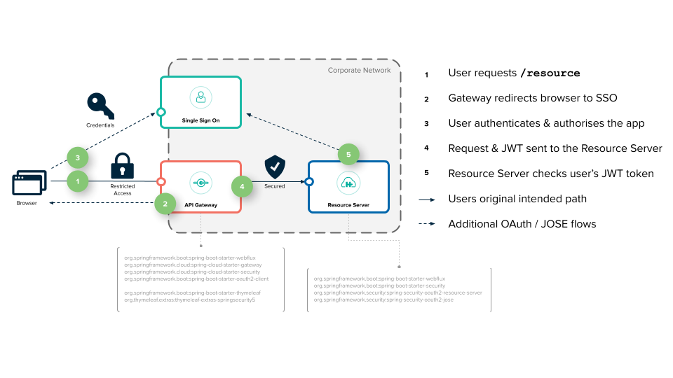
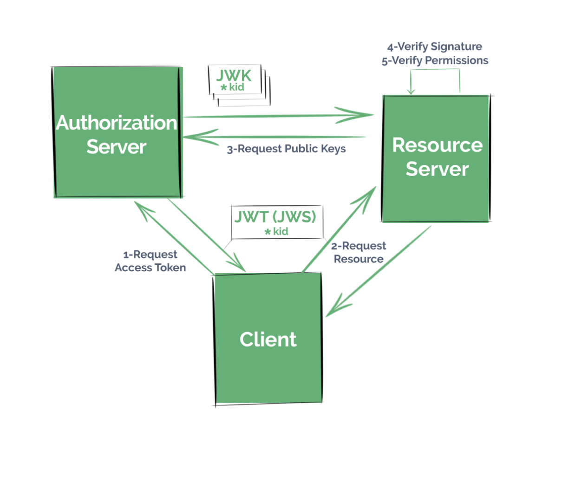
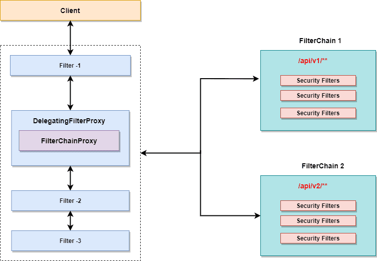
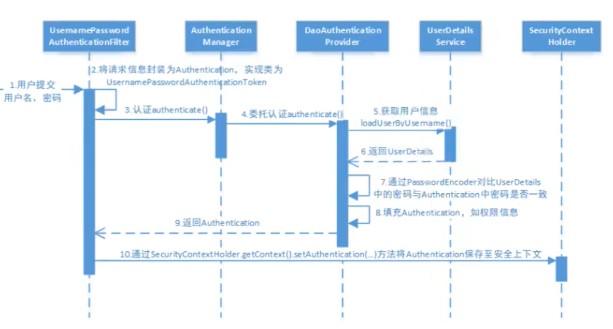
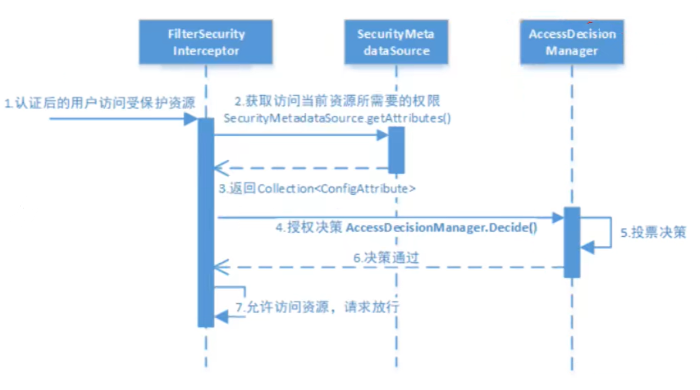

# overview

[toc]

### 预备知识

#### 1.相关概念

##### （1）会话超时

##### （2）自动登录
不必每次都输入账号密码（浏览器缓存了token）


##### （3）单点登录: SSO（single sign on）
只要在一个地方登录，其他服务都可以进行访问

* sso一般也放在API Gateway后面

##### （4）联合身份管理：FIM（federated identity management）
比如可以用微信账号登录百度、美团等其他平台

#### 2.认证授权实现的两种方式

##### （1）基于session（cookie）
* 不适合分布式应用
  * 这种就需要集中式session（比如通过redis实现）
  * 当应用越来越多时，这种方式就会存在性能瓶颈

##### （2）基于token
* 普通token（不携带信息）
  * 拿到token后，需要去check
    * 比如去authorization server上check
    * 如果使用的是redis存储的token，也可以去redis上check

* JWT（携带信息）
  * 无需再去check，但是需要验证密钥的来源
    * 非对称加密: public key可以直接设置在resource server中，不必去authorization server上去取
    * 对称加密：在授权服务和资源服务都设置好对称密钥
  


##### （3）对比

||session-based|token-based|
|-|-|-|
|状态|有状态（用户数据存在server端的session中）|无状态（用户数据存在token中，token存在client的cookie中，当采用非JWT类型的token时，部分数据还是存在服务端的）|
|验证方式|根据sessionid，server端需要进行查询验证|根据token的签名验证token的有效性（用证书），根据token携带的信息获取用户信息|
|应用场景|单体应用|分布式应用|
|缺点|不适合分布式场景，当使用集中session时，需要考虑性能、数据不丢失等问题|token存在客户端容易泄露</br>当使用jwt格式的token时，携带的信息较多，占用带宽|

#### 3.toekn广泛使用的格式：JWT（json web token）
* 本质就是 encode的字符串，本身携带了相关信息，无需再去查询
* 原始数据 就是json
* token格式: `<header>.<payload>.<signature>`
  * `<header>`: token的头信息
  * `<payload>`: token所携带的信息（原始数据进行了encode）
  * `<signature>`: token的签名，用于验证token的来源
* 存储在客户端，一般在请求头中使用：`Authorization: <token_type> <token>`
  * `<token_type>`: token的类型，最常见的是 Bearer

***

### 概述

#### 1.spring security

##### （1）what
本质就是filters chain（过滤器链）



#### 2.filter

##### （1）filter chain


##### （2）认证过滤器：UsernamePasswordAuthenticationFilter


##### （3）鉴权过滤器：FilterSecurityInterceptor



***

### 使用

#### 1.引入依赖
```xml
<dependency>
    <groupId>org.springframework.boot</groupId>
    <artifactId>spring-boot-starter-security</artifactId>
</dependency>
```

#### 2.基本使用

##### （1）自定义用户认证并授权
* `service/UserDetailsService.java`
```java
@Service
public class MyUserDetailsService implements UserDetailsService {
    @Override
    public UserDetails loadUserByUsername(String username) throws UsernameNotFoundException {
        /**
         * 这里可以根据用户输入的用户，然后查询数据库，获取其他信息（比如：密码、角色等）
         * 进行后续的认证
        **/

        //设置权限（一个是直接赋权，一个是赋予角色）
        //如果是角色的话，必须遵循下面的格式：ROLE_xx
        //下面说明：赋予了admin权限，并且赋予了test这个角色
        List<GrantedAuthority> auths = AuthorityUtils.commaSeparatedStringToAuthorityList("admin", "ROLE_test");

        //User包含：用户名、密码、角色 三个信息
        //这里 返回的信息 会和 用户输入的信息 进行对比，从而确定该用户的权限
        return new User("liyi", new BCryptPasswordEncoder().encode("123456"), auths);
    }
}
```

##### （2）创建配置类

* `config/SecurityConfig.java`

```java
@Configuration      
@EnableWebSecurity  //开启web安全
public class SecurityConfig {

    @Resource
    private MyUserDetailsService myUserDetailsService;

    //设置对 用户输入的明文密码 的加密方式（必须要加密）
    @Bean
    public PasswordEncoder passwordEncoder() {
        return new BCryptPasswordEncoder();
    }

    //对用户进行 鉴权
    //这里使用的是filterchain方式，还可以使用注解的方式（参考下文）
    @Bean
    SecurityFilterChain filterChain(HttpSecurity http) throws Exception {
        http.authorizeHttpRequests((authorize) -> authorize
                        .mvcMatchers("/hello").hasAuthority("admin")    //表示用户只有具备admin权限，才能访问/hello
                        .mvcMatchers("/test").hasRole("test")           //表示只有test角色的用户才能访问/test
                        .anyRequest().authenticated()     //表示所有的请求都需要进行认证
        );
        http.formLogin();
        return http.build();
    }
}
```

##### （3）创建测试接口
* `controller/HelloController.java`
```java
@RestController
public class HelloController {

    @RequestMapping("/hello")
    public String hello(){
        System.out.println("aaaaaaaaaaaa");
        return "hello";
    }
}
```

#### 2.常用注解

|注解|说明|
|-|-|
|`@Secured`和`@PreAuthorize`|在访问方法之前进行鉴权|
|`@PostAuthorize`|在方法执行之后进行鉴权|
|`@PreFilter`|对传入的数据做过滤|
|`@PostFilter`|对返回的数据做过滤|

##### （1）通过注解的方式进行权限认证：`Secured`
* 就不需要使用filterChain那种方式了（其他都跟上面保持一致）
* 主函数
```java
@SpringBootApplication
@EnableGlobalMethodSecurity(securedEnabled = true)
public class SecurityMain {
    public static void main(String[] args) {
        SpringApplication.run(SecurityMain.class, args);
    }
}
```

* 使用: `controller/HelloController.java`
```java
@RestController
public class HelloController {

    @RequestMapping("/hello")
    @Secured("ROLE_admin")   //表示只有admin这个角色，能访问这个方法
    public String hello(){
        return "hello";
    }
}
```

#### 3.其他基础使用

下面只是粗略说明（具体参考相关文档）

* 用户注销
```java
http.logout()
```

#### 4.结合oauth2.0使用

* 引入依赖
```xml
<dependency>
    <groupId>org.springframework.boot</groupId>
    <artifactId>spring-boot-starter-security</artifactId>
</dependency>
<dependency>
    <groupId>ru.mynewtons</groupId>
    <artifactId>spring-boot-starter-oauth2</artifactId>
</dependency>
```
