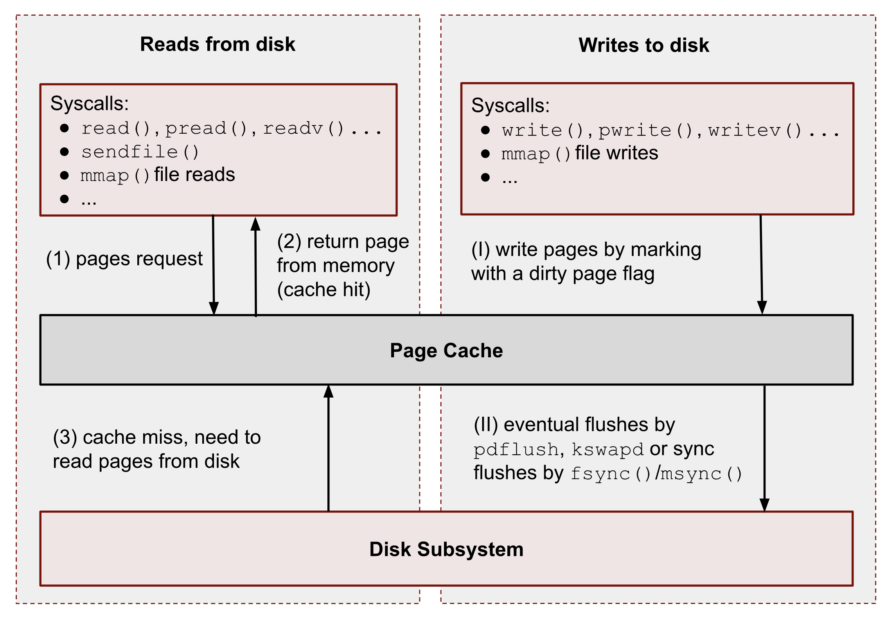

# disk

[toc]

### 概述

#### 1.基础概念

##### （1）I/O
* 一次读写请求
  * 在linux中，一次I/O就是调用一次 write/read系统调用
  * 一般I/O操作都是**异步**的，为了提高性能
    * 即先 写入/读取 到内存中，所以`I/O request size < 可用内存的大小`

##### （2）I/O Request Size
* 一次I/O的数据大小，由**应用程序指定**，一般设为 512B ~ 256KB
  * 数据先 写入/读到 内存中，所以`I/O request size < 可用内存的大小`

#### 2.性能指标

|指标|说明|意义|合理的值|
|-|-|-|-|
|IOPS|每秒进行的I/O操作次数|吞吐量固定，I/O的大小决定了IOPS|硬盘（55-180） 固态（3,000 – 40,000）|
|throughout（Bandwidth ）|每秒最大的写入|`IOPS * I/O size`||
|latency|完成一次I/O请求需要的时间|IOPS越多 或 一次I/O数据越多，会导致latency升高|硬盘（10 ~ 20 ms） 固态（1 ~ 3 ms）|
|time spent doing I/Os（单位：百分比）|查看磁盘的忙碌情况，对于并行的设备：比如ssd、raid，这个值参考意义不大||
