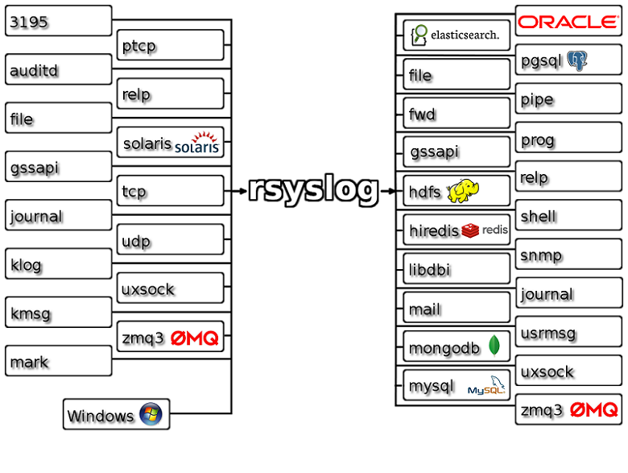

<!-- @import "[TOC]" {cmd="toc" depthFrom=1 depthTo=6 orderedList=false} -->
<!-- code_chunk_output -->

- [rsyslog(rocket-fast syslog)](#rsyslogrocket-fast-syslog)
    - [概述](#概述)
      - [1.rsyslog功能](#1rsyslog功能)
      - [2.处理流程](#2处理流程)
      - [3.input](#3input)
      - [4.rules](#4rules)
        - [（1）selector（选择器）](#1selector选择器)
        - [（2）actions](#2actions)
- [systemd-journald](#systemd-journald)
    - [概述](#概述-1)
      - [1.特点](#1特点)
      - [2.收集以下日志：](#2收集以下日志)
- [logrotate](#logrotate)
    - [概述](#概述-2)
      - [特点](#特点)
    - [配置](#配置)
    - [demo](#demo)
      - [1.对docker日志进行logrotate](#1对docker日志进行logrotate)

<!-- /code_chunk_output -->

# rsyslog(rocket-fast syslog)

### 概述

#### 1.rsyslog功能
* 接收多种方式的输入
* 转换
* 输出到多种目的地


#### 2.处理流程
```mermaid
graph LR
A("Input") --> B("RuleSet")
B --> C("Output")
```

#### 3.input
|模块名|说明|
|-|-|
|imuxsock|input module unix socket，通过Unix socket 收集系统进程的日志|
|imklog|input module module，收集内核日志|
|imjournal|input module journal，收集journald服务收集到的日志|
|imudp|input module udp，监听在某个UDP端口，接收日志|
|imtcp|input module tcp，监听在某个TCP端口，接收日志|

#### 4.rules
每个rule 由 selector + action 组成
##### （1）selector（选择器）
selector：`<facility>.<level>`

facility：
```shell
#man 3 syslog查看
auth          #security/authorization messages
authpriv      #security/authorization messages (private)

daemon        #没有单独的facility值的系统守护进程
kern          #kernel messages
...
```
level：
```shell
debug
info
notice
warning
error
crit
alert
emerg
```
##### （2）actions
* 文件
* 远程主机
```shell
*.* @<IP>:<PORT>    #通过UDP协议发送
*.* @@<IP>:<PORT>   #通过TCP协议发送
```

***

# systemd-journald
### 概述
#### 1.特点
* journald是systemd自带的服务，**配置文件**：`/etc/systemd/journald.conf`
* 日志以**二进制**形式存放
* 如果存在`/var/log/journal/`目录，则日志会被**持久化**存储在该目录下
* 如果不存在该目录，则日志会被**临时**存放在`/run/log/journal/`目录下，重启后里面的内容会丢失
#### 2.收集以下日志：
* 通过kmsg收集**内核日志**
* 通过syslog等库函数收集**简单的系统日志**
* 收集systemd管理的**服务的日志**
* 收集**审计日志**

***
# logrotate
### 概述
#### 特点
* 用于轮替日志
* 由cron定时任务，每天执行（`/etc/cron.daily/logrotate`）
* 执行的内容在`/etc/logrotate.conf`中定义

### 配置
```shell
/var/log/nginx/*.log {

  #日志按天轮询
  daily

  #在日志轮循期间，任何错误将被忽略
  missingok

  #保留5个文档
  rotate 5

  #已轮循的归档将使用gzip进行压缩
  compress
  #delaycompress选项指示logrotate不要将最近的归档压缩
  delaycompress

  #如果日志文件为空，轮循不会进行
  notifempty

  #指定由该配置文件生成的新文件的权限
  create 640 nginx adm

  #在所有其它指令完成后，postrotate和endscript之间指定的命令将被执行
  sharedscripts
  postrotate
          if [ -f /var/run/nginx.pid ]; then
                  kill -USR1 `cat /var/run/nginx.pid`
          fi          
  endscript
}
```

### demo
#### 1.对docker日志进行logrotate
```shell
/var/lib/docker/containers/*/*.log {
    daily
    rotate 5

    #复制原文件，然后清空原文件
    #不设置这一下就移走原文件，然后生成新文件
    copytruncate

    missingok  
    compress

    #logrotate执行的时候，如果文件没有到一天的时间，但是超过了50m，则依然logrotate
    maxsize 50m
    #logrotate执行的时候，如果文件到了一天的时间，但是没有到10m，则不logrotate
    minsize 10m
}
```
