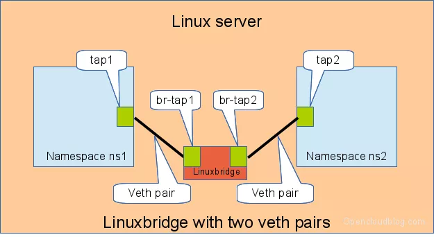

# network
[toc]
### network namesapce
#### 1.ip netns命令
* 创建netns
```shell
ip netns add <NAME>
```
* 列出所有netns
```shell
 ip netns list
```
* 在指定netns中执行命令
```shell
ip netns exec <NAME> <CMD>

#切换到指定netns中
ip netns exec <NAME> bash
```

#### 2.容器的netns
默认`ip netns`无法显示和操作容器中的netns
* 获取容器的pid
```shell
pid=`docker inspect -f '{{.State.Pid}}' <CONTAINER_ID>`
#根据pid可以找到netns：
#  /proc/<PID>/net/ns
```
* 创建`/var/run/netns/`目录
```shell
mkdir -p /var/run/netns/
```

* 将netns连接到`/var/run/netns/`目录下
```shell
ln -s /proc/<PID>/net/ns /var/run/netns/<CUSTOME_NAME>

#ip netns list就可以看到该netns
```

***

### veth pair（virtual ethernet pair）
#### 1.概述
veth-pair 就是一对的虚拟设备接口，和 tap/tun 设备不同的是，它都是**成对出现**的。一端连着**协议栈**，一端**彼此相连**着


#### 2.连接两个netns

```shell
# 创建 namespace
ip netns a ns1
ip netns a ns2

# 创建一对 veth-pair veth0 veth1
ip l a veth0 type veth peer name veth1

# 将 veth0 veth1 分别加入两个 ns
ip l s veth0 netns ns1
ip l s veth1 netns ns2

# 给两个 veth0 veth1 配上 IP 并启用
ip netns exec ns1 ip a a 10.1.1.2/24 dev veth0
ip netns exec ns1 ip l s veth0 up
ip netns exec ns2 ip a a 10.1.1.3/24 dev veth1
ip netns exec ns2 ip l s veth1 up
```

#### 3.通过Bridge相连

```shell
# 首先创建 bridge br0
ip l a br0 type bridge
ip l s br0 up

# 然后创建两对 veth-pair
ip l a veth0 type veth peer name br-veth0
ip l a veth1 type veth peer name br-veth1

# 分别将两对 veth-pair 加入两个 ns 和 br0
ip l s veth0 netns ns1
ip l s br-veth0 master br0
ip l s br-veth0 up

ip l s veth1 netns ns2
ip l s br-veth1 master br0
ip l s br-veth1 up

# 给两个 ns 中的 veth 配置 IP 并启用
ip netns exec ns1 ip a a 10.1.1.2/24 dev veth0
ip netns exec ns1 ip l s veth0 up

ip netns exec ns2 ip a a 10.1.1.3/24 dev veth1
ip netns exec ns2 ip l s veth1 up
```
