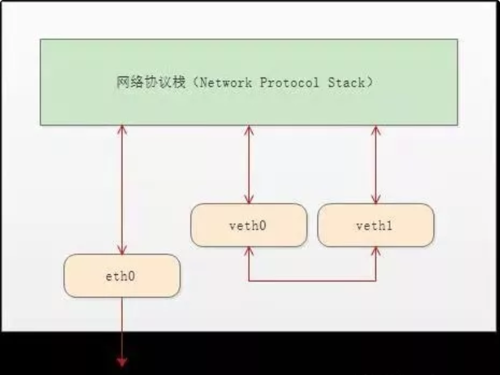

# network

[toc]

### 概述

#### 1.物理网卡
```            
            physical network adapter
                +-------------+   
                | Socket API  |   
                +-------------+              
User Space             |
-----------------------------------------------
Kernel Space           |
                 raw packets
                       |              
                +-------------+  
                |Network Stack|   
                +-------------+  
                       |                  
                +-------------+   
                |    eth0     |  
                +-------------+  
                       |                  
                +-------------+   
                |     NIC     |  
                +-------------+      
                       |   
                      wire
```

#### 2.virtual networking devices（虚拟网络设备）

##### （1）TUN/TAP
* 用软件虚拟的网络设备（功能跟物理网卡一样）
* 一端连着协议栈，另一端连着用户空间（`/dev/net/xx`）
```
                    TUN                TAP
                +-------------+    +-------------+
                | Socket API  |    |  Socket API |
                +-------------+    +-------------+
                      |                  |
                +-------------+    +-------------+
                |     APP     |    |     APP     |
                +-------------+    +-------------+
                      |                  |
User Space      +-------------+    +-------------+
----------------|  /dev/tunX  | ---|  /dev/tapX  | ----------------
Kernel Space    +-------------+    +-------------+
                      |                  |
                  layer3 packets     raw packets
                      |                  |
                +-------------+    +-------------+
                |Network Stack|    |Network Stack|
                +-------------+    +-------------+
                      |                  |
                +-------------+    +-------------+
                |    tunX     |    |    tapX     |
                +-------------+    +-------------+
```

##### （2）veth
* 成对出现
  * 一端连着协议栈，一端彼此相连
* 跟镜像一样
  * 一个veth的外出流量是另一个veth的进入流量
```
                            Veth Pair
                +-------------+    +-------------+
                | Socket API  |    |  Socket API |
                +-------------+    +-------------+
User Space             |                  |
-------------------------------------------------------------------
Kernel Space           |                  |
                       |                  |
                    raw packets        raw packets
                       |                  |
                +-------------+    +-------------+
                |Network Stack|    |Network Stack|
                +-------------+    +-------------+
                       |                  |
                +-------------+    +-------------+
                |    vethX    |    |    vethX    |
                +-------------+    +-------------+
                       |                  |
                       +------------------+

```


#### 3.TUN/TAP和veth的区别
||TUN/TAP|veth|
|-|-|-|
|数量|单个|成对|
|用途|虚拟网卡（通过`/dev/net/xx`可以读写数据到协议栈）|连接不同network namespace|
|本质|虚拟的网卡（跟物理网卡功能一样）|像虚拟的一根线|

#### 4.判断设备属于何种类型（physical、TUN/TAP或者veth）

##### （1）首先判断是否是虚拟
```shell
ls -l /sys/class/net/   #带virtual的都是虚拟设备
```

##### （2）如果虚拟，判断是否成对
```shell
cat /sys/class/net/<NAME>/ifindex
cat /sys/class/net/<NAME>/iflink
#如果两个不相等，表示成对，否则不成对
#成对的就是veth
#不成对的就是TUN/TAP
```

***

### 使用
#### 1.network namesapce

##### （1）ip netns命令

* 创建netns
```shell
ip netns add <NAME>
```

* 列出所有netns
```shell
 ip netns list
```

* 在指定netns中执行命令
```shell
ip netns exec <NAME> <CMD>

#切换到指定netns中
ip netns exec <NAME> bash
```

##### （2）容器的netns
默认`ip netns`无法显示和操作容器中的netns
* 获取容器的pid
```shell
pid=`docker inspect -f '{{.State.Pid}}' <CONTAINER_ID>`
#根据pid可以找到netns：
#  /proc/<PID>/net/ns
```

* 创建`/var/run/netns/`目录
```shell
mkdir -p /var/run/netns/
```

* 将netns连接到`/var/run/netns/`目录下
```shell
ln -s /proc/<PID>/ns/net /var/run/netns/<CUSTOME_NAME>

#ip netns list就可以看到该netns
```

#### 2.veth pair（virtual ethernet pair）

##### （1）连接两个netns

```shell
# 创建 namespace
ip netns add ns1
ip netns add ns2

# 创建一对 veth-pair veth0 veth1
ip link add veth0 type veth peer name veth1

# 将 veth0 veth1 分别加入两个 ns
ip link set veth0 netns ns1
ip link set veth1 netns ns2

# 给两个 veth0 veth1 配上 IP 并启用
ip netns exec ns1 ip addr add 10.1.1.2/24 dev veth0
ip netns exec ns1 ip link set veth0 up
ip netns exec ns2 ip addr add 10.1.1.3/24 dev veth1
ip netns exec ns2 ip link set veth1 up
```

##### （2）通过Bridge相连

```shell
# 首先创建 bridge br0
ip link add br0 type bridge
ip link set br0 up

# 然后创建两对 veth-pair
ip link add veth0 type veth peer name br-veth0
ip link add veth1 type veth peer name br-veth1

# 分别将两对 veth-pair 加入两个 ns 和 br0
ip link set veth0 netns ns1
ip link set br-veth0 master br0
ip link set br-veth0 up

ip link set veth1 netns ns2
ip link set br-veth1 master br0
ip link set br-veth1 up

# 给两个 ns 中的 veth 配置 IP 并启用
ip netns exec ns1 ip addr add 10.1.1.2/24 dev veth0
ip netns exec ns1 ip link set veth0 up

ip netns exec ns2 ip addr add 10.1.1.3/24 dev veth1
ip netns exec ns2 ip link set veth1 up
```

#### 3.TUN/TAP

##### （1）创建TUN/TAP
```shell
ip tuntap add tap0 mode tap
```
