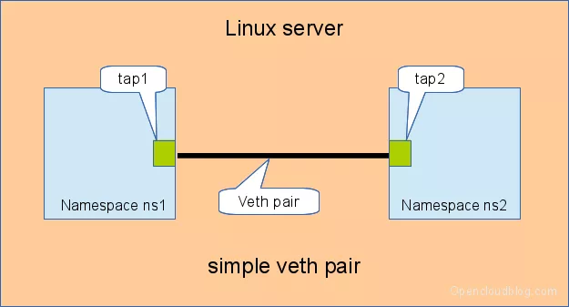
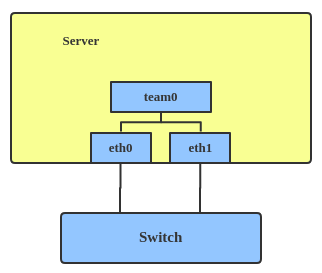
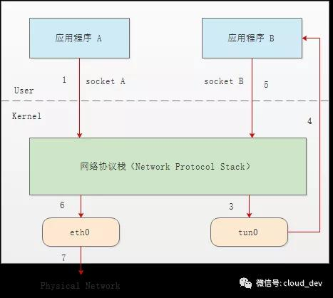

# virtual networking

[toc]

### 准备知识

#### 1.查看指定类型设备能够配置的参数：

##### （1）`man ip link`
常用的都能查到

##### （2）利用驱动查看（如果上面查不到）
```shell
modinfo /lib/modules/3.10.0-957.el7.x86_64/kernel/drivers/<TYPE>/<TYPE>.ko.xz
```

#### 2.-----------------------注意---------------------------------

* 连接着**同一个netns下的协议栈**，也是一种**连接**
  * 那为什么还需要veth、bridge等连接
    * 走协议栈花销更大
    * bridge等功能比协议栈丰富
* 如果没有连接同一个netns下的协议栈，就需要用veth等方式进行连接
* 重点要看**路由表**，是怎么转发的（即使是局域网内的ip也需要看路由表）

***

### veth pair

#### 1.概述

* 成对出现
  * 一端连着协议栈，一端彼此相连
* 跟镜像一样
  * 一个veth的外出流量是另一个veth的进入流量

```
                +-------------+    +-------------+
                | Socket API  |    |  Socket API |
                +-------------+    +-------------+
User Space             |                  |
-------------------------------------------------------------------
Kernel Space           |                  |
                       |                  |
                    raw packets        raw packets
                       |                  |
                +--------------------------------+
                |          Network  Stack        |
                +--------------------------------+
                       |                  |
                +-------------+    +-------------+
                |    vethX    |    |    vethX    |
                +-------------+    +-------------+
                       |                  |
                       +------------------+

```


#### 2.使用

##### （1）连接两个netns

```shell
# 创建 namespace
ip netns add ns1
ip netns add ns2

# 创建一对 veth-pair veth0 veth1
ip link add veth0 type veth peer name veth1

# 将 veth0 veth1 分别加入两个 ns
ip link set veth0 netns ns1
ip link set veth1 netns ns2

# 给两个 veth0 veth1 配上 IP 并启用
ip netns exec ns1 ip addr add 10.1.1.2/24 dev veth0
ip netns exec ns1 ip link set veth0 up
ip netns exec ns2 ip addr add 10.1.1.3/24 dev veth1
ip netns exec ns2 ip link set veth1 up
```

##### （2）通过Bridge相连

```shell
# 首先创建 bridge br0
ip link add br0 type bridge
ip link set br0 up

# 然后创建两对 veth-pair
ip link add veth0 type veth peer name br-veth0
ip link add veth1 type veth peer name br-veth1

# 分别将两对 veth-pair 加入两个 ns 和 br0
ip link set veth0 netns ns1
ip link set br-veth0 master br0
ip link set br-veth0 up

ip link set veth1 netns ns2
ip link set br-veth1 master br0
ip link set br-veth1 up

# 给两个 ns 中的 veth 配置 IP 并启用
ip netns exec ns1 ip addr add 10.1.1.2/24 dev veth0
ip netns exec ns1 ip link set veth0 up

ip netns exec ns2 ip addr add 10.1.1.3/24 dev veth1
ip netns exec ns2 ip link set veth1 up
```

***

### bridge

#### 1.概述
* 虚拟交换机
* 所有接口都连接到该虚拟交换机上（包括物理接口）
* 流量外出时，走物理接口出


#### 2.bridge特点

##### （1）bridge不配置ip，无法处理网络层数据包
* 如果需要处理ip数据包，需要在交换机上配置ip
  * 路由等都是在bridge上进行的（不是在bridge接口上）

##### （2）bridge上的interface，无法处理网络层数据包
因为协议栈中定义了特定的函数处理bridge interface接收到的数据包，不会做其他额外处理
* 所以bridge接口配置ip没有任何意义
* 把物理端口绑定到bridge上，就无法连接外网了
  * 因为此时物理端口无法处理ip包，所以此时配置在物理端口上的对外ip就失效了
  * 可以将对外ip配置到bridge上，就可以与外界通信了
  * 或者直接从协议栈走，不将物理端口绑定到bridge上
* veth pair，绑定在bridge上的一端无法处理ip包，未绑定的一端可以处理

#### 3.设置
```shell
ip link add br0 type bridge
ip link set tap1 master br0
ip link set tap2 master br0
ip link set veth1 master br0
#eth0和br0是通过协议栈连接的
```

#### 3.查询bridge详细信息

##### （1）查询bridge的连接情况
```shell
bridge link show
```


##### （2）查询fdb（forwading database）
```shell
bridge fdb show
```

***

### bond 和 team

#### 1.概述
bond和team功能类似，将多块网卡聚合成一块逻辑网卡
* 都能够实现热备和负载
* 区别：
  * 实现方式不同
  * 有些功能有差异




#### 2.bond使用
```shell
ip link add bond1 type bond miimon 100 mode active-backup
ip link set eth0 master bond1
ip link set eth1 master bond1
```

#### 3.team使用
```shell
teamd -o -n -U -d -t team0 -c '{"runner": {"name": "activebackup"},"link_watch": {"name": "ethtool"}}'
ip link set eth0 down
ip link set eth1 down
teamdctl team0 port add eth0
teamdctl team0 port add eth1
```

***

### VLAN

#### 1.概述
* 虚拟出新的网卡，从该网卡发出的包，都会携带vlan id，并且都会转发给master interface（这里就是eth0）
* 图示中的交换机需要能够接收相应vlan的数据包，不然数据包发送不出去


#### 2.使用
```shell
ip link add eth0.2 link eth0 type vlan id 2
ip link add eth0.3 link eth0 type vlan id 3

#创建好之后就可以物理网卡一样使用了，只不是从这个网卡发出的数据包，都会携带vlan id，并且都会发给master interface
```

***

### VXLAN

#### 1.概述
* 隧道协议，用于解决传统vlan只能划分4096个的问题
* 用UDP封装二层数据帧


#### 2.详细查看：`Architecture/protocol/vxlan.md`

***

### TUN/TAP

#### 1.概述
* 用软件虚拟的网络设备（功能跟物理网卡一样）
* 一端连着协议栈（内核空间），另一端连着用户空间
* TUN/TAP驱动包含两个部分：
  * 字符设备驱动（`/dev/net/tun`）：用于用户空间和内核空间传递数据包
  * 网卡驱动：负责在协议栈上传输和处理数据包
```
                    TUN                TAP
                +-------------+    +-------------+
                | Socket API  |    |  Socket API |
                +-------------+    +-------------+
                      |                  |
                +-------------+    +-------------+
                |     APP     |    |     APP     |
                +-------------+    +-------------+
                      |                  |
User Space      +-------------+    +-------------+
----------------|  /dev/tunX  | ---|  /dev/tapX  | ----------------
Kernel Space    +-------------+    +-------------+
                      |                  |
                  layer3 packets     raw packets
                      |                  |
                +-------------+    +-------------+
                |Network Stack|    |Network Stack|
                +-------------+    +-------------+
                      |                  |
                +-------------+    +-------------+
                |    tunX     |    |    tapX     |
                +-------------+    +-------------+
```


* etho：10.10.10.1
* tun0：192.168.1.1
* 数据包传递过程（**隧道技术**就是这样实现的）：
  * 程序A，构建了一个数据包，
    * 源地址：10.10.10.1
    * 目标地址：192.168.1.1
    * 通过socket A将数据包发往协议栈
  * 协议栈根据路由规则，将数据包发给tun0
  * tun0接收到数据包，发现**另一端正被程序B打开**，所以将这个数据包发给程序B
  * 程序B接收到数据包，进行相关处理，**封装原始的数据包**，封装后的地址为
    * 源地址：10.10.10.1
    * 目标地址：外网地址
    * 通过socket B将新的数据包发往协议栈
  * 协议栈根据路由规则，通过eth0发往到外部
  * 当eth0收到响应包，首先解封装，读取原数据包，发现目标地址为192.168.1.1，则将数据包转发给tun0

#### 2.使用

##### （1）创建TUN/TAP
```shell
ip tuntap add tap0 mode tap
```

#### 3.TUN/TAP和veth的区别


||TUN/TAP|veth|
|-|-|-|
|数量|单个|成对|
|用途|虚拟网卡（跟物理网卡一样用）</br>进程如果想使用该网卡（比如获取发到该网卡的数据包），通过`/dev/net/tun`这个文件|用于连接，比如连接不同network namespace|
|本质|虚拟的网卡（跟物理网卡功能一样）|像虚拟的一根线|
