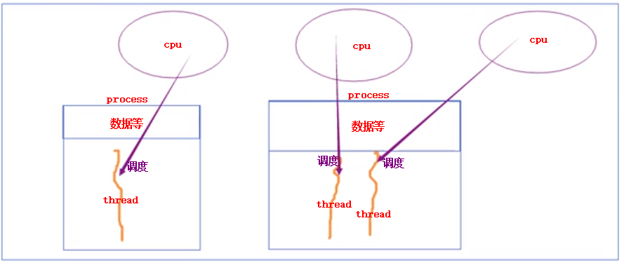
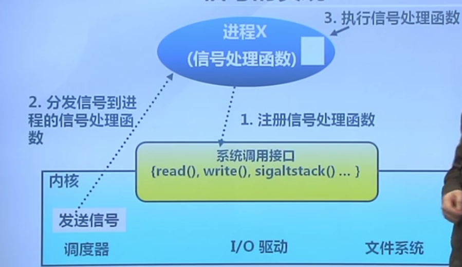
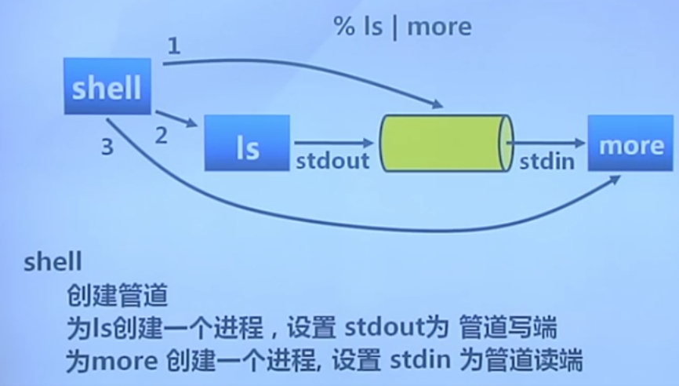

# 进程（资源分配单位）
[toc]
### 基础概念
#### 1.进程的组成
* 代码段
* 数据段
* 堆（用于给开发人员可用的内存空间）
* 栈（用于存放函数的参数值、局部变量等）
* 进程控制块
#### 2.进程控制块（PCB)
（1）PCB作用
* PCB控制进程运行所用的信息集合
* PCB是进程存在的唯一标识

（2）PCB内容
* 进程标识信息
* 进程控制信息
* 处理机现场保存

#### 3.三状态进程模型
```mermaid
graph TD
A("创建(New)") --> B
subgraph 进程状态
B("就绪(Ready)")--"被调度"-->C("运行(Running)")
C--"被抢占"-->B
C--"等待资源"-->D("等待(Blocked)")
D--"唤醒(得到资源)"-->B
end
C-->E("退出(Exit)")
```
#### 4.挂起进程模型
挂起(suspend)：把一个进程从内存转到外存
唤醒(activate)：把一个进程从外存转到内存

```mermaid
graph TD
A("创建(New)") --> B
subgraph 进程状态
B("就绪(Ready)")--"被调度"-->C("运行(Running)")
C--"被抢占"-->B
C--"等待资源"-->D("等待(Blocked)")
D--"唤醒(得到资源)"-->B
end
C-->E("退出(Exit)")
subgraph 进程在外存
D--"挂起"-->F("等待挂起")
F--"得到资源"-->G("就绪挂起")
end
B--挂起-->G
C--挂起-->G
F--激活-->D
G--激活-->B
```
#### 5.状态队列
* 操作系统维护一组状态队列，表示系统中所有进程的状态
* 不同队列b表示不同状态
**就绪队列**（只有一个就绪队列）
各种**等待队列**（比如每种设备有一种等待队列）
**僵尸队列**
* 根据进程状态不同，进程PCB加入相应队列
#### 6.进程切换（上下文切换）
运行状态 切换为 其他状态
或者 就绪状态 切换为 运行状态
#### 7.处理机调度
从就绪队列中选出一个进程运行
从多个可用cpu中选出一个给该进程使用
#### 8.特殊的内核线程：idleproc
是cpu空闲时，执行的线程，用来不断查询就绪队列内是否有进程，有则切换到此进程
因为有了idleproc，所以可以计算褚cpu空闲时间
***
# 线程（cpu调度单位）

### 基础概念
#### 1.线程的组成
* 共享进程的程序、数据和打开文件
* 有独立的堆栈
* 有独立的线程控制块
#### 2.线程优点
* 进程内部的共享
* 进程内部的并发执行
#### 3.线程的三种实现方式
* 用户线程
在用户空间实现
* 内核线程
在内核中实现
* 轻量级进程（lightweight process）
一个j进程可有一个或多个轻量级进程，每个轻量级进程由一个单独的内核线程来支持
***
# 同步与互斥
### 基础概念
#### 1.原子操作（atomic operation）
* 要么操作成功执行
* 要么操作没有执行
* 不会出现部分执行的状态
#### 2.实现互斥：用原子操作实现一个锁
（1）加锁（进入临界区）
* 在锁释放之前，进程一直处于等待
* 如果锁被释放了，只有一个进程可以获取锁
（2）解锁（退出临界区）
* 解锁并唤醒一个处于等待的进程
####  3.实现同步：信号量
*  信号量是资源能够使用的资源数
* pv操作实现信号量的增减，是原子操作
#### 4.实现同步：管程
与临界区类似，区别是允许正在管程中的进程可临时放弃管程的互斥访问，让其他进程执行
***
# 进程间通信
### 基础概念
#### 1.进程间通信方式
（1）信号（signal）

信号的实现：

（2）管道（pipe）

进程间基于内存文件的通信机制
创建一个子进程，会继承父进程的文件描述符

（3）消息队列

由操作系统维护的以字节序列为基本单位的间接通信机制

（4）共享内存

把同一个物理内存区域同时映射到多个进程的逻辑地址空间
