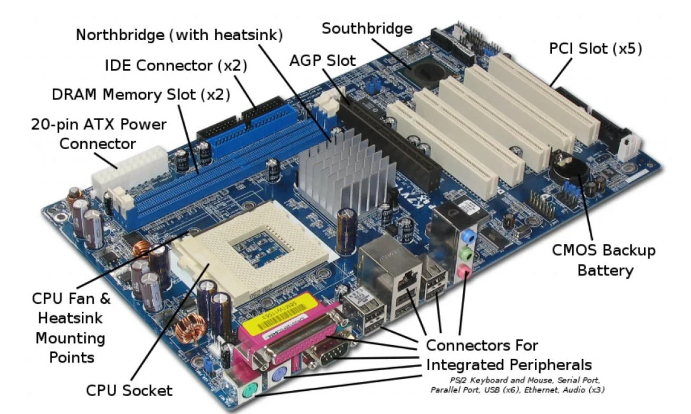
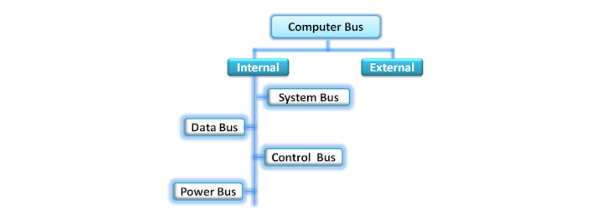
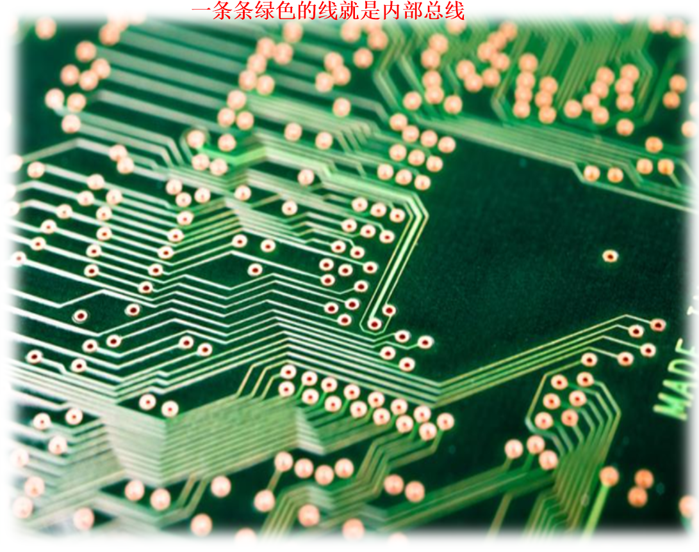
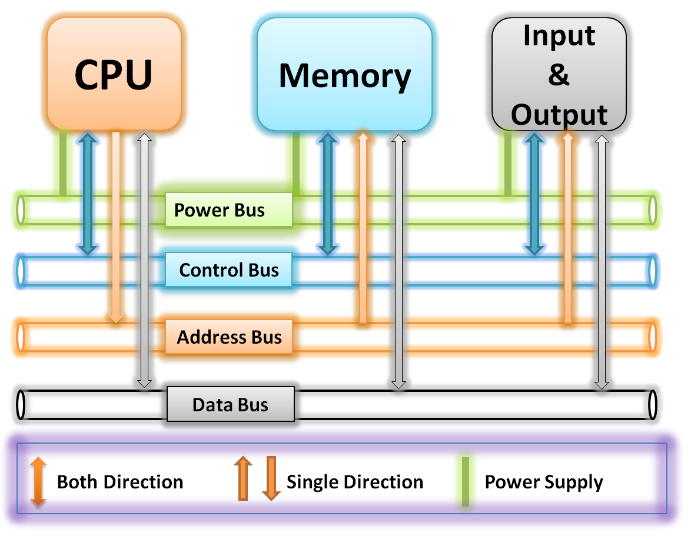
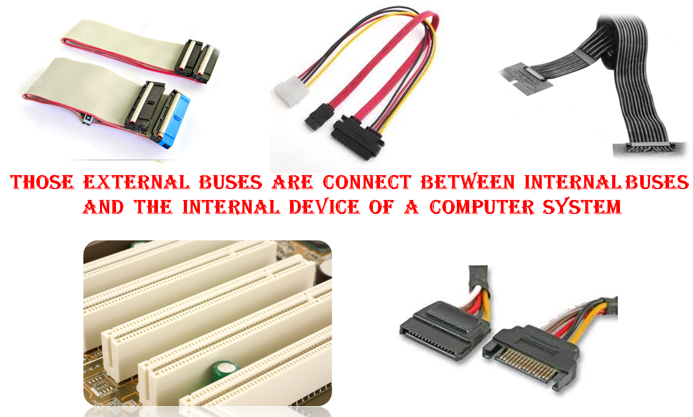
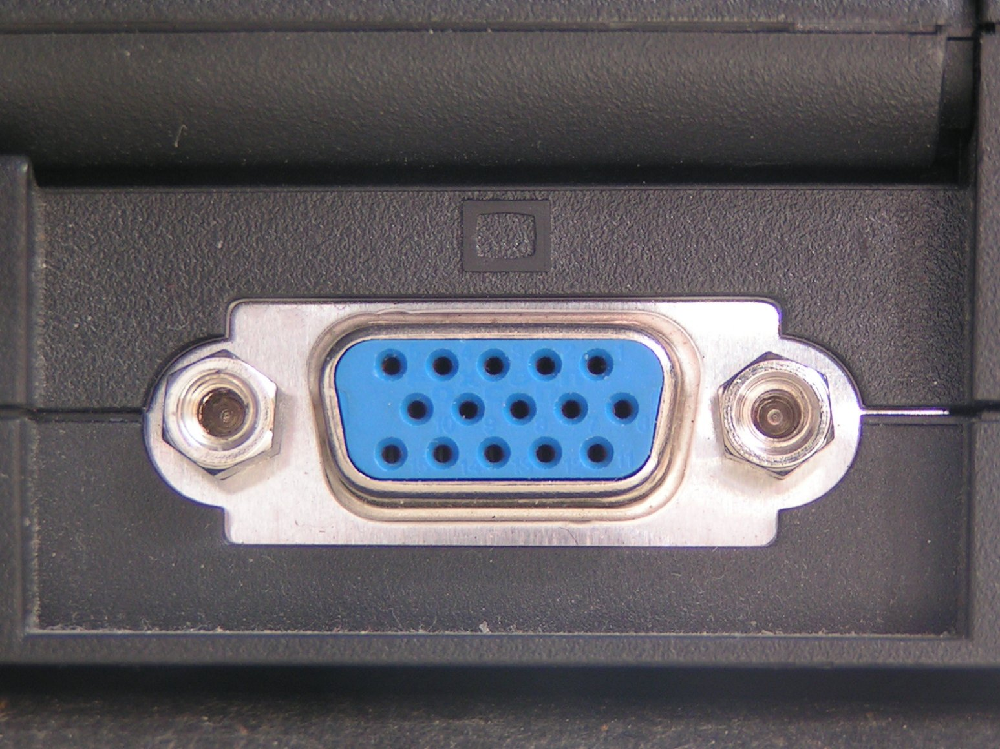

[toc]
### 相关基础概念

#### 1.计算机组件


#### 2.bus（总线）
计算机各个物理组件间传递数据的公共通信干线
与总线相连的组件，能够接收到相同的信息
##### （1）分类
* internal bus
* external bus



##### （2）internal bus

* 有四类内部总线


##### （3）external bus


#### 3.pci（peripheral component interconnect）
是一种标准，用于接入外部设备
有pci总线和pci插槽


#### 4.`COM`（communication port，串口）


#### 5.VGA（video graphics array）
显卡上输出模拟信号的接口



#### 6.FC HBA（fiber channel host bus adapter）
用于连接FC网络，就像以太网卡用来连接以太网一样

#### 7.硬盘相关接口
* SCSI（small computer system interface）
  * SAS（serial attached SCSI）
* IDE（Integrated Drive Electronics）
  * ATA（advanced technology attachment）
  * SATA（serial ATA）
* FC（fiber channel）
和SCSI接口一样光纤通道最初也不是为硬盘设计开发的接口技术，是专门为网络系统设计的，但随着存储系统对速度的需求，才逐渐应用到硬盘系统中

#### 2.cpu相关
* Socket
cpu的插槽（一个插槽代表一个主板上的芯片）
</br>
* Core
cpu的核心，一个核心代表一个独立的处理器（即物理cpu，提供真正的并行能力）
</br>
* Thead
超线程，只是操作系统指令的队列（提高cpu的性能，但不能提供真正的并行能力）
会**欺骗**操作系统，把一个Thread当作一个逻辑CPU
</br>
* CPU（逻辑CPU）
`逻辑CPU = Socket * Core per socket * Thread per core`
`物理CPU = Socket * Core per socket`

#### 3.系统uuid相关

##### （1）system-serial_number
是服务器的序列码，写在服务器的外部

##### （2）system-uuid 和 machine-id区别
* system-uuid
写在BIOS中的，在操作系统中无法修改，重装系统也还是不变（/sys/class/dmi/id/product_uuid）
</br>
* machine-id
安装操作系统时生成的，可以直接修改（/etc/machine-id）

***
### 获取底层信息
#### 1.DMI(desktop mamanger interface)
桌面管理接口，生成一个行业标准的框架，用于收集和管理当前设备的环境信息（硬件和相关软件等）
```shell
#该命用于显示dmi管理的信息
dmidecode               #显示全部环境信息

-t 类型     
#查看有哪些类型：
#   通过man dmidecode可以查看支持哪些类型
#   0 BIOS
#   1 system
#   ... ...
#   8 connector
#   9 slot
#   16 memory array

-s 关键字
#查看有哪些关键字：
#   dmidecode -t --help

```
