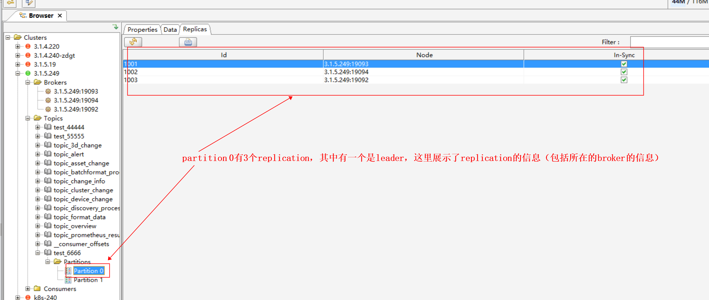

# kafka

[toc]

### 概述

#### 1.三个关键功能
* 发布和订阅
* 持久化（可以指定存储数据多久）
* 可以从指定offset开始处理事件

#### 2.主要概念

##### （1）broker（代理）
一个kafka server就是一个broker

##### （2）event（message、record）
* message的组成：
  * 消息头
  * key（用于hash到指定分区）
  * 消息内容

##### （3）topic
类似文件夹，用于组织和存储event
当event被消费，topic不会删除event
可以设置保存event多长时间

##### （4）partition
* topic会被划分为多个partition（用0，1，2...标识）
  * 对于每个分区:
    * 可以有多个副本，但有且仅有一个leader副本，当leader所在的broker宕机，会重新选择一个leader
    * 在每个broker上，只能有一个副本（即副本数<=broker数量）
    * 当访问某个分区时，会返回leader副本的broker的信息，然后连接被重定向到该broker
  * 多个分区，会根据rebalance策略合理分布在broker上，可以分布在同一个broker上

* 是为了实现并发
  * 同时消费多个分区，不能保证多个分区之间的顺序，只能保证一个分区内的数据是按顺序消费的

* 根据event的key（key是由生产者指定的），将event哈希到指定分区

* 3个broker，2个partition，3个replication



#### 3.使用的安全协议
|协议名|说明|
|-|-|
|PLAINTEXT|不认证，不加密|
|SASL_PLAINTEXT|SASL认证，不加密|
|SASL_SSL|SASL认证，SSL加密|
|SSL|不认证，SSL加密|

#### 4.partition log


##### （1）partition log目录
`<TOPIC>-<PARTITION>/`
* 比如：`topic_os_config-0/`
* 该目录下存放多个log segment

##### （2）log segment的组成
通过`kafka-dump-log.sh --files <FILE>`能够以可读的方式查看下面某个文件的内容
* `<OFFSET>.index`
  * 偏移量索引文件
  * 用于记录 offset 与 消息在log文件中的position 的映射关系
  ```shell
  $ ./kafka_2.11-2.4.0/bin/kafka-dump-log.sh --files ./logs/test_lil-0/00000000000000000051.index

  Dumping ./logs/test_lil-0/00000000000000000051.index
  offset: 55 position: 4280
  offset: 59 position: 8560
  ```
* `<OFFSET>.log`
  * 日志文件
  * 每条日志的内容：
    * 前4N个字节存放该 消息的字节长度，后面紧跟消息的内容
* `<OFFSET>.timestamp`
  * 时间戳索引文件
  * 用于记录 offset 与 时间戳 的映射关系

* 比如：`00000000000000000202.log`，表示该segment中存放的第一条消息从202 offset开始

##### （3）日志操作
* 写入
该日志允许串行追加，该追加始终会转到最后一个文件。 当该文件达到可配置的大小（例如1GB）时，它将被滚动到一个新文件。 日志有两个配置参数：M（在强制操作系统将文件刷新到磁盘之前，提供了要写入的消息数）和S（在强制刷新后的秒数内）。 这样可以持久保证在系统崩溃时最多丢失M条消息或S秒的数据。
</br>
* 删除：
日志管理器应用两个指标来标识可删除的段：时间和大小
</br>
* 日志压缩：
可以有选择的删除日志（根据key，保留每个key最新的数据）

#### 5.producer
* 控制将数据发往 指定topic 的 指定分区
  * 常用方法是利用指定key hash到指定分区，从而能够分类存放

* 异步发送（提高效率）
  * 先将数据缓存在内存中，一次发送多条数据，可以设置当达到一定条件发送（比如64k或10ms）

#### 6.consumer
* 当消费者获取消息后，并且回复了，broker才会增加offset


##### （1）group_id
* offset是与group关联的
* 在同一个group中的消费者只会消费一次数据
* 当有多个消费者监听同一个队列，同一个group中的消费者，只有一个消费者消费数据，当这个消费者挂了，同group中的另一个消费者会顶上继续消费

##### （2）client_id
* 在同一个group中，client_id不能一样

#### 7.工作原理

* client访问某一个broker，该broker会返回metadata（包含adversied listener信息），然后连接会被重定向（即client访问该adversied listener建立连接）
* topic会被划分为多个partition（用0，1，2...标识）
  * 对于每个分区:
    * 可以有多个副本，但有且仅有一个leader副本，当leader所在的broker宕机，会重新选择一个leader
    * 在每个broker上，只能有一个副本（即副本数<=broker数量）
    * 当访问某个分区时，会返回leader副本的broker的信息，然后连接被重定向到该broker
  * 多个分区，会根据rebalance策略合理分布在broker上，可以分布在同一个broker上

***

### 集群（高可用）

#### 1.安装集群

##### （1）broker的要求
* broker id必须不同
* 每个broker的都需要一个唯一的访问地址（即advertised.listeners必须不同）

##### （2）在kubernets中安装kafka集群
本质通过环境变量，从而使得每个pod的配置有所区别

* 当externalAccess enabled时，会预置下面这些环境变量：`kafka/templates/scripts-configmap.yaml`
```shell
HOSTNAME=$(hostname -s)   #${HOSTNAME}，比如：kafka-0
ID=${HOSTNAME:(-1)}       #${ID}，比如：0

EXTERNAL_ACCESS_IP={{ .Values.externalAccess.service.domain }}
EXTERNAL_ACCESS_PORT=$(echo '{{ .Values.externalAccess.service.nodePort }}' | tr -d '[]' | cut -d ' ' -f "$(($ID + 1))")

...
```

```yaml
replicaCount: 3

#每个pod会自动设置唯一的broker id
brokerId: -1

#需要注意：
#使用容器内的环境变量，在chart中如何使用的，需要看具体使用的地方
#如果在pod.spec.containers.env.value，语法：  $(<VAIRABLE_NAME>)
#如果在shell中，语法：  ${<VAIRABLE_NAME>}
listenerSecurityProtocolMap: INTERNAL:PLAINTEXT,EXTERNAL:PLAINTEXT
listeners: INTERNAL://0.0.0.0:9092,EXTERNAL://0.0.0.0:$(EXTERNAL_ACCESS_PORT)
advertisedListeners: INTERNAL://${MY_POD_NAME}.kafka-headless.kafka:9092,EXTERNAL://${EXTERNAL_ACCESS_IP}:${EXTERNAL_ACCESS_PORT}
interBrokerListenerName: INTERNAL

externalAccess:
  enabled: true
  service:
    type: NodePort
    domain: 3.1.5.249
    nodePorts: [19092,19093,19094]
```

#### 2.安全配置

##### （1）只设置SASL认证

* 其中相关listener协议要设置SASL_PLAIN

```shell
vim kafka/values.yaml
```

```yaml
extraEnvVars:
  - name: KAFKA_BROKER_USER
    value: "admin"
  - name: KAFKA_BROKER_PASSWORD
    value: "123456"
  - name: KAFKA_OPTS
    value: "-Djava.security.auth.login.config=/opt/bitnami/kafka/conf/kafka_jaas.conf"
```

* python连接
```python
producer = KafkaProducer(bootstrap_servers = "tajlmt0law.cogiot.net:39093", security_protocol = "SASL_PLAINTEXT", sasl_mechanism = "PLAIN", sasl_plain_username="admin", sasl_plain_password="123456")
```

##### （2）设置SSL和SASL
* 上面只设置SASL的配置就不需要了
* 当使用私有ca签发的证书时，SASL可以不用设置，客户端需要设置trust证书，其实也算一种认证了
* 注意修改相关listener的协议

* 创建jks secret
[jks创建的方式参考](../security/network_security/Encryption/certificate.md)
```shell
kubectl create secret generic jks-secret --from-file=kafka.keystore.jks=./server.jks  --from-file=kafka.truststore.jks=./truststore.jks -n kafka
```

* 修改kafka配置
```shell
vim kafka/values.yaml
```

```yaml
auth:
  ## Switch to enable the kafka authentication.
  enabled: true
  ## Enable SSL to be used with brokers and consumers
  ssl: true

  ## Name of the existing secret containing the certificate files that will be used by Kafka.
  certificatesSecret: jks-secret
  ## Password for the above certificates if they are password protected.
  certificatesPassword: "123456"

  ## Kafka client user.
  brokerUser: admin
  ## Kafka client password.
  brokerPassword: "123456"
```

* client连接
  * 可以使用truststore.jks（其中存放了ca证书）
    * jaas.conf
    ```shell
    org.apache.kafka.common.security.plain.PlainLoginModule required
    username="admin"
    password="Cogiot_Kafka@2021";
    ```
  * 可以直接使用ca证书
  ```python
  producer = KafkaProducer(bootstrap_servers = "tajlmt0law.cogiot.net:39093",
                        security_protocol = "SASL_SSL",
                        sasl_mechanism = "PLAIN", sasl_plain_username="admin",sasl_plain_password="Cogiot_Kafka@2021",
                        ssl_cafile = r"C:\Users\bong-li\Downloads\new-jks\ca.crt", ssl_password="123456",
                        ssl_check_hostname=False
                         )
  ```

***

### 配置

#### 1.broker配置

* broker id必须不同
* 每个broker的都需要一个唯一的访问地址（即advertised.listeners必须不同）

##### （1）基本配置

```shell
#当前kafka server的id，在同一个集群中，id必须唯一
#设为-1时，会自动设置一个唯一的broker id
broker.id=<NUM>
```

##### （2）监听器设置

```shell
#创建监听器：监听器名称 和 安全协议 之间的映射关系
#为什么需要这个：因为每个监听器，需要有不同的策略（比如用于内部通信的就不需要ssl协议，用于外部通信的就需要用ssl协议:listener.name.<NAME>.ssl.keystore.location）
listener.security.protocol.map=<LISTENER_NAME>:<PROTOCOL>,<LISTENER_NAME>:<PROTOCOL>

#设置 每个监听器 监听的地址（ip:port）
listeners=<LISTENER_NAME>://<IP>:<PORT>

#broker之间用哪个监听器进行通信
interBrokerListenerName=<LISTENER_NAME>

#将 声明的监听器信息 发布到 zookeeper中
#当client访问某个监听器时，broker会返回对应的元信息（包含 该监听器 声明的监听器信息），client就会使用 该监听器 声明的监听器信息 来建立连接）
advertised.listeners=<LISTENER_NAME>://<IP>:<PORT>
```

* broker-1 示例
```yaml
listenerSecurityProtocolMap: INTERNAL:PLAINTEXT,EXTERNAL:PLAINTEXT

listeners: INTERNAL://0.0.0.0:9092,EXTERNAL://0.0.0.0:19092

advertisedListeners: INTERNAL://kafka-0.kafka:9092,EXTERNAL://3.1.5.249:19092

interBrokerListenerName: INTERNAL
```

* broker-2 示例
```yaml
listenerSecurityProtocolMap: INTERNAL:PLAINTEXT,EXTERNAL:PLAINTEXT

listeners: INTERNAL://0.0.0.0:9092,EXTERNAL://0.0.0.0:19093

advertisedListeners: INTERNAL://kafka-1.kafka:9092,EXTERNAL://3.1.5.249:19093

interBrokerListenerName: INTERNAL
```

* broker-3 示例
```yaml
listenerSecurityProtocolMap: INTERNAL:PLAINTEXT,EXTERNAL:PLAINTEXT

listeners: INTERNAL://0.0.0.0:9092,EXTERNAL://0.0.0.0:19094

advertisedListeners: INTERNAL://kafka-2.kafka:9092,EXTERNAL://3.1.5.249:19094

interBrokerListenerName: INTERNAL
```

##### （3）topic默认配置
如果创建topic时不指定相关配置，则使用默认配置
```shell
#允许自动创建topic，比如生产者需要往某个topic推数据，不需要先创建好topic
auto.create.topics.enable=true

auto.leader.rebalance.enable

#允许删除topic，否则无法删除任何topic
delete.topic.enable=true

#partition的副本数量
default.replication.factor=<INT>      #默认使用初始化broker时设置的默认值
```

##### （4）zookeeper相关配置

```shell
#指定zookeeper地址，为了高可用可以指定多个，用逗号隔开
#还可以指定，将数据放在zookeeper指定目录下
#zookeeper.connect=192.168.1.1:2181/my/kafka
zookeeper.connect=<host:port>,<host:port>
```

##### （5）日志相关

日志删除的基本单位是：log segment
```shell
#日志存储目录
log.dirs=<DIR>

#每个日志分片（即日志文件）的大小
#如果一条消息大于该值，则该消息不会存放kafka中
log.segment.bytes=<NUM>

#指定日志清理策略
#   delete策略，根据时间或者大小删除日志
#   compact策略，根据key，每个key只保留最新的数据
log.cleanup.policy=<delete or compact>

#多长时间检查一次是否满足删除条件
log.retention.check.interval.ms=<NUM>

#该大小必须设为大于日志分片的大小，否则不生效
log.retention.bytes=<NUM>

#根据 设置的时间 和 log segemnt创建的时间删除，不依赖检查时间（log.retention.check.interval.ms）
#当设置了更小的单位时，只会按照较单位执行
log.retention.hours=<NUM>
log.retention.minutes=<NUM>
log.retention.ms=<NUM>

#最多多长时间将log写入磁盘
#默认写文件并不是直接写入到磁盘，而是先存放在缓冲区（了解：linux的fsync命令）
log.flush.interval.ms=<NUM>

#log.cleaner是关于日志压缩策略的配置
```

#### 2.producer配置（客户端的配置）
```python
from kafka import KafkaProducer

producer = KafkaProducer(**configs)
```
* configs:

```python
#指定kafka broker地址
  bootstrap_servers = <STRING or LIST>

#确认写入完成
# 0表示，不等待确认消息
# 1表示，leader写入成功立即返回确认，不需要等待其他副本写入成功
# all表示，leader写入成功并且等待所有副本写入成功，才会返回确认
  acks = <NUM>

#设置缓冲的大小（字节），如果一条数据大于缓冲区大小，则无法发送
#一般数据先放在缓冲区，当缓冲区满了，会将数发送出去
#也可以直接flush，将数据发送出去
#缓冲原因：当发送数据速度大于数据被发送到服务器上的速度，则会引发异常
  buffer.memory = <NUM>

#设置批处理的大小（字节）
#批处理是将多条消息一起发送
#批处理大小 限制 一次请求最大发送多少数据（必须小于buffer.memory大小）
  batch.size = <NUM>

#用于标识请求源
#就能通过日志跟踪请求源，便于排查问题
  client_id = "<STR>"
```

* producer send时可以指定分区、设置keyd等

#### 3.consumer配置（客户端的配置）
```python
from kafka import KafkaConsumer

consumer = KafkaConsumer(*topics, **configs)
```

##### （1）基础概念
* poll()
轮询操作，当consumer监听一个topic时，会每隔一段时间去轮询一次，去获取消息

##### （2）configs：
```python
#指定kafka broker地址
  bootstrap_servers = <STRING or LIST>

#设置group id和client id
  group_id = "<STR>"
  client_id = "<STR>"

#当没有offset记录时，该设置才生效，有以下几个值：
# earliest  当没有offset记录，从头开始消费
# latest    当没有offset记录，从现在开始消费
# none      当没有offset记录，则抛异常
auto_offset_reset = "earliest"

#是否自动提交offset记录，如果不自动，需要手动i提交offset记录
enable_auto_commit = True

#用于设置最少获取多少数据，当一条消息很小时，通过此配置能够提高效率
fetch.min.bytes = <INT|default=1>
#如果没有满足最少数据量，则最多等待多长时间
fetch.max.wait.ms = <INT|default=500>
#用于设置最大获取数据，防止处理数据量过大，导致相关问题，比如：超时等
fetch.max.bytes = <INT|default=52428800>


#每次轮询最大获取的消息数量
max.poll.records = <INT|default=500>
#两次poll之前的时间间隔（默认5分钟），当超过这个时间，consumer就会被认为失败了，group会重新分配分区（但是session还是保持着的，因为有心跳检测机制，如果有其他消费者等着，则分区会分配给其他消费者，如果没有，consumer.commit()时会报错，捕获这个异常后能够继续处理）
max.poll.interval.ms = <INT|default=300000>

#consumer多久发送一次心跳检测包给server
#设置的值必须小于session.timeout.ms
heartbeat.interval.ms = <INT|default=3000>
#发送心跳检测包后，等待回复的超时时间（默认为10s，group.min.session.timeout.ms <= 可配置的范围 <= group.max.session.timeout.ms）
#如果超时了，server会将该consumer移除该group（即断开session连接）
session.timeout.ms = <INT|default=10000>
```

#### 4.安全配置

##### （1）认证配置：SASL（simple authentication and security layer）
SASL利用jaas（Java Authentication and Authorization Service）文件，设置账号密码

* SASL机制：PLAIN、GSSAPI等

* JAAS文件格式
```shell
#提供给broker使用的SASL配置
KafkaServer {
  #表明使用的是PALIN机制
  org.apache.kafka.common.security.plain.PlainLoginModule required

  #broker连接其他broker使用的SASL配置   
  username="user"
  password="bitnami"

  #broker作为服务端的SASL配置
  user_user1="password1"   #表示可以用 user1/password1 客户端这个账号进行认证
}

#提供给broker连接zookeeper使用的SASL配置（如果kafka和zookeeper之间没有SASL，则这个配置也不会被使用）
KafkaClient {
  #表明使用的是PALIN机制
  org.apache.kafka.common.security.plain.PlainLoginModule required

  #broker连接zookeeper使用的SASL配置   
  username="user"
  password="bitnami"
}
```

* 启动kafka时，需要加一个参数
```shell
-Djava.security.auth.login.config=/etc/kafka/kafka_client_jaas.conf
```
