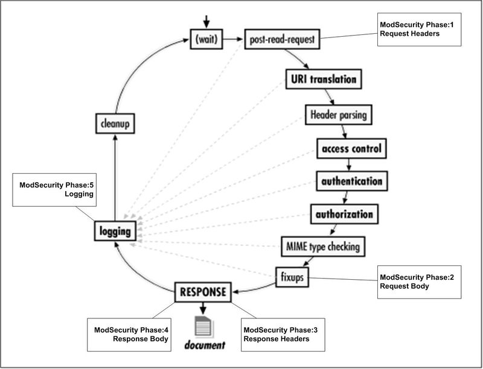

# ModSecurity

[toc]

### 概述

[参考文档](https://github.com/SpiderLabs/ModSecurity/wiki/Reference-Manual-%28v2.x%29)

#### 1.专业术语
* false negative
漏报

* false positive（false alarms）
误报

#### 2.ModSecurity的五个处理阶段
ModSecurity会将rule放在其中一个阶段进行处理
* 在 同一个phase 中的rule，会按照按照配置文件中的顺序依次执行
* 随着进入后续的阶段，可用数据也会增加
  * 比如 在phase 1只解析了请求头，所以只能获取请求头中的数据，在phase 2解析了请求体，所以能够获取请求头和请求体中的数据



##### （1）phase 1：request headers
当读取请求头后，立即处理在phase 1中的rules（此时请求体还没读取）
* 在这个阶段一般做一些需要提前处理的rule
  * 比如判断Content-Type的类型，从而决定如何解析请求体中的数据

##### （2）phase 2：request body
当读取请求体后，立即处理在phase 2中的rules
* 一般对请求的处理都在这个阶段
* 请求体默认支持的解析类型：
  * application/x-www-form-urlencoded
  * multipart/form-data
  * text/xml
  * 可扩展，参考下面的基础配置部分

##### （3）phase 3: response headers
在响应发送前读取请求头

##### （4）phase 4：response body
在响应发送前读取请求体

##### （5）phase 5：logging
无论如何都会经过这个阶段（即使在前面阶段drop了）

#### 3.审计日志格式
```python
A: Audit log header (mandatory).
B: Request headers.
C: Request body (present only if the request body exists and ModSecurity is configured to intercept it. This would require SecRequestBodyAccess to be set to on).
D: Reserved for intermediary response headers; not implemented yet.
E: Intermediary response body (present only if ModSecurity is configured to intercept response bodies, and if the audit log engine is configured to record it. Intercepting response bodies requires SecResponseBodyAccess to be enabled). Intermediary response body is the same as the actual response body unless ModSecurity intercepts the intermediary response body, in which case the actual response body will contain the error message (either the Apache default error message, or the ErrorDocument page).
F: Final response headers (excluding the Date and Server headers, which are always added by Apache in the late stage of content delivery).
G: Reserved for the actual response body; not implemented yet.

#主要看H，这里显示了经过的处理
H: Audit log trailer.

I: This part is a replacement for part C. It will log the same data as C in all cases except when multipart/form-data encoding in used. In this case, it will log a fake application/x-www-form-urlencoded body that contains the information about parameters but not about the files. This is handy if you don’t want to have (often large) files stored in your audit logs.
J: This part contains information about the files uploaded using multipart/form-data encoding.
K: This part contains a full list of every rule that matched (one per line) in the order they were matched. The rules are fully qualified and will thus show inherited actions and default operators. Supported as of v2.5.0.
Z: Final boundary, signifies the end of the entry (mandatory).
```

***

### nginx加载ModSecurity动态模块

要么从源码编译nginx，通过--add-module添加该模块，
要么之后编译ModSecurity模块，然后在配置文件中通过`load_module`添加该模块
下面采用的是第二种方法

#### 1.安装ModSecurity

##### （1）安装依赖
```shell
apt-get install -y apt-utils autoconf automake build-essential git libcurl4-openssl-dev libgeoip-dev liblmdb-dev libpcre++-dev libtool libxml2-dev libyajl-dev pkgconf wget zlib1g-dev
```

##### （2）安装ModSecurity
```shell
git clone https://github.com/SpiderLabs/ModSecurity.git
cd ModSecurity
./build.sh
./configure
make
make install
```

#### 2.生成 指定nginx版本 对应的ModSecurity动态库文件

##### （1）下载nginx connector用于连接ModSecurity
```shell
git clone https://github.com/SpiderLabs/ModSecurity-nginx.git
```

##### （2）下载指定版本的nginx源码
比如目前使用的nginx版本是1.18.0
```shell
wget http://nginx.org/download/nginx-1.18.0.tar.gz
```

##### （3）生成相应的ModSecurity动态库文件
```shell
tar -xf nginx-1.18.0.tar.gz
cd nginx-1.18.0/
./configure --with-compat --add-dynamic-module=../ModSecurity-nginx
make modules
```

##### （4）将ModSecurity动态库文件移动到当前nginx中
```shell
cp objs/ngx_http_modsecurity_module.so /etc/nginx/modules
```

#### 3.nginx加载ModSecurity

```shell
load_module modules/ngx_http_modsecurity_module.so;

http {
  modsecurity on;
  modsecurity_rules_file <PATH>;
  ...
}
```

#### 4.验证
* 创建一个测试的规则
```shell
SecRule ARGS:testparam "@contains test" "id:1234,phase:2,deny,status:403"
```

* 重启nginx并且测试
```shell
curl <URL>?testparam=test

#当返回403表示测试成功，即ModSecurity生效
```

***

### 配置ModSecurity

#### 1.基础配置
[下载推荐的配置](https://raw.githubusercontent.com/SpiderLabs/ModSecurity/v3/master/modsecurity.conf-recommended)
```shell
#SecRuleEngine DetectionOnly改成SecRuleEngine On，表示启动rule引擎
SecRuleEngine On


#允许解析请求体
SecRequestBodyAccess On
#默认支持的解析格式（格式是根据请求头中的Content-Type判断的）
#   application/x-www-form-urlencoded
#   multipart/form-data
#   text/xml

#允许解析xml格式的请求体（这里需要写，因为默认不支持application/xml）
#默认就支持的格式：
SecRule REQUEST_HEADERS:Content-Type "(?:application(?:/soap\+|/)|text/)xml" \
     "id:'200000',phase:1,t:none,t:lowercase,pass,nolog,ctl:requestBodyProcessor=XML"
#允许解析json格式的请求体（这里需要写，因为默认不支持json）
#当解析json时，json里面的参数就是ARGS:json.<KEY>
#比如：{"data": {"name": "liyi"}}  用ARGS:json.data.name
SecRule REQUEST_HEADERS:Content-Type "application/json" \
     "id:'200001',phase:1,t:none,t:lowercase,pass,nolog,ctl:requestBodyProcessor=JSON"


#允许解析响应体
SecResponseBodyAccess On
#解析指定格式的响应体（格式是根据响应头中的Content-Type判断的）
SecResponseBodyMimeType text/plain text/html text/xml


#用于调试
#  比如解析json时，不知道怎么获取那个变量，可以开启debug模式，从日志里就能看出
#  Adding request argument (JSON): name "json.data.name", value "liyi"
SecDebugLog /var/log/modsecurity_debug.log
SecDebugLogLevel 9

...
```

#### 2.rule配置
```shell
#根据rule进行判断，如果符合要求，则执行某些操作
SecRule <VARIABLES> <OPERATOR> [ACTIONS]

#无条件执行某些规则（与SecRule相似，只不过没有条件判断，而是直接执行）
SecAction <ACTIONS>
```

##### （1）`<VARIABLES>`

* 使用方式
```shell
<VARIABLES>           #当<VARIABLES>中有多个参数，会对所有参数进行匹配
<VARIABLES>:<name>    #当<VARIABLES>中有多个参数，可以通过<name>指定某个参数
<VARIABLES>:<regex>   #当<VARIABLES>中有多个参数，通过正则匹配出指定的某些参数，然后再进行判断
                      #<VARIABLES>:/^id_/，匹配出id_开头的参数
<VARIABLES>|!<VARIABLES>:<name>   #当<VARIABLES>中有多个参数，排除名为<name>的参数，然后再进行判断
&<VARIABLES>          #计算参数个数，用参数个数进行判断
```

* 常用变量
```shell
ARGS_GET    #query_string中的参数（即url中？后面的参数）
ARGS_POST   #POST请求中body的参数
ARGS        #ARGS_GET和ARGS_POST的集合
REQUEST_HEADERS   #所有的请求头
TX          #transient transaction collection，临时事务收集器，用于存储一些变量（里面的变量贯穿整个事务，且每个事务都相互独立的）
```

##### （2）`<OPERATOR>`

* 使用方式
```shell
"@<OPERATOR> [VALUE]"
```

* 常用运算符
```shell
rx            #正则匹配，判断参数的值是否匹配[VALUE]这个正则表达式
              #这是默认的运算符，所以可以省略，直接写："[VALUE]"
contains      #判断参数的值是否包含[VALUE]
```

##### （3）`[ACTIONS]`

* 使用方式
```shell
"<ACTION1>,<ACTION2>"   #可以有多个ACTION，用逗号隔开
```

* 常用action
```shell
id        #给rule分配一个唯一id（必须要写），id:11
log       #当匹配成功后，会记录到nginx的error日志
auditlog  #当匹配成功后，会记录到modsecurity的审计日志
deny      #停止规则处理，并且拦截该事务
status    #响应的状态码，status:403
msg       #记录日志时会添加msg字段，msg:request is risk
detectSQLi  #利用LibInjection检测，是否含有敏感语句
detectXSS
```
