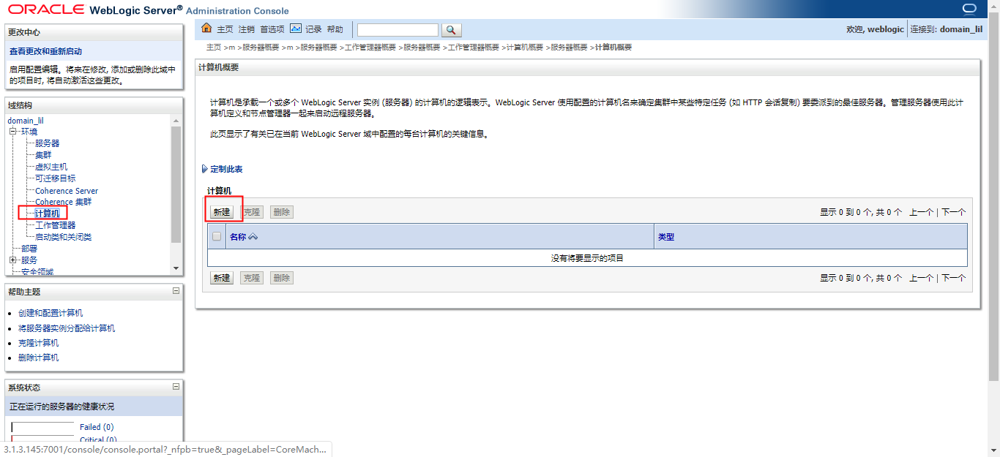

### 基础概念

#### 1.domian
  一组server的集合，至少包含一个administration server
  可选的包含managed server和cluster

#### 2.server
  是类weblogic.Server的一个实例

#### 3.administration server
  是一个domain中的管理者，负责管理其他server

#### 4.managed server
  是一个domain中被管理的server
  功能就是：执行具体的业务逻辑

#### 5. as（administration server）的功能（通过JMX实现这些功能的）
  提供该domain内的所有server的配置
  记录server的重要日志
  监控ms（managed server）

#### 6.NodeManager
一台机器上启动一个，用于远程管理该机器上的servers

### 基本操作

#### 1.静默方式安装weblogic
（1）修改静默方式的配置文件
```shell
#这个文件是事先准备号的
#主要修改安装路径
vim silent.xml

#BEAHOME，一些通用的库的目录
#WLS_INSTALL_HOME，weblogic的安装目录，不需要明确指定，会自动装在BEAHOME目录下的wlserver_<version>目录中
```
（2）执行安装
```shell
java -jar wls1036_generic.jar \
-mode=silent -silent_xml=./silent.xml \
-log=./weblogic10_install.log
```

#### 2.创建域
```shell
cd <WLS_INSTALL_HOME>

./common/bin/config.sh -mode=console
```

#### 3.启动weblogic控制台
```shell
#一般都是在BEAHOME下
cd <BEAHOME>/user_projects/domains/<DOMAIN_NAME>

nohub ./bin/startWeblogic.sh &
#需要等好几分钟才能启动起来
```

#### 4.启动NodeManager
（1）在本机上启动NodeManager
```shell
cd <WLS_INSTALL_HOME>

nohup ./server/bin/startNodeManager.sh <ip地址> 5556 &
#指明该机器上的NodeManager监听的地址
#第一次启动需要等比较久的时间
```
如果报错，修改相应配置
```shell
cd <WLS_INSTALL_HOME>
vim ./common/nodemanager/nodemanager.properties
```
```
SecureListener=false
```
（2）在另一台机器上启动NodeManager
前提条件：
* 该机器安装了weblogic
* 需要把这个域整个复制到该机器上
* 最后启动NodeManager

#### 5.使用NodeManager
（1）创建 计算机（machine）资源，用于连接NodeManager



（2）将 服务器（server） 与 指定计算机（machine）关联
需要该server部署在这台计算机上，即可以远程管理server了


（3）管理相关server


#### 6.创建managed server

（1）访问控制台：http://xx:7001
  环境 -> 服务器 -> 新建 -> 设置服务器名称和监听端口

**注意**：当启动了NodeManager，就可以通过NodeManager进行管理了，不需要手动管理，即下面的步骤就不需要了

（2）设置免密启动
```shell
mkdir ./servers/xx/security		#在被管服务器的目录下创建security目录
vim ./servers/xx/security/boot.properties
```
```
username=xx
password=xx
```

（3）启动managed server
```shell
nohup ./bin/startManagedWeblogic.sh 服务器名 http://xx:7001 &
#指明Administrator Server的地址
```
