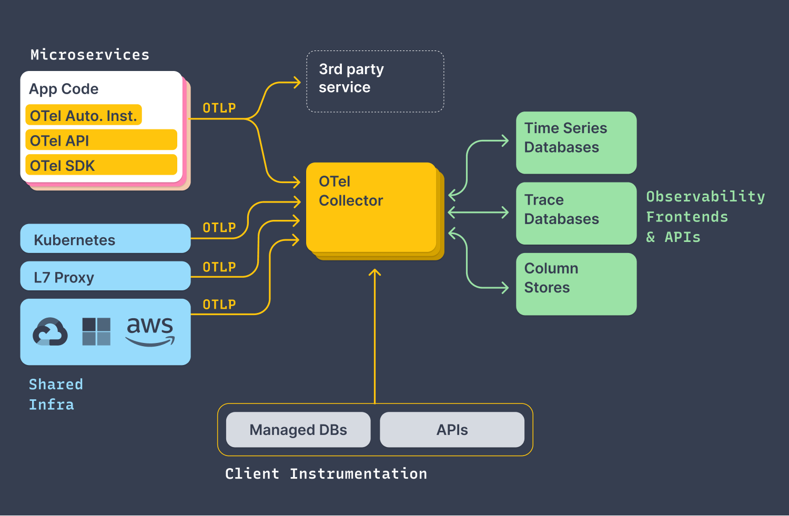
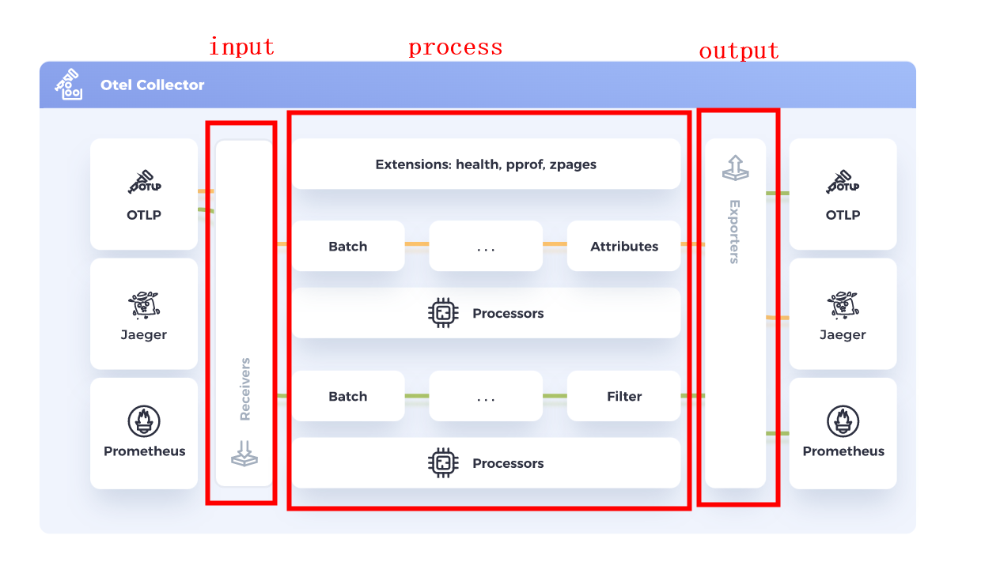

# overview

<!-- @import "[TOC]" {cmd="toc" depthFrom=1 depthTo=6 orderedList=false} -->
<!-- code_chunk_output -->

- [overview](#overview)
    - [概述](#概述)
      - [1.opentelemetry（标准化）](#1opentelemetry标准化)
      - [2.术语](#2术语)
      - [3.architecture](#3architecture)
        - [（1）数据处理: collector（与jaeger的collector不同）](#1数据处理-collector与jaeger的collector不同)
        - [（2）存储存储: TSDB、Trace DB等](#2存储存储-tsdb-trace-db等)
      - [3.signals（监控数据）](#3signals监控数据)
      - [4.sample数据](#4sample数据)
      - [5.demo](#5demo)

<!-- /code_chunk_output -->

### 概述

#### 1.opentelemetry（标准化）

将OpenTracing和OpenCensus合并
* 提供 监控数据 存入 后端存储 的API标准
* 提供 各种语言的SDK（遵循API标准）
  * 用于装配在服务上，采集服务的signals（包括：traces、metrics、logs、baggage）

#### 2.术语

|term|description|
|-|-|
|OTel|opentelemetry|
|OTLP|opentelemetry protocol|
|otelcol|opentelemetry collector|

#### 3.architecture


##### （1）数据处理: collector（与jaeger的collector不同）

* 用于 处理 数据
  * 支持多种数据源（即receivers）和backend（exporters）
* 哪些场景需要：
  * 比如: 需要把metrics存入prometheus，这时需要collector来采集metrics，然后prometheus到collector采集metrics

##### （2）存储存储: TSDB、Trace DB等

#### 3.signals（监控数据）

|signal|description|
|-|-|
|traces|链路数据|
|metrics|指标数据（如：读写的总字节数、进程资源的使用的等）|
|logs|访问日志等（还不成熟）|
|baggage|用户在context中定义的元数据|

#### 4.sample数据

* span数据格式

```json
{
  //基本信息
  "trace_id": "7bba9f33312b3dbb8b2c2c62bb7abe2d",
  "name": "/v1/sys/health",
  "parent_id": "",
  "span_id": "086e83747d0e381e",

  //开始和结束时间
  "start_time": "2021-10-22 16:04:01.209458162 +0000 UTC",
  "end_time": "2021-10-22 16:04:01.209514132 +0000 UTC",

  //状态（当发生异常，且处理了则为ERROR，未处理UNSET）
  "status_code": "STATUS_CODE_OK",
  "status_message": "",

  //元数据
  "attributes": {
    "net.transport": "IP.TCP",
    "net.peer.ip": "172.17.0.1"
  },

  //日志数据
  "events": {
    "name": "",
    "message": "OK",
    "timestamp": "2021-10-22 16:04:01.209512872 +0000 UTC"
  }
}
```

#### 5.demo
[参考](https://opentelemetry.io/community/demo/)
