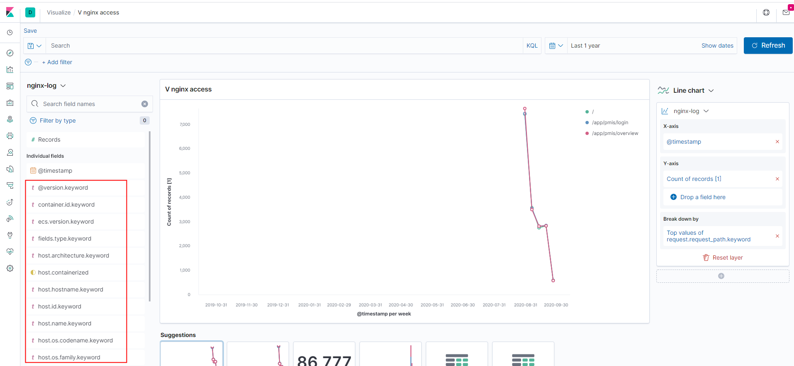

# mapping
[toc]
### 概述

#### 1.特点
mapping定义了document如何被索引和存储的
* 字段的类型

#### 2.mapping包括两部分

##### （1）meta-fields
创建index时，会自动生成
在mappings中看不到
常见的：`_index`，`_id`，`_source`

##### （2）properties
在properties下**定义字段**
如果一个字段中包含其他字段，需要用properties
```json
//下面定义的mappings中，有@timestamp字段和os.version字段
"mappings": {
  "properties": {
    "@timestamp": {
      "type": "date"
    },
    "os": {
      "properties": {
        "version": {
          "type": "text"
        }
      }
    }
  }
}
```

#### 3.数据类型
每个**字段**都有一个**数据类型**，下面是常用的一些数据类型

* text
用于搜索（就是query时，可以用该字段进行搜索）
</br>
* keyword
用于排序和聚合（能够根据这个字段，就是对搜索的结果，进行排序和聚合）
</br>
* date
* long
* float
* double
* boolean
* ip

#### 4.设置参数（定义字段时）

##### （1）fileds（设置子字段）

用于为一个字段，设置**多种类型**

```json
//这里的话，version字段就是text类型，
//但是version.keyword就是keyword类型的version字段
"mappings": {
  "properties": {
    "os": {
      "properties": {
        "version": {
          "type": "text",
          "fields": {
            "keyword": {      //这里名字随便取，用keyword只是方面使用
              "type": "keyword"
            }
          }
        }
      }
    }
  }
}
```
在kibana中
查询的时候就是用的text类型的字段（即上面的 os.version）
聚合的时候就是用的keyword类型的字段（即上面的 os.version.keyword）


#### 5.动态映射（dynamic mapping）

##### （1）动态字段映射（默认）
当index数据时，会自动生成mapping，生成相应字段（有增量数量时，也会自动生成字段）
* 映射规则：

|JSON data type|elasticsearch field type|
|-|-|
|true or false|boolean|
|floating point number|float|
|integer|long|
|string|text（并且会设置keyword子字段，即该字段有text和keyword两种类型|

* 高级的映射
能够检测string中的内容，
比如匹配字符串是时间格式，可以生成date类型的字段
比如匹配字符串是数值格式，可以生成long类型的字段

##### （2）动态映射模板（需要手动设置）
动态映射模板需要手动定义，匹配即停止，即匹配第一个模板的话，就不会继续往后匹配

* 工作原理:
  * json中的数据会匹配动态模板，如果匹配到某个模板，会按照该模板的设置创建字段
  * 匹配方式都多种
    * match_mapping_type，匹配json中的数据类型
    * match ，匹配json中的字段名（通配符或正则）
    * 等等，具体的看文档
```json
{
  "mappings": {
    "dynamic_templates": {
      //模板1，为string类型数据，生成text类型的字段和keywrod类型的子字段
      "<TEMPLATE_NAME_1>": {
        //这个是匹配json的数据类型，还有其他方式，比如正则匹配等
        //正则匹配的关键字就不是match_mapping_type了，具体看文档
        "match_mapping_type": "string",
        "mapping": {
          "type": "text",
          "fields": {
            "keyword": {
              "type": "keyword"
            }
          }
        }
      }
    },
      "<TEMPLATE_NAME_2>": {}
  }
}
```

***

### 操作

#### 1.查询索引的mapping

* 查询mapping
```python
GET /<INDEX>/_mapping
```

* 查询某个字段
```python
GET /<INDEX>/_mapping/field/<FILELD>
```

#### 2.明确指定mappings
* 创建index时指定
```python
PUT /my-index
{
  "mappings": {
    "properties": {
      "age":    { "type": "integer" },  
      "email":  { "type": "keyword"  },
      "name":   { "type": "text"  }     
    }
  }
}
```
* 添加filed到已存在的index中
```python
PUT /my-index/_mapping
{
  "properties": {
    "employee-id": {
      "type": "keyword",
      "index": false    #表示这个字段不用于search
    }
  }
}
```

* 更新一个field的mapping
不能直接更新。这样会导致index失效
正确的做法是，重新创建一个索引，然后将旧数据重新索引到新的index中
