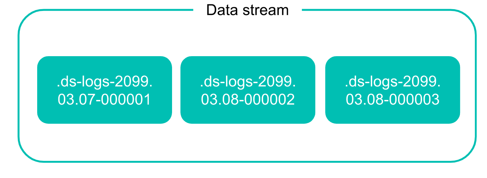
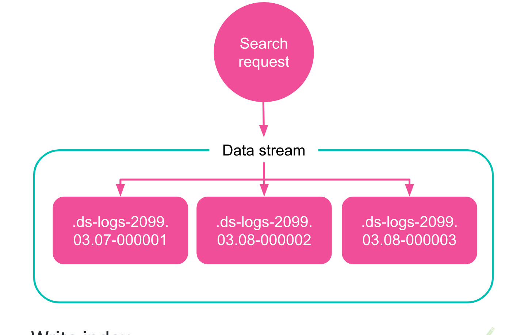
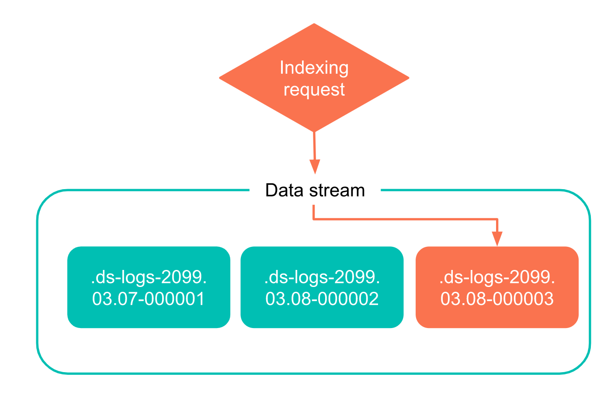
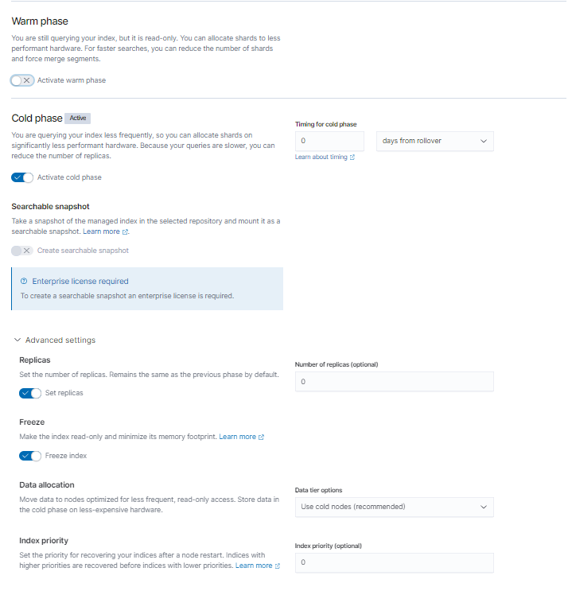
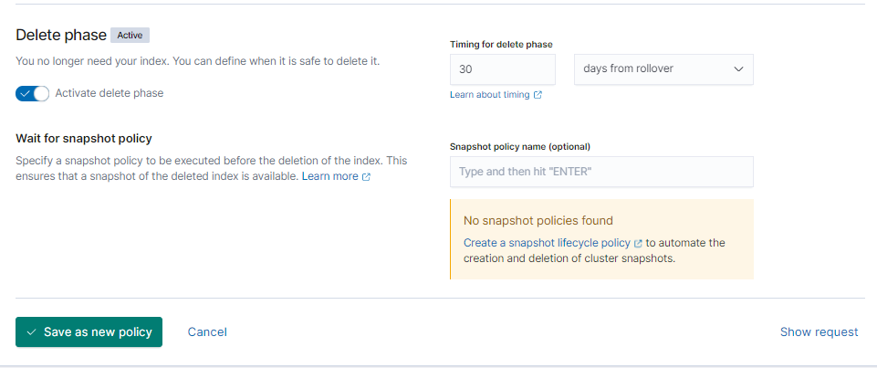

# overview

[toc]

### Introduction

#### 1.index modules

每个index都有多个modules，用于控制各个方面的内容
常用的modules:
* settings
* mappings

#### 2.两种管理index的方式

##### (1) alias

##### (2) data stream

#### 3.alias
多个index可能有相同的alias，所以一个alias就能够匹配多个index

|config|description|
|-|-|
|index.alias|索引的别名，别名不能与es中的index名称重复（多个index可以使用相同的别名，一个index可以有多个别名）</br>当多个index拥有相同的别名，**写别名**只能有一个(所以当进行ILM时，不要在template中设置别名，这样会有多个写别名)|
|index.liftcycle.rollover_alias|指定用哪个别名进行rollover（因为一个index可能有多个别名，所以这里要明确指定一下），会创建新的index，会用这里指定的别名作为新的index的别名|

#### 4.one index vs multiple indexes
In most cases multiple indexes are better
[参考](https://stackoverflow.com/questions/44700066/elastic-search-one-index-vs-multiple-indexes)

#### 5.datastream

* 由多个隐藏的、自动生成的index组成
* 只能进行append-only
* 一个data stream需要至少匹配一个index template
  * 包含index的settings和mappings，用于配置该datastream背后的index
  * 包含ilm策略，会根据策略对当前index进行rollover（即产生一个新的index）
* 必须包含@timestamp字段

##### （1）读data stream


##### （2）写data strem


***

### shards(数据分片)

#### 1.说明
每个index会被分成一个或多个shards
每个shard保存一部分documents

#### 2.有两类shard

##### （1）primary shards（主分片）

* es会将数据进行分片，从而减轻单台服务器上的数据量
  * 但当有一个节点宕机，部分数据会丢失


##### （2）replica shards（副本分片）
* 为了实现高可用，需要冗余分片（即给每一个分片设置多少副本）
  * 1个副本


#### 3.shards数量的影响
shards太多，会影响search的性能
shards太少，会影响indexing（添加和更新documents）的性能
shards太大，会影响故障恢复的性能

#### 4.确定shards的数量
[参考](https://www.elastic.co/guide/en/elasticsearch/reference/current/size-your-shards.html)
* 单个shard的大小
  * 10G ~ 50G
* shard的数量
  * 20个shards每GB的heap memory
  * shards数量应该是node数量的整数倍
  * 建议等于node的数量

***

### ILM(index lifecycle management)

#### 1.四个生命周期阶段

|phase|description|
|-|-|
|hot|这个index正在被使用|
|warm|index不能被更新了，只能读取|
|cold|index不能被更新了，并且很少被读取|
|delete|index被删除了|

#### 2.配置

##### (1) 创建index lifecycle policy: common-policy




##### (2) 创建index template: common-template
注意：这里要创建legacy index template，因为logstash那里的设置会生成一个legacy index template，这样这两个template的配置才会合并

* 可以通过界面创建，也可以用api
```python
PUT _template/common-template
{
  "order": 0,
  "index_patterns": [
    "*"
  ],
  "settings": {
    "index": {
      "number_of_shards": "3",
      "number_of_replicas": "1"
    }
  },
  "aliases": {},
  "mappings": {
    "properties": {
      "geoip.location": {
        "ignore_malformed": false,
        "type": "geo_point",
        "ignore_z_value": true
      }
    }
  }
}
```

##### (3) logstash配置
```shell
output {
  elasticsearch {
    hosts => "<host>"
    #不需要指定index
    ilm_rollover_alias => "<alias>" #这里不能用变量（生成的index名称为<alias>-000001，当达到rollover的条件后，<alias>-000001就会被rollover，并且会创建一个新的index: <alias>-000002，来写入数据)
    ilm_pattern => "000001"
    ilm_policy => "common-policy"
  }
}

```
