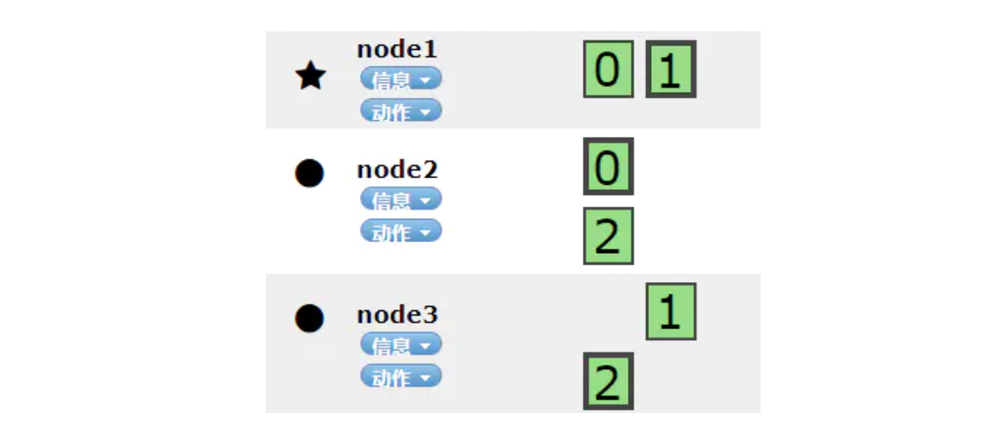

[toc]
### 基础概念
#### 1.特点
* 分布式
* 数据以 **json格式** 保存
* 索引方式：inverted index（倒排索引），索引文本查询速度很快
  * 正常索引：以文档ID作为索引，以文档内容作为记录
  * inverted index：以文档内容作为索引，以文档id作为记录

#### 2.核心概念
```shell
index         #documents的集合
type          #已经弃用type（因为type会影响性能）
              #类似表，7.0版本
              #一个index中，不会有多个type
document      #fields的集合（一条json记录）
field         #key-value键值对

settings      #用来定义该index的相关配置（比如：备份数等）
mappings      #用来定义该index中各字段的属性（比如有一个字段，名为name，可以在mapping中定义这个字段，类型为string等）
```

#### 3.shards（数据分片）
##### （1）primary shards（主分片）
* es会将数据进行分片，从而减轻单台服务器上的数据量
  * 但当有一个节点宕机，部分数据会丢失


##### （2）replica shards（副本分片）
* 为了实现高可用，需要冗余分片（即给每一个分片设置多少副本）
  * 1个副本



#### 4.角色
ES集群给每个节点分配不同角色，每种角色干的活都不一样

**（1）master**
主要负责维护集群状态，负载较轻
由于一个master会存在单点故障，所以一般会设置多个master
然后从中选举出一个**active master**，其他则是**backup master**
实际只有active master在工作，backuo master只是有资格参与竞选active master

**（2）data node**
主要负责集群中数据的存储和检索

**（3）coordinating node**
分发：请求到达协调节点后，协调节点将查询请求分发到每个分片上。
聚合: 协调节点搜集到每个分片上查询结果，在将查询的结果进行排序，之后给用户返回结果。

**（4）ingest node**
对索引的文档做预处理

#### 5.命名格式
（1）meta-filed
元字段用下划线开头

#### 6.ES中的时区是UTC（无法修改）

#### 7.index modules

每个index都有多个modules，用于控制各个方面的内容
常用的modules:
* settings
* mappings

***

### Aggregations（聚合）
#### 1.有4类聚合
##### （1）bucketing
用于生成buckets的聚合方式
每个bucket都有 一个**key**（key用于标识该bucket） 和 一个**document条件**
当执行聚合时，会对每个document进行条件评估
如果，document符合某个backet的条件，则该document属于该bucket
最后，会返回多个backets

##### （2）metric
计算一组document的数值指标

##### （3）matrix（试验阶段）

##### （4）pipeline
