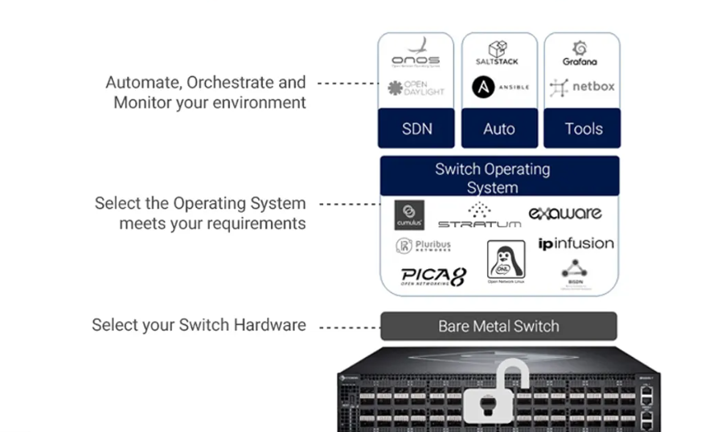

# overview

<!-- @import "[TOC]" {cmd="toc" depthFrom=1 depthTo=6 orderedList=false} -->
<!-- code_chunk_output -->

- [overview](#overview)
    - [Introduction](#introduction)
      - [1.SDN vs NFV](#1sdn-vs-nfv)
      - [2.open networking](#2open-networking)

<!-- /code_chunk_output -->

### Introduction

#### 1.SDN vs NFV

* SDN和NFV的最终目的都是为了节约成本，方便管理

|SDN(software defined networking)|NFV(network function virtualization)|
|-|-|
|分离网络设备的控制平面和数据平面|分离硬件和软件，能够在普通服务器上，部署网络功能（比如：防火墙、load balance等，不需要特定的设备）|
|工作在第2、3层|工作在第4、5、6、7层|

#### 2.open networking

将网络设备的软件和硬件分离，即将开放标准和裸机硬件结合，在裸机硬件上部署符合标准的任意软件，而不必使用厂商的特定软件
提供灵活、可编程的网络功能
可以在上面运行各种应用，比如：SDN、network virtualization、NFV、network analytics等
