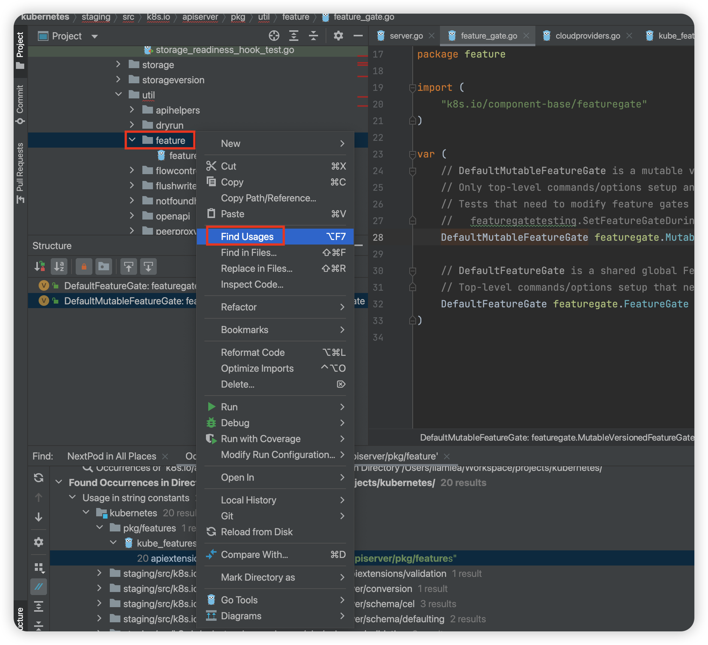

# Debug GO


<!-- @import "[TOC]" {cmd="toc" depthFrom=1 depthTo=6 orderedList=false} -->

<!-- code_chunk_output -->

- [Debug GO](#debug-go)
    - [Delve](#delve)
      - [1.start delve server](#1start-delve-server)
        - [(1) debug source code](#1-debug-source-code)
        - [(2) debug compiled code](#2-debug-compiled-code)
        - [(3) debug a running process](#3-debug-a-running-process)
      - [2.Configure IDE](#2configure-ide)
    - [debug import](#debug-import)
      - [1.Why](#1why)
      - [2.How](#2how)
        - [(1) how does import work](#1-how-does-import-work)
        - [(2) how to analyze](#2-how-to-analyze)
    - [debug using stack](#debug-using-stack)
      - [1.pay attention to stack trace and gorutines](#1pay-attention-to-stack-trace-and-gorutines)

<!-- /code_chunk_output -->


### Delve

#### 1.start delve server

* delve args
```shell
# Headless Mode: Running Delve without its interactive command-line interface, allowing it to accept remote connections via a debugger client over a network socket
--headless

# --api-version: Selects JSON-RPC API version when headless. New clients should use v2.
--api-version=2 

# --accept-multiclient: Allows a headless server to accept multiple client connections via JSON-RPC or DAP
--accept-multiclient
```

##### (1) debug source code
```shell
dlv debug --headless --listen=:2345 --api-version=2 --accept-multiclient main.go
```

##### (2) debug compiled code
* build source code
    * `all=`: Apply the flags to all packages, including dependencies.
    * `-N`: Disables optimizations.
        * When Go's compiler applies optimizations, it rearranges or transforms your code to improve performance
    * `-l`: Disables inlining.
        * The Go compiler inlines small functions directly into the calling code to improve performance
```shell
go build -gcflags="all=-N -l" -o test
```

* debug
```shell
dlv --listen=:2345 --headless=true --api-version=2 --accept-multiclient exec ./test
```

##### (3) debug a running process
```shell
dlv --listen=:2345 --headless=true --api-version=2 --accept-multiclient attach <PID>
``` 

#### 2.Configure IDE

* Open the Same Codebase in GoLand
* remote debug:
    * edit configurations -> add "go remote"
* local debug:
    * run -> Attach to Process

***

### debug import

#### 1.Why

* importing packages will do initialization

#### 2.How

##### (1) how does import work
* imports will run do the following:
    * define `const`, `var`, `func`, ...
        * which may exec corresponding functions, e.g. `var a = myfunc()`
    * exec `init()`
* multiple imports will do **only one** import

##### (2) how to analyze

* **determine** which package you want to analyze (e.g. `"k8s.io/apiserver/pkg/util/feature"`)

* **locate** the package and **find usages** of the packages


* get all codes which use the package and jump into one usage

* **Structure** show package structure and check if the package has **initialization**:
    * `f init()`
    * `v ...` (variable)


***

### debug using stack

#### 1.pay attention to stack trace and gorutines
