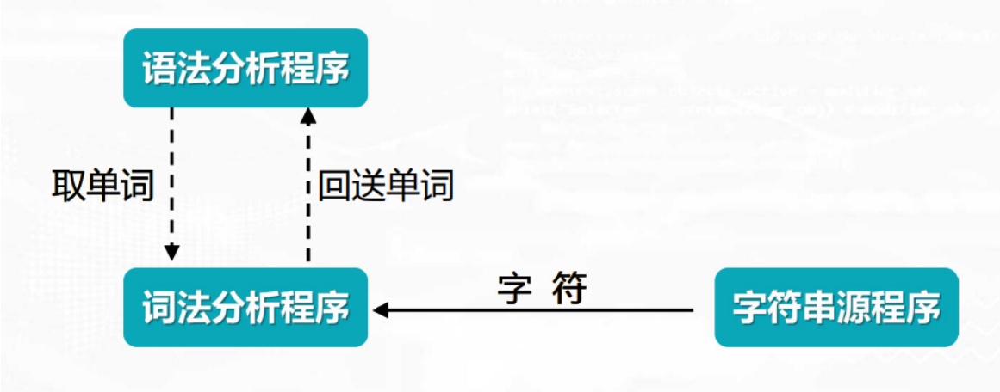
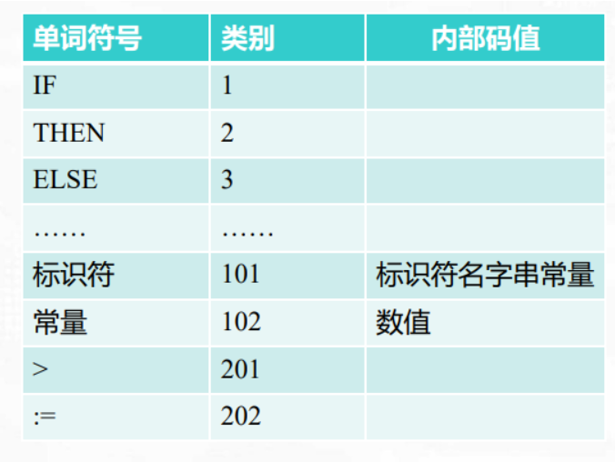
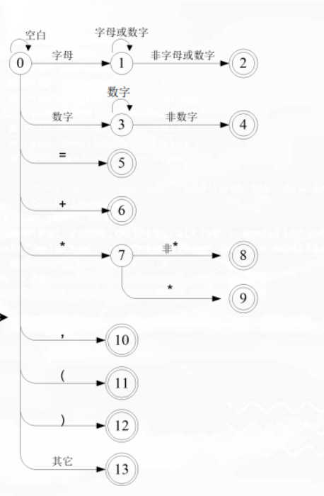
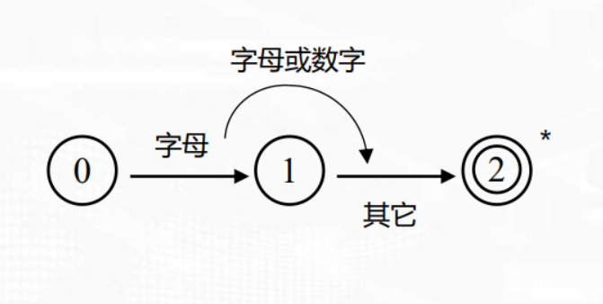
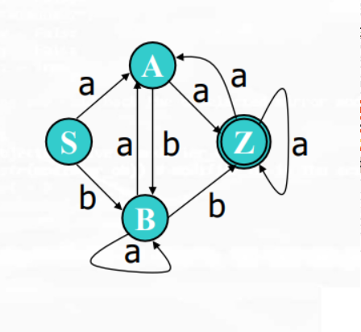
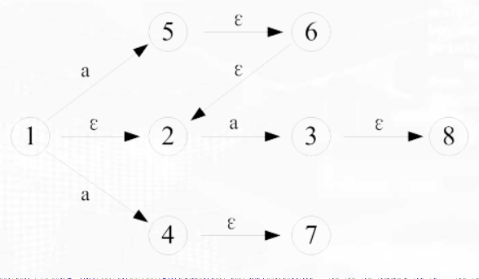
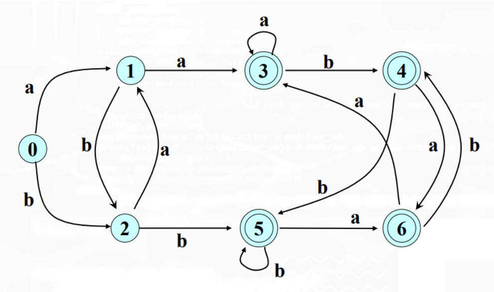
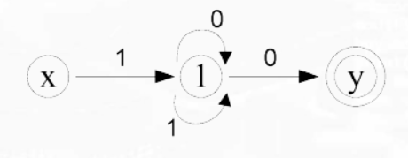
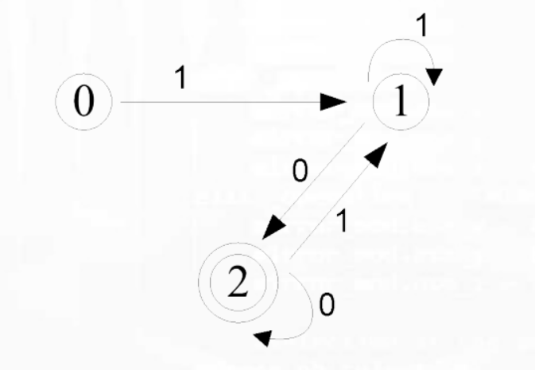

# lexical analysis


<!-- @import "[TOC]" {cmd="toc" depthFrom=1 depthTo=6 orderedList=false} -->

<!-- code_chunk_output -->

- [lexical analysis](#lexical-analysis)
    - [概述](#概述)
      - [1.词法分析](#1词法分析)
        - [(1) 任务](#1-任务)
        - [(2) 实现方式](#2-实现方式)
        - [(3) 输出形式](#3-输出形式)
      - [2.词法分析实现](#2词法分析实现)
        - [(1) 状态转换图](#1-状态转换图)
        - [(2) 简单案例实现](#2-简单案例实现)
      - [3.正规式和正规集](#3正规式和正规集)
        - [(1) 正规式定义](#1-正规式定义)
        - [(2) 举例](#2-举例)
      - [4.DFA (determinitive finite automata, 确定有限自动机)](#4dfa-determinitive-finite-automata-确定有限自动机)
        - [(1) 定义](#1-定义)
        - [(2) 确定性](#2-确定性)
        - [(3) 举例](#3-举例)
        - [(4) DFA识别字符串](#4-dfa识别字符串)
      - [5.NFA (non-deterministic finite automata, 非确定有限自动机)](#5nfa-non-deterministic-finite-automata-非确定有限自动机)
        - [(1) 定义](#1-定义-1)
        - [(2) 非确定性](#2-非确定性)
        - [(3) 举例](#3-举例-1)
      - [6.正规式和有限机的等价（转换）](#6正规式和有限机的等价转换)
        - [(1) 正规式 -> NFA](#1-正规式---nfa)
        - [(2) NFA -> DFA](#2-nfa---dfa)
        - [(3) 设计一个DFA](#3-设计一个dfa)

<!-- /code_chunk_output -->

### 概述

#### 1.词法分析

##### (1) 任务
识别出一个个单词符号 (token)

##### (2) 实现方式

* 完全独立的方式
    * 生成一个中间文件
    

* 相对独立的方式
    * 被调用时，返回单词
    

##### (3) 输出形式
* 单词符号 通常用**二元式**表示
    * `(单词类别, 自身的值)`
    * 比如: 
        * 存在如下单词分类
        
        * 尝试解析:
            ```shell
            IF a1> 0
            THEN b1:=c1*d1
            ELSE b1:=5
            ```
        * 解析结果:
            ```shell
            (1, _)
            (101, 'a1')
            (201, _)
            (102, 0)
            (2,_)
            ...
            ```

#### 2.词法分析实现

##### (1) 状态转换图


* 说明
    * 处于0状态时
        * 当输入的字符是字母，则进入1状态（即调用程序1）
        * 当输入的字符是`=`符号，则进入5状态（即调用程序5）
        * ...
    * 处于1状态时
        * 当输入的字符是字母或数字，则进入1状态（即调用程序1）
        * 当出入的字符是非字母数字，则进入2状态（即调用程序2）
    * ...

##### (2) 简单案例实现


```shell

#程序0
#   获取字符： 
#       如果是字母则调用程序1
#       否则报错
PROCEDURE Pro0;
BEGIN
    Getchar;
    IF char IN [‘A’..‘Z’ ]
    then pro1
    else error;
END;

#程序1
#   获取字符: 
#       如果是字母或数字，则连接字符，并继续重复
#       否则，调用程序2
Procedure pro1;
BEGIN 
    getchar;
    while char IN [‘A’..‘Z’, ‘o’..‘9’ ] DO
        BEGIN 
            concat;
            getchar;
        END;
    pro2; 
END; 

#程序2
#   字符指针回退一个
#   返回单词的二元式
procedure pro2; 
BEGIN 
    retract; 
    return(101,TOKEN ); 
END;
```

#### 3.正规式和正规集
正规式用于描述正规集

##### (1) 正规式定义
* ε (空字) 和 φ (空集)都是Σ (字母表) 上的正规式
* 任何a ∈ Σ，则a是Σ上的正规式
* 假定u和v是正规式，则以下都是正规式: u|v, uv, u*

仅由**有限次**使用上述三步而定义的表达式才是Σ上的正规式

##### (2) 举例
* 字母表Σ={0, 1}
    * 则存在正规式: 0， 1， ε， φ ， 1*， (101)*, ...
    * 则存在正规集: {0}，{1}， {ε}， φ， {1}*，{101}*, ...

#### 4.DFA (determinitive finite automata, 确定有限自动机)

##### (1) 定义
D =（K，Σ，M，S，F）
* K: 有穷非空的状态集合
* Σ: 有穷非空的字母表
* M: 转换函数，M(ki,a) = kj, 其中ki、kj ∈ K, a ∈ Σ
    * 表示当处于ki状态时，输入的是a，则进入kj状态
* S: S是唯一的一个初态 (S ∈ K)
* F: 是一个非空的终态集合 (F是K的子集)

##### (2) 确定性
确定性体： 转换函数是一个单值函数，即对任何状态s ∈ S 和 输入符号a ∈ Σ，M(s, a)能唯一地确定了下一状态

##### (3) 举例
* 存在DFA D =（{S，Z，A，B}，{a，b}，M，S，{Z}）
* 转换函数:
```
M(S，a)=A  M(S，b)=B
M(A，a)=Z  M(A，b)=B
M(B，a)=A  M(B，b)=Z
M(Z，a)=Z
```


##### (4) DFA识别字符串
判断字符串能否被DFA所识别，比如
* 存在DFA D =（{S，Z，A，B}，{a，b}，M，S，{Z}）
* 转换函数:
```
M(S，a)=A  M(S，b)=B
M(A，a)=Z  M(A，b)=B
M(B，a)=A  M(B，b)=Z
M(Z，a)=Z
```
* 判断能否识别字符串ababaa
M(S, ababaa) = M(M(S,a), babaa) = M(A,babaa) = M(M(A,b), abaa) = M(B,abaa) = M(A,baa) = M(B,aa) = M(A,a) = Z

#### 5.NFA (non-deterministic finite automata, 非确定有限自动机)

##### (1) 定义
N =（K，Σ，M，S，F）
* K: 有穷非空的状态集合
* Σ: 有穷非空的字母表
* M: 转换函数，M(ki,a) = {k1,k2,..,kn} 其中ki、kn ∈ K, a ∈ Σ
    * 表示当处于ki状态时，输入的是a，则可能进入{k1,k2,..,kn}中的某个状态
* S: 是一个非空的初态集合 (S是K的子集)
* F: 是一个非空的终态集合 (F是K的子集)

##### (2) 非确定性
非确定性： 转换函数不是一个单值函数，即对任何状态s ∈ S 和 输入符号a ∈ Σ，M(s, a)可能转换到多种状态中的某个

##### (3) 举例
* 存在NFS N = ({S,A,B,Z},{a,b},M,{S},{Z})
* 转换函数:
```
M(S,a)={A} M(S,b)={B}
M(A,a)={Z} M(A,b)={B}
M(B,a)={A,B} M(B,b)={Z}
M(Z,a)={A,Z}
```



#### 6.正规式和有限机的等价（转换）

##### (1) 正规式 -> NFA
* 转换规则


* 举例: 存在正规式 (A|B){A|B|0|1}，转换成NFA


##### (2) NFA -> DFA

* 前置概念
    * I是NFA的一个状态子集，I的ε-闭包
        * 若S∈I，则S∈ε-CLOSURE(I)
        * 若S∈I ，则从s出发经过任意条ε弧而达到的状态s’，有s’∈ε-CLOSURE(I)
    * Ia= ε-CLOSURE(J)，其中J是I中任意状态出发（跳过前面任意多条ε弧），经过一条a弧而能达到的状态结的全体
    * Ib= ε-CLOSURE(J)，其中J是I中任意状态出发（跳过前面任意多条ε弧），经过一条b弧而能达到的状态结的全体
    * 举例
        * 存在NFA如下:
        
        * I={1,3}，则
            * ε-CLOSURE(I) ={1, 3, 2, 8}
            * Ia={2,3,4,5,6,7,8}
* 算法描述，举例:
    * 存在NFA
    

    * 逐渐填充这个表
    
    
        * 第0列第1行: εCLOSURE(X)
        * 由于只有两个字符a和b，所以只有两列Ia和Ib
        * Ia的第一行（根据上述定义的概念填充），同理填充Ib的第一行
        * 然后观察Ia和Ib的第一行，是否出现在第0列中
            * 如果没有，则在第0列添加一行，重复上述步骤
    * 根据上表，得到DFA
        * 把第0列的每一行标记为一种状态
        
        * 得到DFA
        

##### (3) 设计一个DFA
要求: 识别二进制偶数（不以0开头的无符号数）

* 写出正规式: 1（1|0）* 0
* 正规式 -> NFA


* NFA -> DFA


