# BST (Binary Search Tree)


<!-- @import "[TOC]" {cmd="toc" depthFrom=1 depthTo=6 orderedList=false} -->

<!-- code_chunk_output -->

- [BST (Binary Search Tree)](#bst-binary-search-tree)
    - [概述](#概述)
      - [1.BST](#1bst)
        - [(1) 定义](#1-定义)
        - [(2) 特性](#2-特性)
      - [2.BBST (balanced BST)](#2bbst-balanced-bst)
        - [(1) 平衡标准](#1-平衡标准)
        - [(2) 重平衡算法 (基于等价变换)](#2-重平衡算法-基于等价变换)
      - [3.AVL Tree (一种BBST)](#3avl-tree-一种bbst)
        - [(1) 平衡标准](#1-平衡标准-1)
        - [(2) 重平衡算法: 3+4重构](#2-重平衡算法-34重构)
      - [4.Splay Tree (一种BBST)](#4splay-tree-一种bbst)
        - [(1) locality (局部性)](#1-locality-局部性)
        - [(2) 平衡标准](#2-平衡标准)
        - [(3) 自平衡核心: 双层旋转](#3-自平衡核心-双层旋转)
        - [(4) 综合评价](#4-综合评价)
      - [5.B-Tree (一种balanced multi-way search tree)](#5b-tree-一种balanced-multi-way-search-tree)
        - [(1) 多路搜索树 (multi-way search tree)](#1-多路搜索树-multi-way-search-tree)
        - [(2) why (与BBST的区别)](#2-why-与bbst的区别)
        - [(3) m阶B-tree (即m路平衡搜索树) 的平衡标准](#3-m阶b-tree-即m路平衡搜索树-的平衡标准)
        - [(4) 分裂 (当添加节点发生上溢时)](#4-分裂-当添加节点发生上溢时)
        - [(5) 旋转或合并 (当删除节点发生下溢时)](#5-旋转或合并-当删除节点发生下溢时)
        - [(6) 实际应用](#6-实际应用)
      - [6.B+tree](#6btree)
        - [(1) 定义](#1-定义-1)
        - [(2) 和B-tree的区别](#2-和b-tree的区别)
      - [7.red-black tree (一种BBST)](#7red-black-tree-一种bbst)
        - [(1) persistent structure (持久性结构、一致性结构)](#1-persistent-structure-持久性结构-一致性结构)
        - [(2) why (与BBST的区别)](#2-why-与bbst的区别-1)
        - [(3) 定义 (即平衡标准)](#3-定义-即平衡标准)
        - [(4) 提升变换: red-black tree -> (2,4)-tree](#4-提升变换-red-black-tree---24-tree)
        - [(5) 双红缺陷 (当添加节点时)](#5-双红缺陷-当添加节点时)
        - [(6) 双黑缺陷 (当删除节点时)](#6-双黑缺陷-当删除节点时)
        - [(7) 总结](#7-总结)

<!-- /code_chunk_output -->

### 概述

#### 1.BST

##### (1) 定义
* 用**key**标识每一个节点
    * 通过key访问节点
    * key需要能够 大小比较 和 相等比较
* 需要满足**顺序性**
    * 任何一节点均 不小于/不大于 其 左/右后代

##### (2) 特性
* 采用中序遍历，则必然单调非降
* 搜索、添加、删除的时间复杂度 = O(h)，即与树的高度有关
    * 所以需要控制树的高度
* 将vector和list优势结合
    * vector 查找效率高，移动（插入、删除等）效率低
    * list 查找效率低，移动（插入、删除等）效率高

#### 2.BBST (balanced BST)

* 不同的BBST的 **平衡标准** 和 **自平衡算法** 不一样

##### (1) 平衡标准
定义平衡的标准

##### (2) 重平衡算法 (基于等价变换)
通过基于等价变换的相关算法，将 失衡的BBST 重新调整成平衡的
* 基本方式: 等价变换


#### 3.AVL Tree (一种BBST)

* 当添加节点，导致失衡时
    * 只需要从下往上遍历，找到失衡的节点，进行调整
    * 则整体会变为平衡
    * 所以复杂度: O(1)
* 当删除节点，导致失衡时
    * 需要从下往上遍历，找到失衡的节点，进行调整
    * 调整后，祖先节点可能也会失衡，则需要继续调整
    * 直到遍历到最上层
    * 所以复杂度: O(logn)

##### (1) 平衡标准
* 对于每个节点: 平衡因子等于左右子树的高度差
* `balFac(v) = height(lc(v)) - heigh(rc(v))`
    * balFac: balance factor
    * lc: left child
    * rc: right child

##### (2) 重平衡算法: 3+4重构
* 三个节点
    * 失衡节点g
    * g的更高的孩子节点p
    * p的更高的孩子节点v
* 四个子节点:
    g、p、v的子节点
* 有四种排列情况，下图为其中两种

* 概述：
    将这个七个节点，按顺序排列，然后组成装层数更低的树

#### 4.Splay Tree (一种BBST)


##### (1) locality (局部性)
* 刚被访问过的数据，极有可能很快的再次被访问

##### (2) 平衡标准 
* 将被访问的节点，通过不断的等价变换，移动到树根
    * 即search后，会调整目标节点到树根
        * 当search成功，则目标节点为所要查找的节点
        * 当search失败，则目标节点为最后一个定位到的节点

##### (3) 自平衡核心: 双层旋转

* 子孙异侧
    * v是要访问的点
    * p是v的父亲
    * g是v的祖父


* 子孙同侧
    * v是要访问的点
    * p是v的父亲
    * g是v的祖父


##### (4) 综合评价

* 无需记录平衡因子等，编程实现优于AVL树
* 分摊复杂度O(logn), 与AVL树相当
* 当局部性强、缓存命中率极高时，效率更高
* 不能保证单次最坏情况，所以不适用于效率敏感的场合

#### 5.B-Tree (一种balanced multi-way search tree)

##### (1) 多路搜索树 (multi-way search tree)
多路搜索树 本质 还是 二叉树，可以理解为二叉树按某种方式合并，比如: 
* 和相邻结点合并: 3路
* 每2代合并: 4路

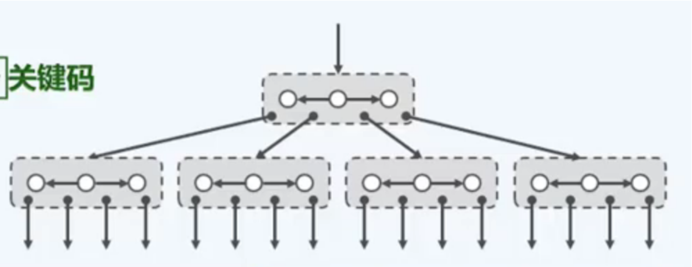
* 每3代合并: 8路
* 每n代合并: `m = 2^n`路, `m-1`个key

##### (2) why (与BBST的区别)

* **充分利用I/O**的特性: 当读取数据单元的大小为1KB时，则读取1B和1KB时间是一样的
    * 因为能够将**多个keys/pointers** 放入 **一个结点** 中（而不是一个结点一个key/pointer）
    * 且key需要能够**排序**

* 比如在1GB数据中进行查找
    * AVL需要
        * 路数: `m = 2`
        * I/O次数: `log(2, 10^9) = 30`
    * 平衡的多路搜索树:
        * 路数 `m = 1KB/4 ~= 256` (假设key的大小是4B)
        * I/O次数: `log(256, 10^9) <= 4`

##### (3) m阶B-tree (即m路平衡搜索树) 的平衡标准

* 所有**叶节点深度统一**
* m为任意正整数
* 路数的范围: 
    * 树根: `[2, m]` 
        * 即key数`[1,m-1]`
        * 因为插入可能导致上溢，上溢到根节点，根会进行分裂，分裂后树的高度会增加1, 树根的路数会为2
    * 除树根外: `[m/2, m]`
        * 即key数`[m/2-1, m-1]`
        * 称为 `m/2-m tree`，比如:当m=3时，则为2-3 tree

* 说明
    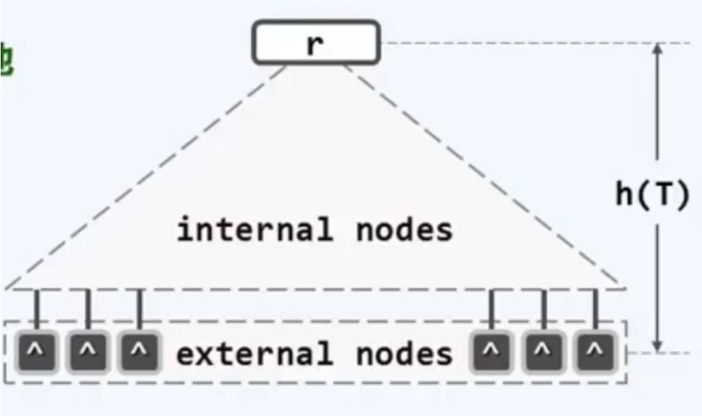
    * 外部节点 (external nodes): 就是叶节点并不存在的孩子
    * 树高h=外部节点的深度 (与其他的树不同) 


##### (4) 分裂 (当添加节点发生上溢时)
选择中间key，然后移动到父节点中，左、右部分分别作为该key的左右孩子
移动到父节点后，如果发生上溢，则继续分裂
直到根节点，根节的点分裂，树的高度会增加1, 树根的路数会为2

##### (5) 旋转或合并 (当删除节点发生下溢时)

* 旋转
    * 当旁边节点的key足够多，则会移动一个到当前节点
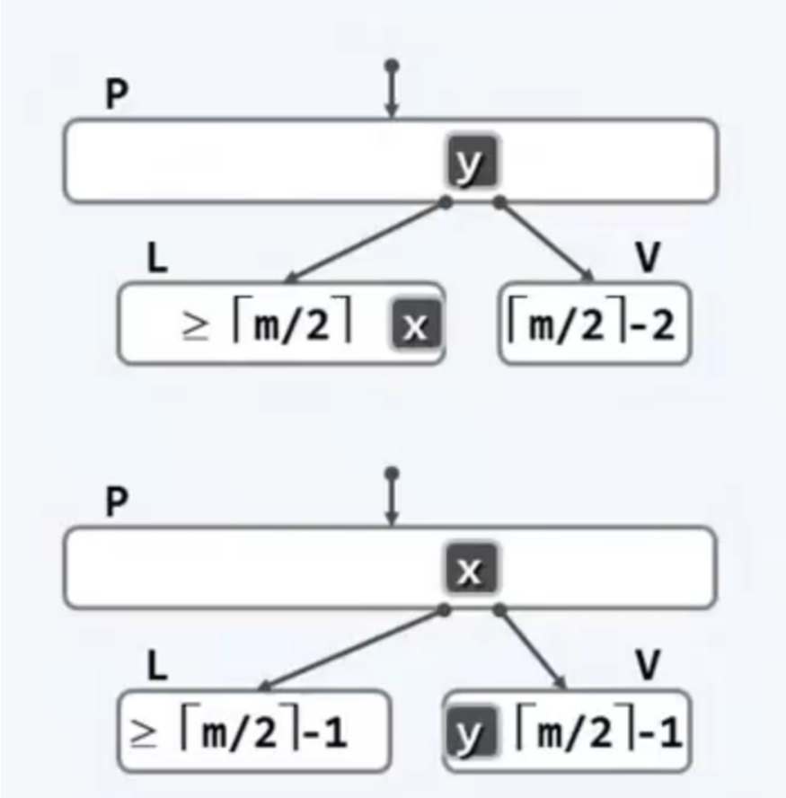

* 合并
    * 当无法通过旋转调整时
        * 即旁边节点的key和当前节点的key加起来不足m-1
    * 则从父节点上取出一个key，作为粘合剂，将两个子节点进行合并
    * 父节点可能发生下溢，则继续旋转或合并
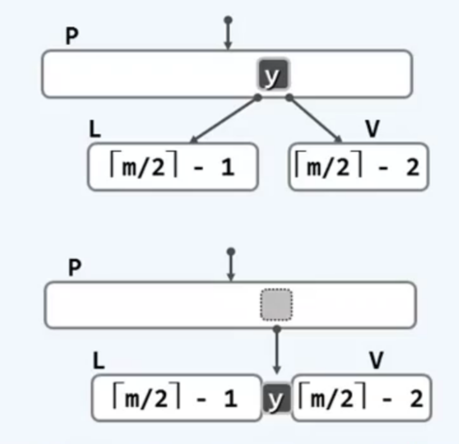


##### (6) 实际应用
能够将多个keys/pointers放入一个结点中（而不是一个结点一个key/pointer）
且key需要能够排序

* 在database中的应用
    * 用B-tree/B+tree 组织数据库的索引
        * 将 index/data pointer 放入在结点中，从而能够更快的找到数据库记录

* 在filesystem中的应用
    * 用B-tree/B+tree 组织文件搜索
        * 将 文件名/文件属性 放入结点中，从而能够快速搜索到指定文件的相关属性
    * ext4中的extent tree
        * 一个extent是一组连续的数据块
        * 假设"example.txt"有三个extent，extent tree如下
            * 将 逻辑地址/物理地址 放入结点中，从而能够很快定位到物理地址
            ```csharp
            Extent Tree for "example.txt":

                        [Extent1]
                        /         \
                    [Extent2]  [Extent3]
            ```
        * 当需要读取具体的数据块时，能够根据逻辑地址快速定位到extent，从而快速定位到物理地址

#### 6.B+tree

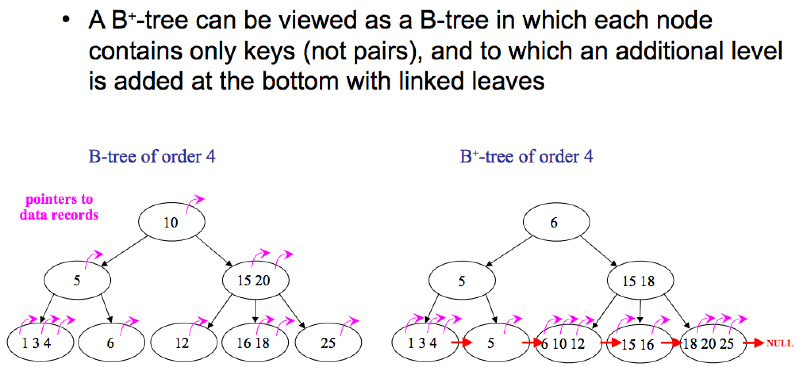

##### (1) 定义
与B-tree类似，特殊点在于:
* 只有叶子结点存储了数据的地址
* 叶子层所有的结点都是链接的

##### (2) 和B-tree的区别

* B+tree优势
    * B+tree只有叶子结点存储了数据的地址，B-tree每个结点都存储了数据的地址
        * 所以当每次IO数据的大小固定时，B+tree能够存储**更多的结点**（即除了叶子结点的其他结点），从而确定要搜索对象的地址（即叶子结点的地址）
    * B+tree叶子层所有的结点都是链接的，所以能够从搜索到的结点**按顺序遍历**其他结点

* B-tree优势
    * B+tree每次需要读取到叶子结点，而B-tree当搜索到数据时可以**提前退出**

#### 7.red-black tree (一种BBST)

##### (1) persistent structure (持久性结构、一致性结构)
* 能够支持对历史版本的访问
    * 所以不同版本之间**关联性**要好: 数据要尽可能**共享**
        * 这就需要树的结构的调整要尽可能小
        * 然后之前学习的BBST，添加、删除操作后，树结构的调整比较大，复杂度为O(logn)

##### (2) why (与BBST的区别)
* 添加、删除操作后，树结构的调整复杂度为O(1)
    * 所以该树结构，变化前后，关联性比较好
    * 所以比较适合实现 persistent structure

##### (3) 定义 (即平衡标准)
* 树根 必为黑
* 外部节点 均为黑
* 红 的 父节点 和 子节点 必为黑
* 所有外部节点 到根节点 途中黑节点数目相等

##### (4) 提升变换: red-black tree -> (2,4)-tree
* 将**红节点**往上提，跟父节点平齐
    * red-black tree 就相当于 4阶的b-tree

* 变换前


* 变换后


* 四种情况


##### (5) 双红缺陷 (当添加节点时)
添加节点时，初始化颜色为红
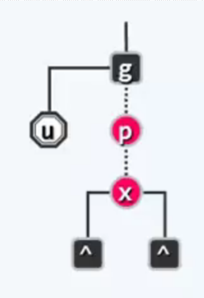

* 当u是黑色
    * 转换成b-tree，便于理解
        * 对于图a': 将p置为黑，g置为红，然后还原成red-black tree
            * 对于图a有一次“3+4”重构，并改变颜色
        * 对于图b': 将x置为黑，g置为红, 然后还原成red-black tree
            * 对于图b有一次“3+4”重构，并改变颜色
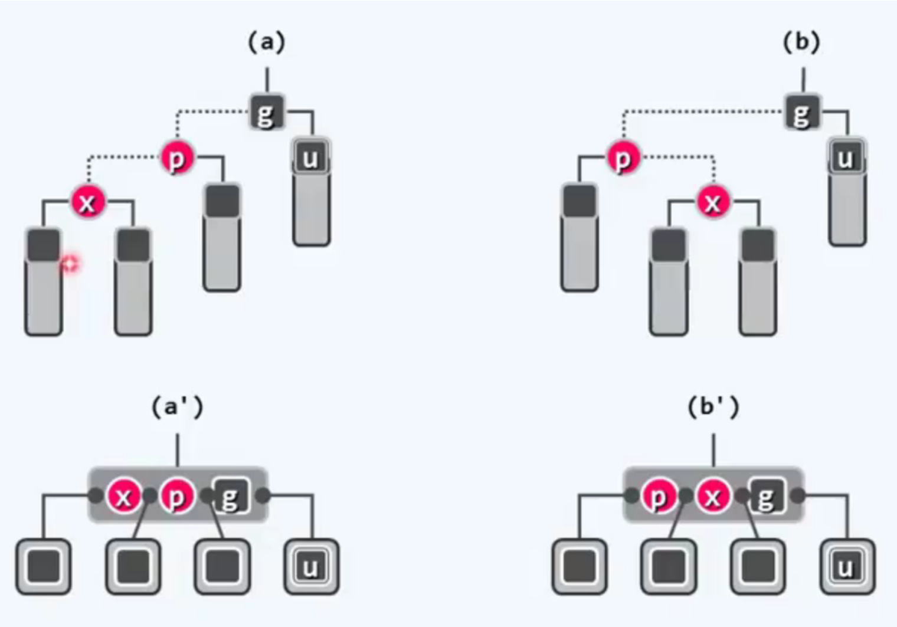

* 当u是红色
    * 转换成b-tree，便于理解
        * 对于图a': 上溢，将g移动父节点，进行分裂
            * 对于图a: 不需要调整结构，只需将x、u置为黑, g置为红
        * 对于图b': 上溢，将g移动父节点，进行分裂
            * 对于图b: 不需要调整结构，只需将p、u置为黑, g置为红
        * 如果g与父节点有双红缺陷，则继续调整
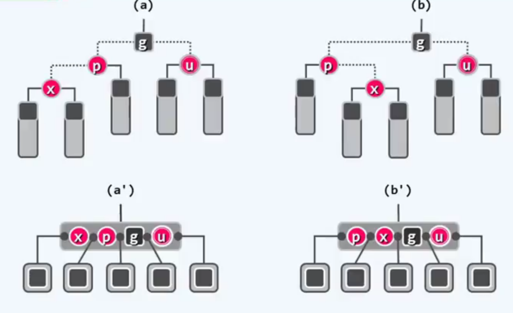


##### (6) 双黑缺陷 (当删除节点时)

删除操作: 删除x，用其某个孩子r代替x
* 当两者有一个为红，则将r置为黑色，不存在双黑问题
* 当两者都为黑，则存在双黑问题，因为路径中的黑色节点数减少了
* 转换为b-tree，就相当于处理下溢问题
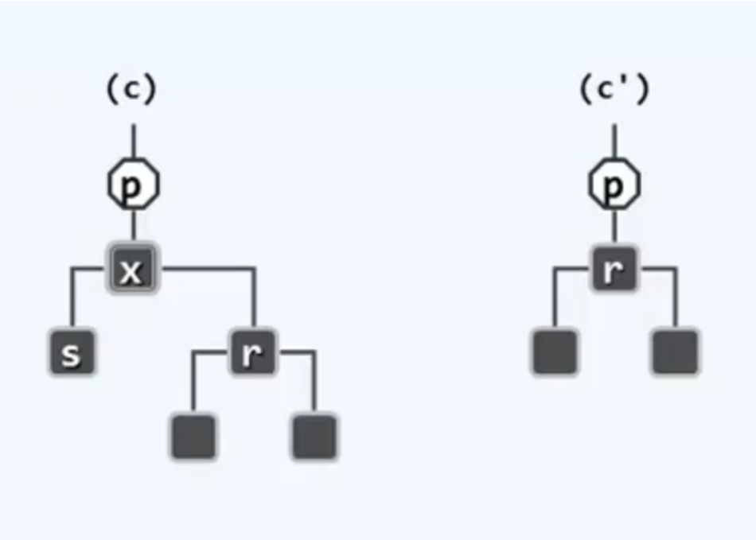

* 当s为黑，且s至少有一个红孩子t时
    * 转换成b-tree，便于理解
        * 通过旋转操作，解决下溢问题
    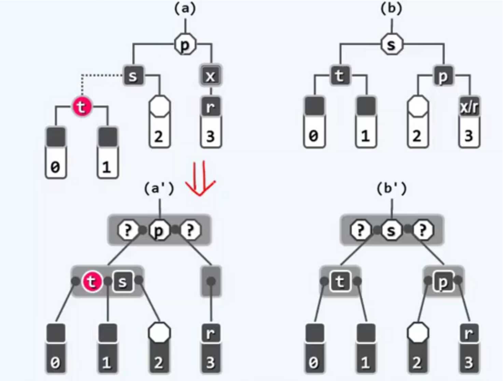

* 当s为黑，且两个孩子都为黑
    * p为红
        * 转换成b-tree，便于理解
            * 用p合并两个孩子，并且不会将下溢上移，因为p是红色，旁边一定还存在黑色的
    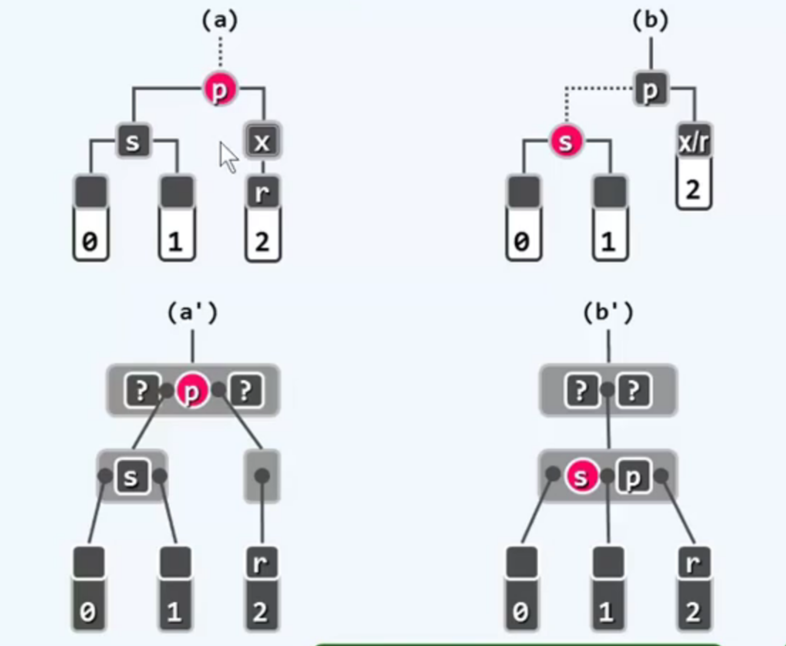
    * p为黑
        * 转换成b-tree，便于理解
            * 用p合并两个孩子，下溢可能上移，但是red-black树的结构没有变化，只是颜色变化
    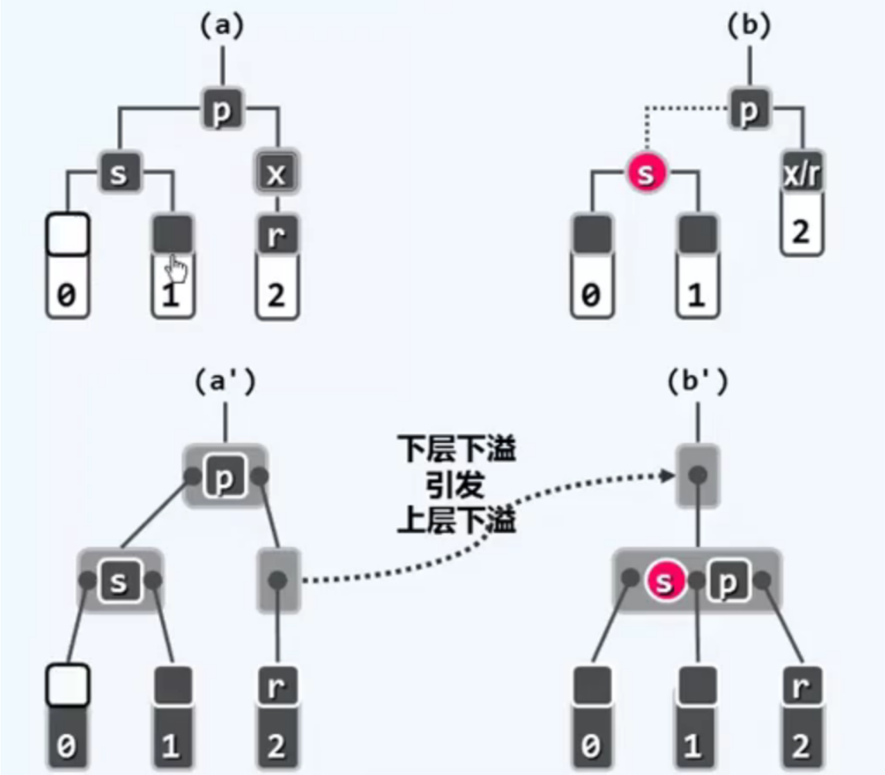
* 当s为红
    * 经过下面转换后，则可能满足上面几种可能性
    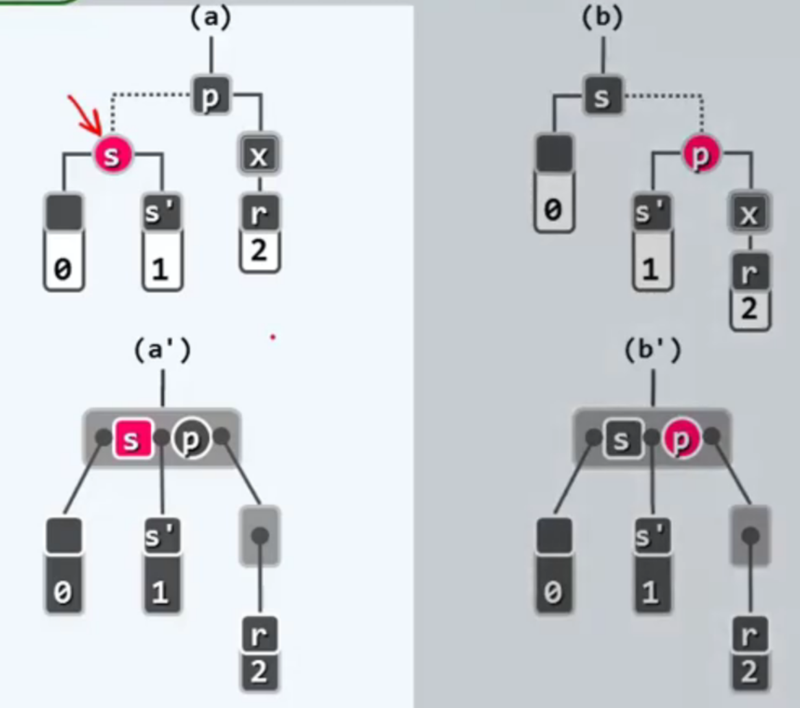

##### (7) 总结
* 添加、删除操作，树结构的调整复杂度为O(1)

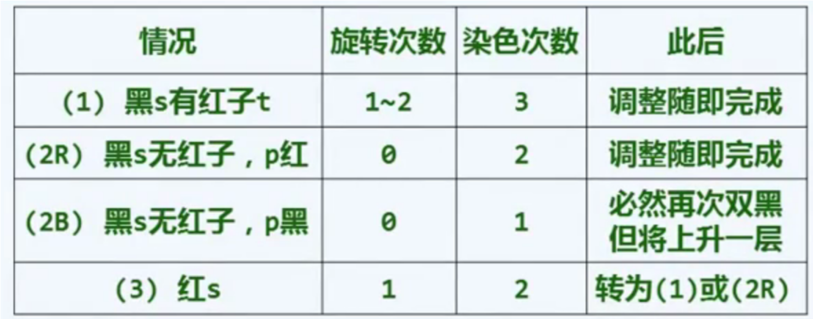