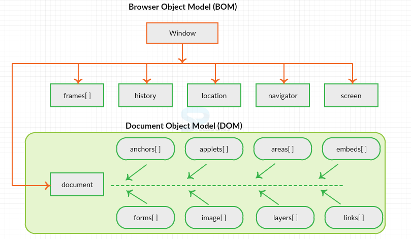

# DOM


<!-- @import "[TOC]" {cmd="toc" depthFrom=1 depthTo=6 orderedList=false} -->

<!-- code_chunk_output -->

- [DOM](#dom)
    - [overview](#overview)
      - [1.Document Object Model](#1document-object-model)
    - [Usage](#usage)
      - [1.window (top)](#1window-top)
        - [(1) basic](#1-basic)
        - [(2) localStorage](#2-localstorage)
      - [2.document](#2document)
      - [3.element](#3element)
        - [(1) events](#1-events)

<!-- /code_chunk_output -->


### overview

#### 1.Document Object Model
* an API for an html document
* 不同的浏览器DOM实现有所不同

***

### Usage

[参考](https://developer.mozilla.org/en-US/docs/Web/API)



#### 1.window (top)

[参考](https://developer.mozilla.org/en-US/docs/Web/API/Window)

##### (1) basic
```js
window.alert("aaaa");

window.open("https://www.google.com");

// scroll the window
window.scrollBy(
    {
        top: window.outerHeight,
        left: 0,
        behavior: 'smooth'
    }
)
```

##### (2) localStorage
* `window.localStorage`其中`window.`可以省略
```js
localStorage.setItem('test', 20);
```


#### 2.document
* `window.document`其中`window.`可以省略

* get element
```js
// get first button element
const btn = document.querySelector("button");

// get first button element which id is "btn-1"
const btn = document.querySelector("button#btn-1");

// get first button element which has "btn-1" class
const btn = document.querySelector("button.btn-1");
```

* add element
```js

// one way
const elementNode = document.createElement('p');
const textNode = document.createTextNode('this is content');
const attributeNode = document.createAttribute('class')
attributeNode.value = 'some-class';

elementNode.appendChild(textNode);
elementNode.setAttributeNode(attributeNode);

document.body.appendChild(elementNode);

// another way
const elementNode = document.createElement('p');
elementNode.textContent = 'this is content';
elementNode.setAttribute('class', 'some-class');

document.body.appendChild(elementNode);


// elementNode:
//  <p class="some-class">this is content</p>
```


#### 3.element

window is also an element

##### (1) events

```js
const element = document.querySelector("div#scroll-box");

function printEvent(event) {
    console.log(event);
}

// one way
element.onscroll = printEvent;

// another way
element.addEventListener('scroll', printEvent);
```