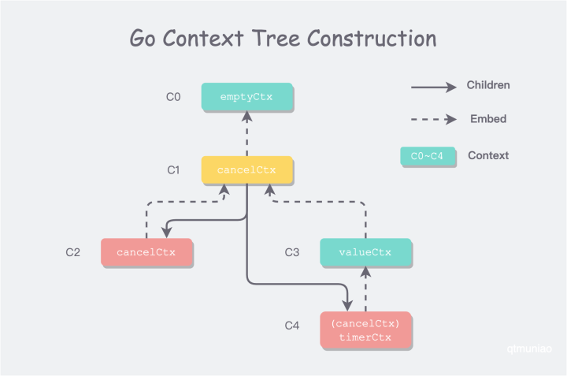

# context


<!-- @import "[TOC]" {cmd="toc" depthFrom=1 depthTo=6 orderedList=false} -->

<!-- code_chunk_output -->

- [context](#context)
    - [overview](#overview)
      - [1.basic](#1basic)
        - [(1) introduction](#1-introduction)
        - [(2) `Background()`和`TODO()`](#2-background和todo)
        - [(3) withCancel、withDeadline、withTimeout、withValue](#3-withcancel-withdeadline-withtimeout-withvalue)

<!-- /code_chunk_output -->


### overview

* 
  * embed points to the cotext's parent

* tree-like hierarchy
  * `with<Function>(<parent_context>)` will create a **new child context**
  * If the parent’s context is canceled, the child sees the cancellation
  * if you cancel the child context (or it times out), this does not affect the parent
* passed between different functions
* `cancelCtx` has a channel which used to receive signal to cancel context
  * other implements of context don't have a channel (i.e. Done() is nil)
  * you can do what you want to do when you receive a signal from the channel
* `Background()` and `TODO()` are `emptyCtx`, which can't cancel or do other things and their context interfaces are all nil
  ```go
  type emptyCtx struct{}

  func (emptyCtx) Deadline() (deadline time.Time, ok bool) {
    return
  }

  func (emptyCtx) Done() <-chan struct{} {
    return nil
  }

  func (emptyCtx) Err() error {
    return nil
  }

  func (emptyCtx) Value(key any) any {
    return nil
  }
  ```

#### 1.basic

The context is used to allow cancellation of requests, and potentially things like tracing

##### (1) introduction
```go
type Context interface {
  Deadline()(deadline time.Time, ok bool)

  // return a channel which is used to receive cancel signal
  Done() <-chan struct{}  

  Err() error
  Value(key interface{}) interface{}
}
```
* Context type is used to carry deadlines,cancellation signals and other request-scoped values accross goroutines
* when a Context is canceled,all Contexts derived from it are also canceled(means Done() channel will get a cancel signal)

##### (2) `Background()`和`TODO()`
这两个函数返回的是**empty** Context, so can't cancel the them

* `Background()`
  * 返回一个context，主要用于main函数等，作为最顶层的Context（即根Context）
* `TODO()`
  * 返回一个context，当不清楚是否需要Context，可以使用`TODO()`产生一个Context
  * use context.TODO() as a “marker” for code that should to be fixed at some point
```go
package main

import (
	"context"
	"fmt"
)

func main() {
	// Placeholder context as we're not sure what to use here yet
	// could replace it with the timeout context in the future:
	// ctx, cancel := context.WithTimeout(context.Background(), 5*time.Second)
	ctx := context.TODO()

	result, err := queryDatabase(ctx)
	if err != nil {
		fmt.Println("Query failed:", err)
		return
	}
	fmt.Println("Query result:", result)
}

func queryDatabase(ctx context.Context) (string, error) {
	// Simulate a database query
	return "Data from database", nil
}

```

##### (3) withCancel、withDeadline、withTimeout、withValue
```go
// used to send signal to Done() channel actively
// 返回 Context 和 CancelFunc函数（用于取消当前context）
func withCancel(parent Context) (Context, CancelFunc)

//设置一个超时时间（具体的时间点），即到了这个时间点，会触发CancelFunc()函数
func withDeadline(parent Context, deadline time.Time) (Context, CancelFunc)

//设置一个超时时间（时长）,即执行时长超过设置的值，会触发CancelFunc()函数
func withTimeout(parent Context, timeout time.Duration) (Context, CancelFunc)

//传递值
//  key不应该用内置类型（比如string），防止冲突，因为可能会在不能包中传递，当很多人使用你这个包时，容易使用同一个key，从而造成冲突
func withValue(parent Context, key, val interface{}) Context
```
* 使用说明
```go
func main(){
  ctx,cancel := context.withCancel(context.Background())
  defer cancel()
  //...
  //判断上下文是否取消: ctx.Done()进行判断
}
```

```go
//自定义一个类型
type TradeCode string

func main(){
  ctx,cancel := context.withTimeout(context.Background(), time.Millisecond*50)
  ctx := context.withValue(ctx, TradeCode("k1"),"v1")
  //...
}
```
