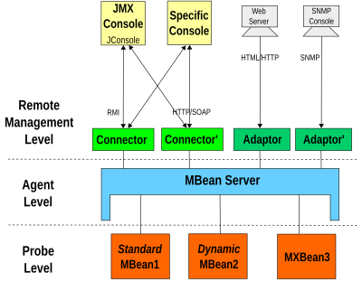

# jmx（java management extensions）

<!-- @import "[TOC]" {cmd="toc" depthFrom=1 depthTo=6 orderedList=false} -->
<!-- code_chunk_output -->

- [jmx（java management extensions）](#jmxjava-management-extensions)
    - [概述](#概述)
      - [1.术语](#1术语)
        - [（1）MBean](#1mbean)
      - [2.架构](#2架构)
        - [（1）probe level（探测层）](#1probe-level探测层)
        - [（2）agent level（管理层）](#2agent-level管理层)
        - [（3）remote management level（远程管理层）](#3remote-management-level远程管理层)
    - [使用](#使用)
      - [1.基本语法](#1基本语法)
        - [（1）查看某台主机所有的MBean](#1查看某台主机所有的mbean)
        - [（2）查看某个MBean的内容](#2查看某个mbean的内容)
        - [（3）某些MBean含有context或path关键字](#3某些mbean含有context或path关键字)

<!-- /code_chunk_output -->

### 概述

#### 1.术语

##### （1）MBean
managed bean，是JVM中运行的一个资源，是一个探测器


#### 2.架构


##### （1）probe level（探测层）
通过探测器（MBean）采集信息

##### （2）agent level（管理层）
jmx的核心，通过MBeanServer管理探测器（MBean）

##### （3）remote management level（远程管理层）
提供远程访问的入口，允许远程应用访问MBeanServer，从而获取采集信息

***

### 使用

使用`cmdline-jmxclient-0.10.3.jar`获取监控数据

#### 1.基本语法
```shell
java -jar cmdline-jmxclient-0.10.3.jar <user>:<password> <ip>:<port> [BEAN] [COMMAND]
#没有用户密码，就用 - 填充
```

##### （1）查看某台主机所有的MBean
```shell
java -jar cmdline-jmxclient-0.10.3.jar - <ip>:<port>
```

##### （2）查看某个MBean的内容
```shell
java -jar cmdline-jmxclient-0.10.3.jar - <ip>:<port> Catalina:name=\"http-nio-8080\",type=GlobalRequestProcessor
#有引号的地方必须转义
#
#获得的内容如下：
#
#Attributes:
# bytesReceived: Introspected attribute bytesReceived (type=long)
# bytesSent: Introspected attribute bytesSent (type=long)
# ... ...
#Operations:
# resetCounters: Introspected operation resetCounters
#  Parameters 0, return type=void
#
#Attributes是该MBean的属性，可以获得指定的Attributes的值
#如： java -jar cmdline-jmxclient-0.10.3.jar - HOST:PORT Catalina:name=\"http-nio-8080\",type=GlobalRequestProcessor bytesSent
#会获得bytesSent的值
#
#Operations是可以对该MBean进行的操作
#如：java -jar cmdline-jmxclient-0.10.3.jar - HOST:PORT Catalina:name=\"http-nio-8080\",type=GlobalRequestProcessor resetCounters
#会重置计数器，即把所有的attributes的值清0
```

##### （3）某些MBean含有context或path关键字
```shell
context=/              #表示访问webapps目录时
context=/ROOT          #表示访问ROOT这个项目（即webapps/ROOT)时
path=/                 #表示的是url路径，已经不用这个参数了
```
