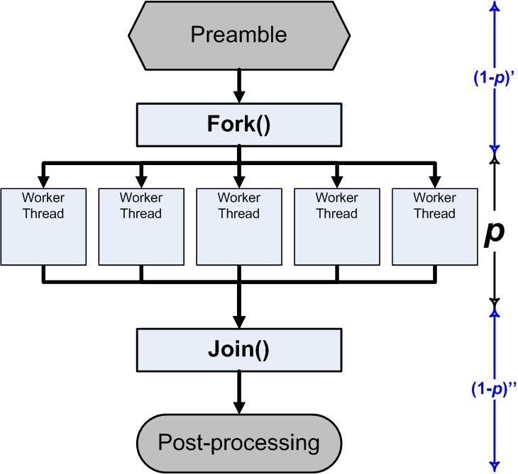

# Process

<!-- @import "[TOC]" {cmd="toc" depthFrom=1 depthTo=6 orderedList=false} -->
<!-- code_chunk_output -->

- [Process](#process)
    - [预备知识](#预备知识)
    - [概述](#概述)
      - [1.特点](#1特点)
      - [2.守护进程](#2守护进程)
      - [3.linux和windows多进程区别](#3linux和windows多进程区别)
    - [使用](#使用)
      - [1. `os.fork()`](#1-osfork)
    - [multiprocssing模块](#multiprocssing模块)
      - [1.基本用法](#1基本用法)
      - [2.`join()`的用法](#2join的用法)
      - [3.互斥锁](#3互斥锁)
      - [4.进程间通信](#4进程间通信)
        - [（1）队列（是进程安全的）](#1队列是进程安全的)
      - [5.进程间共享状态](#5进程间共享状态)
        - [（1）共享内存（速度较慢）](#1共享内存速度较慢)

<!-- /code_chunk_output -->

### 预备知识
* 同步与异步区别：**通知方式**
请求发出后，是否需要等待结果，才能继续执行其他操作
</br>
* 阻塞与非阻塞区别：**等待过程中的状态**
阻塞和非阻塞这两个概念与程序（线程）等待消息通知(无所谓同步或者异步)时的状态有关
</br>
* 通知方式：
  * 轮询
  * 通知
  * 回调
</br>
* 同步阻塞
发出一个功能调用，等待这个调用的结果，在获取结果之前，当前线程会被挂起
典型的例子：input()、sleep()、get()等
</br>
* 同步非阻塞
发出一个功能调用，等待这个调用的结果，在获得结果之前，当前线程可以去做其他事
典型的例子：strip()、sum()、eval()等函数
</br>
* 异步非阻塞
发出一个功能调用，当前线程去做其他事，当执行完成，会通知当前线程
`p.start()`
</br>
* 异步阻塞
发出一个功能调用，当前线程被挂起，当执行完成，会通知当前线程
典型的例子是：等待多个结果，不知道哪个结果先来
### 概述


#### 1.特点

* 每个进程都有自己独立的运行环境
  * 如果多进程要需要通信的话，创建进程时，将通信地址（比如队列）传给进程，则进程就可以通过该地址进行通信

* 进程的生命周期
```mermaid
graph LR
A("parent process")--"fork()"-->B("child process")
B--"exec()"-->C("child process")
C--"exit()"-->D("zombine process")
D--"回收"-->A
```

#### 2.守护进程
* 守护进程 会随着主进程的结束而结束
* 如果主进程结束后还有其他子进程在运行，守护进程不守护
* 在linux中实现系统级别守护进程的方式：fork两次，孙进程会被systemd接管，从而成为守护进程

#### 3.linux和windows多进程区别
* 在linux中
  * 创建进程，进程会复制父进程的数据（fork），然后将**新的任务**放进进程，**覆盖以前的所有数据**（exec），并把新的任务**运行环境（包括导入的模块等）**也放入进程
  * 即 即使没有在任务中import，而是在任务所在文件中import了，该import也会在进程中生效

* 在windows中
  * 创建进程，进程会从头开始，并且重新加载所有模块
  * 所以在windows下，启动进程的要写在`if __name__ == '__main__':`下，不然会无限创建和启动进程（因为创建一个进程就会重新加载所有的模块）
    * 如果创建进程操作不写在下面没事，只要创建后不启动就不会无限循环

***

### 使用
#### 1. `os.fork()`
底层的命令，其他process相关的模块都是基于这个命令
```python
for i in range(3):
    retval = os.fork()
    if retval == 0:
      print('hello')

#打印7个hello
```
```python
for i in range(3):
    retval = os.fork()
    if retval = 0:
      print('hello')
      exit()

#打印3个hello,注意两者的区别
```
***
### multiprocssing模块
#### 1.基本用法
```python
from multiprocessing import Process

p = Process(target = xx, args = (xx,))
p.start()           #这是一个异步操作，不会阻塞
p.pid               #获取进程的pid
p.terminate()       #强制结束一个子进程，异步非阻塞

p.daemon = True     #将该进程设置为守护进程（守护主进程），在start前设置
```
#### 2.`join()`的用法
```python

p_list = []

p = Process(target = xx, args = (xx,))
p.start()
p_list.append(p)

p = Process(target = xx, args = (xx,))
p.start()
p_list.append(p)

for p in p_list:
    p.join()        #阻塞，直到收到p进程返回值（即执行完毕）
```

#### 3.互斥锁
```python
from multiprocessing import Lock

lock = Lock()         #创建一把锁

lock.acquire()        #获取锁
pass                  #临界区的代码
lock.release()        #释放锁

#等价于

#建议使用
with lock:
    pass
```

#### 4.进程间通信
进程数据都是**独立**的，**创建进程时** 将 **通信地址（比如队列）传过去**，就可以通过该地址进行通信

##### （1）队列（是进程安全的）
```python
from multiprocessing import Queue

q = Queue()         #创建队列

q.put(xx)           #往队列里存数据

q.get()             #从队列里取数据（取出后队列中就没有数据了）
                    #没有会阻塞
```

#### 5.进程间共享状态

不建议在进程间共享状态，最好的方式是用进程间通信

##### （1）共享内存（速度较慢）
```python
from multiprocessing import Manager

manager = Manager()
my_list = manager.list()
#可以创建多种类型，包括：list、dict、queue等
```
