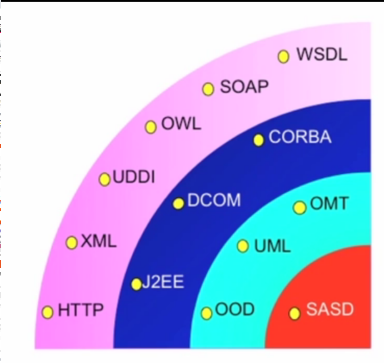
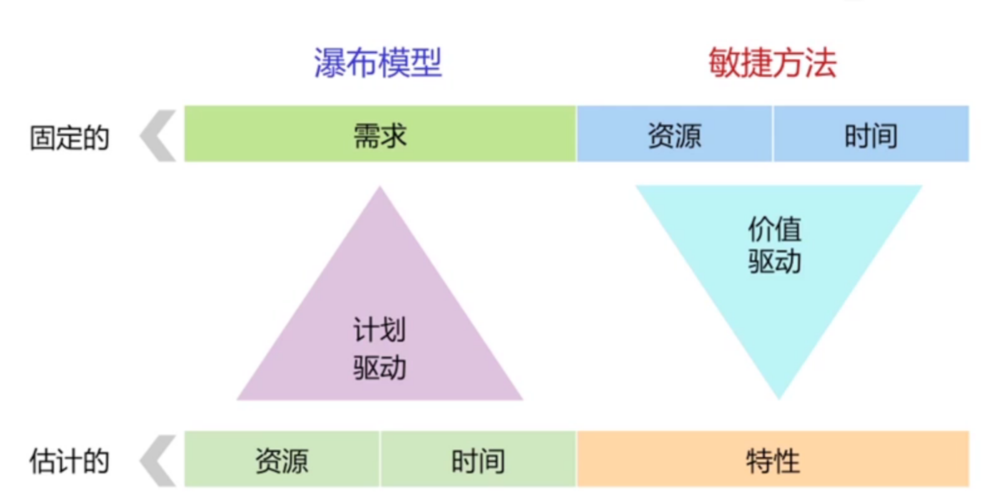
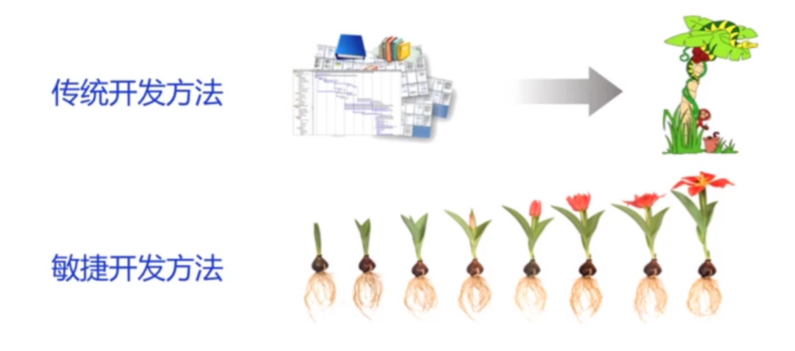
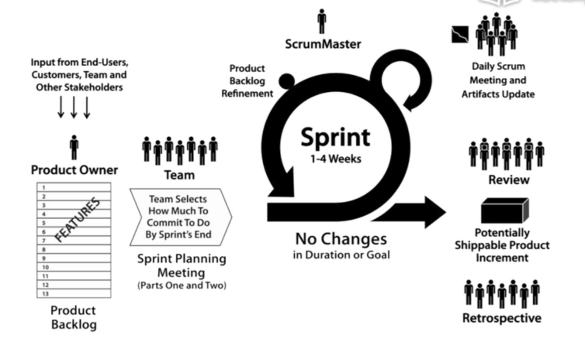
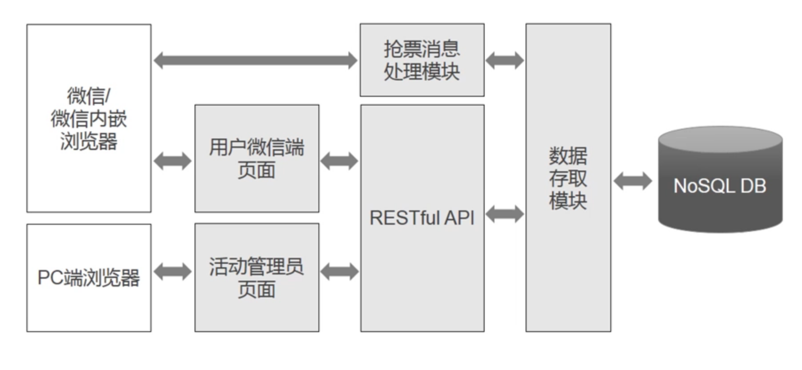
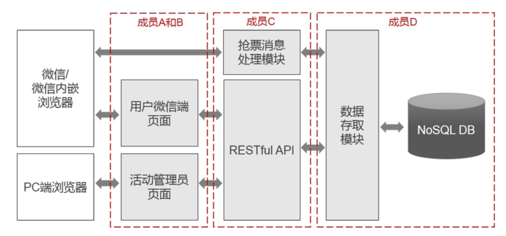
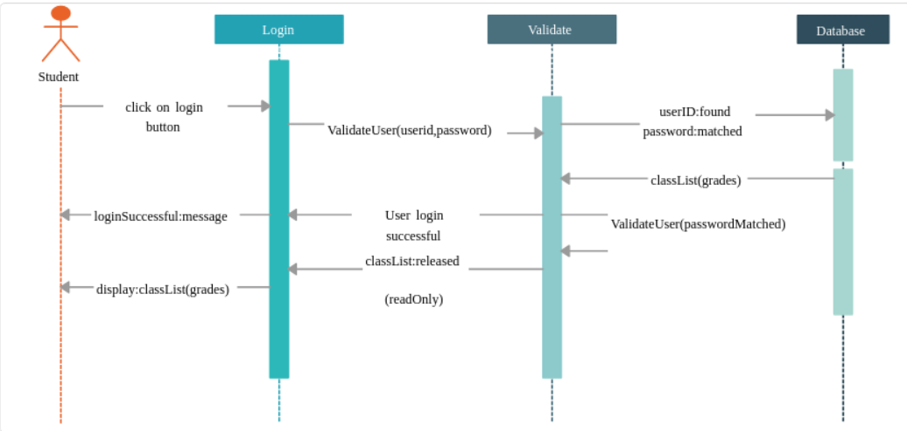
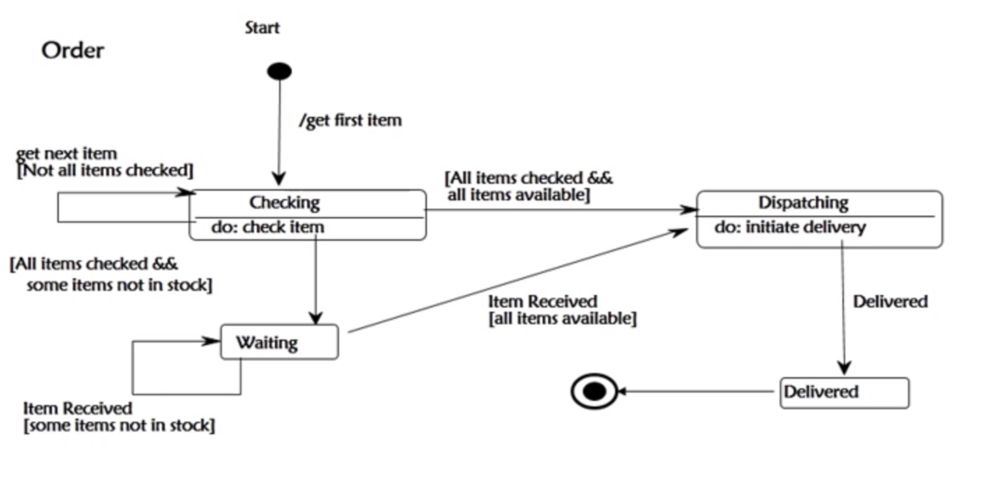

# overview

<!-- @import "[TOC]" {cmd="toc" depthFrom=1 depthTo=6 orderedList=false} -->

<!-- code_chunk_output -->

- [overview](#overview)
    - [概述](#概述)
      - [1.software engineering](#1software-engineering)
        - [(1) 过程](#1-过程)
        - [(2) 方法](#2-方法)
        - [(3) 工具](#3-工具)
      - [2.code review](#2code-review)
        - [(1) 静态代码分析工具](#1-静态代码分析工具)
        - [(2) 性能分析工具](#2-性能分析工具)
      - [3.unit test](#3unit-test)
        - [(1) 测试内容](#1-测试内容)
        - [(2) 测试过程](#2-测试过程)
        - [(3) mock测试](#3-mock测试)
        - [(4) 测试用例](#4-测试用例)
      - [4.过程模型](#4过程模型)
        - [(1) waterfall model (瀑布模型)](#1-waterfall-model-瀑布模型)
        - [(2) prototype model (原型化模型)](#2-prototype-model-原型化模型)
        - [(3) iterative model (迭代模型)](#3-iterative-model-迭代模型)
        - [(4) transformation model (转换模型)](#4-transformation-model-转换模型)
      - [5.敏捷开发](#5敏捷开发)
        - [(1) scrum开发方法](#1-scrum开发方法)
        - [(2) ExtremeProgramming (XP, 极限编程)开发方法](#2-extremeprogramming-xp-极限编程开发方法)
      - [6.软件项目计划](#6软件项目计划)
      - [7.建模方法](#7建模方法)
        - [(1) use case modeling (用例建模)](#1-use-case-modeling-用例建模)
        - [(2) class diagram modeling (类图建模)](#2-class-diagram-modeling-类图建模)
        - [(3) software behavior modeling (软件行为建模)](#3-software-behavior-modeling-软件行为建模)

<!-- /code_chunk_output -->

### 概述

#### 1.software engineering

##### (1) 过程

* 问题定义
    * 提出问题和可行性研究
* 需求开发
    * 需求分析并编写需求规格说明 (SRS: software requirement specification)
* 软件设计
    * 原型、架构、接口等设计
* 软件构造
    * 编写代码
* 软件测试
    * 单元测试
    * 子系统集成测试
    * 系统集成测试
    * 验收测试

##### (2) 方法

* process-oriented
    * 以算法（即函数）作为基本构建单元
* object-oriented
    * 以类作为基本程序单元
* component-oriented
    * 比类 粒度更大且易于复用 的组件
* service-oriented
    * 以服务作为基本单元，构造更复杂的系统
    * 服务由多个组件组装而成

##### (3) 工具
* 需求开发和软件设计
    * 软件建模工具
    * 数据库设计工具
* 软件构造
    * ide工具
* 软件测试
    * 单元测试工具
    * 静态分析工具
    * 自动化测试工具
    * 性能测试工具
    * 缺陷跟踪工具
* 代码维护
    * 代码重构工具
    * 逆向工程工具
* 开发管理
    * 需求管理工具
    * 项目管理工具
    * 配置管理工具
    * 测试管理工具

#### 2.code review

##### (1) 静态代码分析工具
* python: pylint

##### (2) 性能分析工具
* python: profile

#### 3.unit test

##### (1) 测试内容
* 接口
* 数据结构
* 边界条件
* 异常
* 异常处理

##### (2) 测试过程
* 确定要测试的单元或模块
    * 不是每个函数都要测试，而是要找出潜在的最大问题区进行测试
* 编写测试用例
* 进行单元测试

##### (3) mock测试
当测试的模块需要调用其他模块，则通过mock模拟其他模块

##### (4) 测试用例
* 要有足够的覆盖率
    * 等价类
        * 分为多个，一个等价类中只要测试一个
        * 比如输入参数x的范围是 0<=x<=10，则三个范围(,0)、[0,10]、(10,)分别是三个等价类
    * 边界值
        * 边界是最容易出错的地方

* 黑盒测试
* 白盒测试
    * 代码覆盖
        * 完全的代码覆盖率不现实，要根据情况而定
    * 基本路径测试
        * 根据流程图，测试每一条路径是否正确

#### 4.过程模型

##### (1) waterfall model (瀑布模型)
* 缺点:
    * 不适应变化
    * 只有在开发过程结束时，才能看到结果

##### (2) prototype model (原型化模型)
* 减少了瀑布模型中因为软件需求不明确而给开发工作带来的风险
* 缺点:
    * 具有和瀑布模型类似的缺点

##### (3) iterative model (迭代模型)
* 一个版本发布一些功能，不断进行完善
* 及时响应变化

##### (4) transformation model (转换模型)
*  采用形式化的数学手段描述系统，利用自动化手段将需求文档转换为可使用的系统

#### 5.敏捷开发

##### (1) scrum开发方法

##### (2) ExtremeProgramming (XP, 极限编程)开发方法

* spike: 用于寻找可能解决方案的简单方法

#### 6.软件项目计划
* 问题描述
    * 问题背景、项目目标、功能需求等
* 定义顶层设计
    * 明确设计目标、初步进行子系统分解、不断分解等
    * 比如：
    
* 定义项目工作分解
    * 将项目分解为若干子项目或工作单元，并进行任务分配
    * 比如:
    
* 建立初始时间表

#### 7.建模方法

##### (1) use case modeling (用例建模)
* 一个用例定义系统的一系列行为
    * 能为参与者提供有价值和可观测的结果

##### (2) class diagram modeling (类图建模)

* 补充说明
    * `+` 表示public
    * `-` 表示private
    * `#` 表示protected
    * 多样性
    

        * 2表示鸟只能与有2个翅膀实例关联
        * 1表示翅膀只能与1个鸟实例关联

##### (3) software behavior modeling (软件行为建模)

* sequence diagram (顺序图、时序图、序列图)
    * 刻画系统实现某个功能的必要步骤
    * 说明:
        * 横轴: 表面正在进行操作的对象/参与者
        * 纵轴: 时间（向下表示时间的顺延）
        * 顶端多个矩形框： 定义参与交互的对象（类实例）名
        * 每个对象下面的虚直线： 表示该对象的生命线
        * 对象间的各种箭头： 表示各种类型的消息
            * 虚线箭头: 表示返回值
        * 生命线上的竖直矩形：表示对象激活期，表面对象正在执行某操作

* state chart/machine diagram (状态图)
    * 用来表示一个类的全生命周期过程
    * 说明
        * 建模元素: 状态、事件、状态转移
