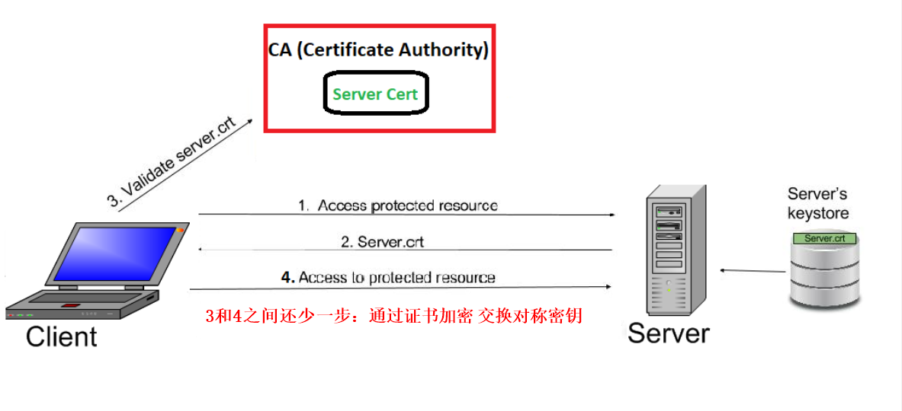

# overview

<!-- @import "[TOC]" {cmd="toc" depthFrom=1 depthTo=6 orderedList=false} -->
<!-- code_chunk_output -->

- [overview](#overview)
    - [基础](#基础)
      - [1.目的](#1目的)
      - [2.网络安全原则](#2网络安全原则)
      - [3.几种加密方式](#3几种加密方式)
        - [（1）单向加密](#1单向加密)
        - [（2）对称加密](#2对称加密)
        - [（3）密钥交换（internet key exchange，IKE，该方式也属于对称加密）](#3密钥交换internet-key-exchangeike该方式也属于对称加密)
        - [（4）非对称加密（很少用来加密数据，速度太慢）](#4非对称加密很少用来加密数据速度太慢)
      - [4.实际双方通信时，加密的方式](#4实际双方通信时加密的方式)
      - [5.ssl两种认证方式](#5ssl两种认证方式)
        - [（1）单向认证](#1单向认证)
        - [（2）双向认证](#2双向认证)

<!-- /code_chunk_output -->

### 基础

#### 1.目的
* 机密性
* 完整性（即防止数据被篡改）
* 身份验证（数据来源）

#### 2.网络安全原则
* 在网络上 **不允许** 传输用户隐私数据的 **明文**
* 在本地（不论是服务端还是客户端） **不允许** 保存用户隐私数据的 **明文**

#### 3.几种加密方式

##### （1）单向加密		
* 输入一样，输出一定一样  
* 计算需要发送数据的特征值，并对特征值加密，然后连同数据一起发送给对方   
* 对方同样计算接收数据的特征值，然后解密收到的特征值，并进行比较  
* 从而判断数据是否完整  

##### （2）对称加密
* 双方约定一个密码
* 缺点：  
  * 约定时是明文，容易被截取     
  * 当与多个人通信时，需要不同的密钥，难管理  

##### （3）密钥交换（internet key exchange，IKE，该方式也属于对称加密）
* 双方协商一个密码  
* 比如：
  * 双方项约定两个数字 p 和 g，这两个数字所有人都可以看到  
  * A随机生成一个数 x，只有A自己知道  
  * B随机生成一个数 y，只有B自己知道    
  * A发送 p+g+x的结果到B，然后B计算 p+g+x+y的值，就是协商好的密钥   
  * 同理，B发送 p+g+y的结果到A，然后A计算 p+g+x+y的值，就是协商好的密钥   
  * 然而其他人都计算不出这个值，从而实现加密  
* 缺点：
  * 无法实现身份验证  

##### （4）非对称加密（很少用来加密数据，速度太慢）
* 用私钥加密数据，可以实现身份验证  
* 用公钥加密数据，可以保证数据机密性   
* 应用：  
  * 用私钥加密特征码，保证完整性和身份验证   

#### 4.实际双方通信时，加密的方式
* 利用自己的 **私钥** 加密 **信息特征码**，从而保证了**完整性**和**身份验证**
* 其中利用 **对方的公钥** 加密 **对称加密密钥**，然后发送给对方，从而实现了机密性


#### 5.ssl两种认证方式

##### （1）单向认证
client会验证server发过来的证书，如果验证成功，client和server会协商一个对称密钥



##### （2）双向认证
client会验证server发过来的证书，如果验证成功，client会向server发送自己的证书
server会验证client发过来的证书，如果验证成功，client和server会协商一个对称密钥


* 比如nginx要配置双向认证：需要开启客户端证书认证
```shell
ssl_verify_client on
ssl_client_certificate <ca>
```
