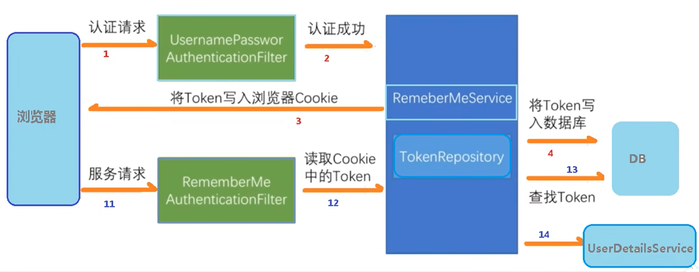

# Overview

<!-- @import "[TOC]" {cmd="toc" depthFrom=1 depthTo=6 orderedList=false} -->

<!-- code_chunk_output -->

- [Overview](#overview)
    - [Overview](#overview-1)
      - [1.Concepts](#1concepts)
        - [(1) session timeout](#1-session-timeout)
        - [(2) 自动登录](#2-自动登录)
        - [(3) SSO（single sign on）](#3-ssosingle-sign-on)
        - [(4) FIM（federated identity management）](#4-fimfederated-identity-management)
      - [2.Authorization](#2authorization)
        - [(1) session（cookie）](#1-sessioncookie)
        - [(2) token](#2-token)
        - [(3) comparison](#3-comparison)
      - [3.the common format of token: JWT（json web token）](#3the-common-format-of-token-jwtjson-web-token)
      - [4\.id token vs access token](#4id-token-vs-access-token)

<!-- /code_chunk_output -->

### Overview

#### 1.Concepts

##### (1) session timeout

##### (2) 自动登录
不必每次都输入账号密码（浏览器缓存了token）

##### (3) SSO（single sign on）
* 只要在一个地方登录，其他服务都可以进行访问
    
    * sso一般也放在API Gateway后面

* common SSO
    * OIDC (openid connect)

##### (4) FIM（federated identity management）
比如可以用微信账号登录百度、美团等其他平台

#### 2.Authorization

##### (1) session（cookie）
* 不适合分布式应用
  * 这种就需要集中式session（比如通过redis实现）
  * 当应用越来越多时，这种方式就会存在性能瓶颈

##### (2) token
* 普通token（不携带信息）
  * 拿到token后，需要去check
    * 比如去authorization server上check
    * 如果使用的是redis存储的token，也可以去redis上check

* JWT（携带信息）
  * 无需再去check，但是需要验证密钥的来源
    * 非对称加密: public key可以直接设置在resource server中，不必去authorization server上去取
    * 对称加密：在授权服务和资源服务都设置好对称密钥
  

##### (3) comparison

||session-based|token-based|
|-|-|-|
|状态|有状态（用户数据存在server端的session中）|无状态（用户数据存在token中，token存在client的cookie中，当采用非JWT类型的token时，部分数据还是存在服务端的）|
|验证方式|根据sessionid，server端需要进行查询验证|根据token的签名验证token的有效性（用证书），根据token携带的信息获取用户信息|
|应用场景|单体应用|分布式应用|
|缺点|不适合分布式场景，当使用集中session时，需要考虑性能、数据不丢失等问题|token存在客户端容易泄露 当使用jwt格式的token时，携带的信息较多，占用带宽|

#### 3.the common format of token: JWT（json web token）
* 本质就是 encode的字符串，本身携带了相关信息，无需再去查询
* 原始数据 就是json
* token格式: `<header>.<payload>.<signature>`
  * `<header>`: token的头信息
  * `<payload>`: token所携带的信息（原始数据进行了encode）
    * sub
      * the unique identifier for a user
    * aud
      * audience: identifies the recipients that the JWT is intended for. This can be a specific application, a set of applications, or the general public
      * The authorization server can then use the "aud" claim to verify the validity of the JWT
    * iss
      * issuer: identiy provider
  * `<signature>`: token的签名，用于验证token的来源
    * the receiver will use the public key to validate the JWT which is signed by the private key of the issuer
* 存储在客户端，一般在请求头中使用：`Authorization: <token_type> <token>`
  * `<token_type>`: token的类型，最常见的是 Bearer

#### 4\.id token vs access token
* id token is used for authentication
* access token is used to access resources
* for example:
  * first, a user goes to OIDC to get the id token
  * second, the user uses the id token to login in AWS and assumes some roles (i.e. claim some privileges)
  * then, aws return a access token (access key id, secret access key) to the user
  * then, the user can access aws with the access token