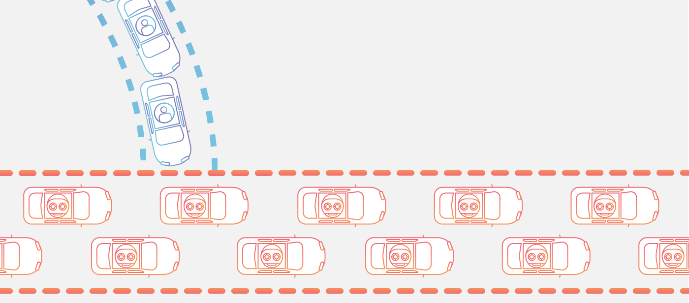
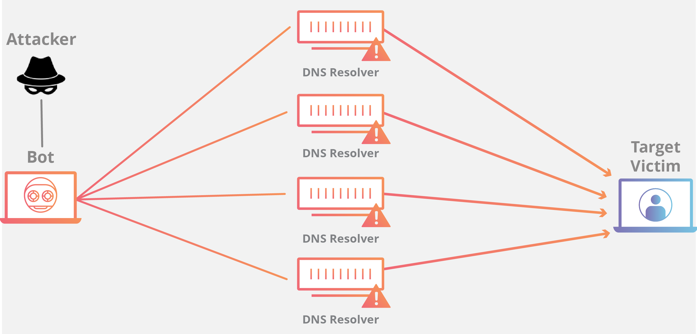

# DDoS

[toc]

### Introduction

#### 1.what is DDoS attack
distributed denial-of-service attack
* 通过大量的请求服务器，耗尽服务器的资源，导致服务器无法响应正常用户的请器

#### 2.principle
* 首先需要建立botnet
  * 需要向很多主机注入恶意程序，然后就可以控制这些主机
* 利用botnet，操作botnet中的机器，同时攻击某一目标

#### 3. 3 typpes of DDoS attacks

##### (1) application layer attacks
* 利用7层协议，请求的数据量比较小，服务需要返回的数据量比较大
* 比如: HTTP flood（botnet同时向某一目标发起http请求）

##### (2) protocol attacks
* 利用3层或4层协议的弱点
* 比如：SYN flood

##### (3) volumetric attacks
* 需要利用ip spoofing技术
* botnet用受害者的ip作为源ip，访问某一个服务器（该服务器会返回大量的数据），然后该服务器会将数据返回给受害者
* 比如：DNS amplification（DNS放大攻击）

#### 4.如何识别DDoS攻击
常见的一些特征：
* 来自某一个ip或网段的可疑流量
  * 比较某一个ip的流量非常大，就比较可疑
* 对某一个网页或者一个endpoint的访问量激增
* 某一时间点或每隔一个时间段，流量就激增
* 大量的流量使用相同的行为配置（比如：设备类型、浏览器版本等等）

#### 5.mitigate DDoS attack

##### (1) blackhole routing
添加blackhole路由，将部分流量丢弃
* 这是一种通用手法，能够缓解DDoS攻击，但是容易丢掉合法的流量
* 但是对于一个大型网络中的某一个节点被攻击，丢弃这个节点的流量，能够保护整个网络

##### (2) rate limiting

##### (3) web application firewall

##### (4) anycast network diffusion
