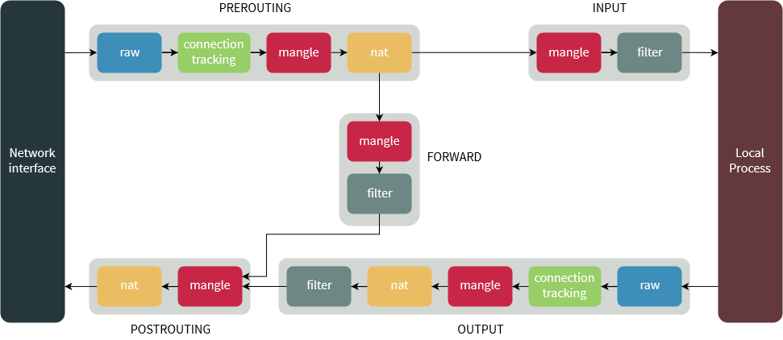

# firewall
[toc]
### 概述


#### 1.防火墙拓扑

* 边缘防火墙


* 三向外围防火墙


* 背靠背防火墙


***

### iptables
#### 1.基础概念
* 包过滤防火墙iptables
* 工作在网络层,firewalld底层还是调用的iptales

#### 2.相关文件
* 主配置文件:/etc/sysconfig/iptables-config
* 规则文件:/etc/sysconfig/iptables

#### 3.四张表
|表名|说明|
|-|-|
|raw|状态跟踪表|
|mangle|修改数据包的头部|
|nat|地址转换表|
|filter|过滤表|

#### 4.五条链
链是数据包传播的方向,每个表里有不同的链
|链名|说明|
|-|-|
|PREROUTING|路由前|
|POSTROUTING|选择路由后|
|INPUT|输入|
|OUTPUT|输出|
|FORWARD|路由（不会 与输入和输出 出现在同一个表中）|

#### 5.数据包流程图


#### 6.使用
* 注意:
  * 表 ->  链 -> 规则(匹配即停止)
  * 不指定表,默认为filter
  * 不指定链,默认为对应表的所有链
  * 如果没有匹配的规则,则使用默认策略
  * 选项,链名,目标操作 用大写字母

##### （1）命令格式:
```shell
iptables [-t 表名] 选项 [链名] [条件] [-j 目标操作]
#j:jump
```

##### （2）常见选项
* 添加规则
```shell
-A      #在链的末尾追加一条规则
-I      #在链的开头插入一条规则
```
* 查看规则
```shell
-L      #列出所有规则
-n      #numeric,查看规则时,以数字形式显示
--line-numbers      #查看规则时,显示规则的序号
```
* 删除规则
```shell
-D      #删除链内指定序号的规则
-F      #flush,删除所有规则
```
* 默认策略
```shell
-P     #policy,为指定的链设置目标策略(即ACCEPT等)
       #如:iptables -t filter -P INPUT DROP
```

##### （3）条件(取反:!)
```shell
数字              #匹配第几条规则,从而进行插入
-p 协议名
-s 源地址
-d 目标地址
-i 收数据的网卡
-o 发数据的网卡
--sport 源端口
--dport 目标端口
-p icmp --icmp-type <ICMP_TYPE>     #如:echo-request,通过抓包查看
```

##### （4）扩展条件(需要指定模块):
* MAC地址匹配
```shell
-m mac --mac-source MAC地址
```
* 多端口匹配
```shell
-m multiport --sports 源端口列表(逗号隔开)
-m multiport --dports 目标端口列表
```
* IP范围匹配
```shell
-m iprange --src-range IP1-IP2
-m iprange --dst-range IP1-IP2
```

##### （5）目标操作:
```shell
ACCEPT
DROP
REJECT
LOG         #记录日志,这里不会停止,继续向下匹配
```

##### （6）保存规则:
```shell
iptables-save > /etc/sysconfig/iptables
```

#### 7.相关应用
##### （1）nat表的应用

```shell
#选择路由之后，将源ip地址修改为网关的公网ip地址(SNAT:源地址转换)

iptables -t nat -A POSTROUTING -s <SRC_IP_OR_MASK>  -j SNAT --to-source <NEW_SRC_IP>
```
* 如果网关的公网ip不是固定的（指定转换成指定网卡的ip）
```shell
iptables -t nat -A POSTROUTING -s <SRC_IP> -o <INTERFACE> -j MASQUERADE
```

#### （2）调试iptables
* 开启内核功能
```shell
modprobe nf_log_ipv4
sysctl net.netfilter.nf_log.2=nf_log_ipv4
```
* 添加跟踪规则（只能在raw表中添加）
```shell
iptables -t raw -A PREROUTING xx(这里填需要跟踪的包的条件) -j TRACE
iptables -t raw -A OUTPUT xx(比如：-s 1.1.1.1) -j TRACE
```
* 查看日志：/var/log/messages

#### （3）实现端口映射
```shell
iptables -t nat -A PREROUTING -d <DST_IP> -p tcp --dport <DST_PORT> -j DNAT --to-destination <NEW_DST_IP>:<NEW_DST_PORT>
```
