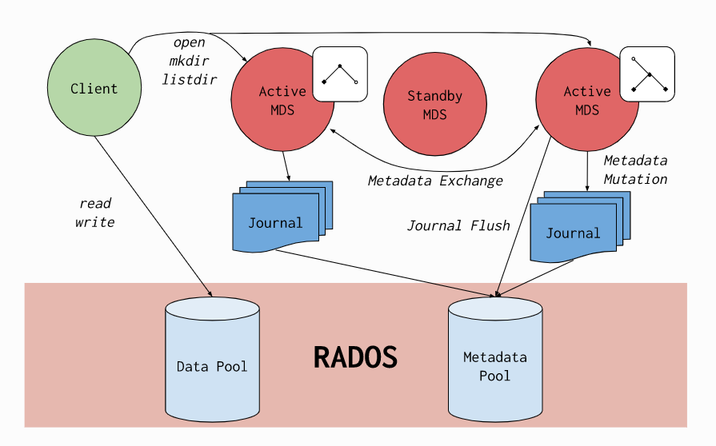

# overview

[toc]

### 概述

#### 1.术语
|简称|全称|说明|
|-|-|-|
|rados|reliable autonomic distributed object store（可靠的自治分布式对象存储）|ceph的存储系统|
|CRUSH|controlled replication under scalable hashing（可扩展散列下的受控复制）|用于计算 对象 存储的位置（替换需要维护查询表的方式）|
|OSD|object storage device|对象存储设备|
|RBD|RADOS block device|基于RADOS对外提供块存储|

#### 2.架构


##### （1）RADOS
是ceph的存储系统
* 对象存储的格式


##### （2）RBD（RADOS block device）
基于RADOS对外提供块存储
会虚拟出块设备，即数据会被分成多个小chunks，每个chunk是一个对象，然后进行存储

##### （3）file system
基于RADOS对外提供文件系统
数据的存取通过直接读写RADOS的data blocks，元数据存在另一个pool（通过MDS服务提供）


##### （4）librados
库，能够直接访问rados

##### （5）RADOSGW
基于bucket的网关，兼容s3和swift接口，对外提供对象存储服务

#### 3.ceph storage cluster组件

##### （1）RADOS组件
* ceph OSD（ceph-osd，object storage device）
  * 运行OSD服务，处理数据（包括存储、处理副本、恢复等等）
  * 提供其他OSD的状态给ceph-mon和ceph-mgr

* ceph monitor（ceph-mon）
  * 用于**服务发现**：维护集群组件的映射（包括monitor的映射，manager的映射、OSD映射等）
    * 组件之间的沟通需要使用这些映射，才能找到彼此，所以很重要
  * 管理认证信息

##### （2）其他组件
* ceph manager（ceph-mgr）
  * 对外暴露接口，用于管理和查看ceph集群
  * 监控ceph

* ceph MDS（ceph-mds，metadata server）
给ceph文件系统存储元数据（块存储和对象存储不使用ceph-mds）

* rados gateway（RGW）
对外提供对象存储接口，支持两种接口（S3和swift）

#### 4.目录规划
* 日志路径：`/var/log/ceph/`
* 数据路径：`/var/lib/ceph/`

***

### RADOS

#### 1.基础概念

##### （1）bluestore
OSD使用的新的后端对象存储，以前的是filestore，即对象先写入文件系统，再存入块设备，现在bluestore是直接可以存入块设备，不需要经过文件系统，提高了性能

##### （2）erasure code
将一个对象分成多个data chunks（k）和coding chunks（m）,存放在不同的OSD上（`crush-failure-domain=host`存放在不同的host的OSD上，`crush-failure-domain=rack`存放在不同的rack上的OSD上），能够忍受m个OSD故障
恢复需要一定的时间，该时间是线性增长的

##### （3）CRUSH map
用于计算 对象 存储的位置，避免需要维护查询表的方式，从而提高性能

#### 2.pool

存储对象的逻辑分组，定义一些存储的策略：pg、副本数量、CRUSH rule、snpashots等

##### （1）两类pool
* replicated pool（默认）
  * 通过副本object实现数据的高可用
  * 消耗磁盘

* erasure-coded pool
  * 通过纠删码实现数据的高可用
  * 消耗计算资源，读取性能低于replicated pool

##### （2）pool的相关参数
```shell
<pg_num:int>    #该pool的placement group的数量
<pgp_num:int>   #Placement Group for Placement，有效的placement group的数量，比如当提高了pool的pg_num，此时并不会进行rebalance，直到提高了pgp_num才会进行rebalance

[replicated|erasure]  #该pool的类型，默认：replicated

[--autoscale-mode=<on,off,warn>]    #该pool是否开启自动调节pg数量，默认：on
```

##### （3）pool需要与application关联
|存储类型|application名称|
|-|-|
|CephFS|cephfs|
|RBD|rbd|
|RGW|rgw|

```shell
#CephFS和RGW会自动关联，不需要明确执行这个命令
ceph osd pool application enable {pool-name} {application-name}
```

#### 3.placement group
实现数据的分发

##### （1）原理
每个placement group与多个OSDs关联
每个object会通过CRUSH算法映射到某个placement group
然后该object会被分发到与该pg关联的OSDs上（如果是replicated方式，则副本会被放在这些OSDs上，如果是erasure coded方式，chunks会放在这些OSDs上）

##### （2）为什么需要pg
这样当后端OSD增加或删除时，不会影响前面的hash
当OSDs变化后可以，会进行rebalance

##### （3）pg数量的权衡
**数据的持久化、数据的均匀分布** 和 **计算资源（CPU和内存）的消耗** 之前的权衡
* 当pg数量提升，数据恢复能力越强，因为当pg数量多，OSDs数量肯定也多，数据就会比较分散，当某个OSD挂掉，恢复也会较快
* 当pg数量提升，hash的结果会越分散，数据分布会越均匀
* 当pg数量提升，需要消耗更多的计算资源
