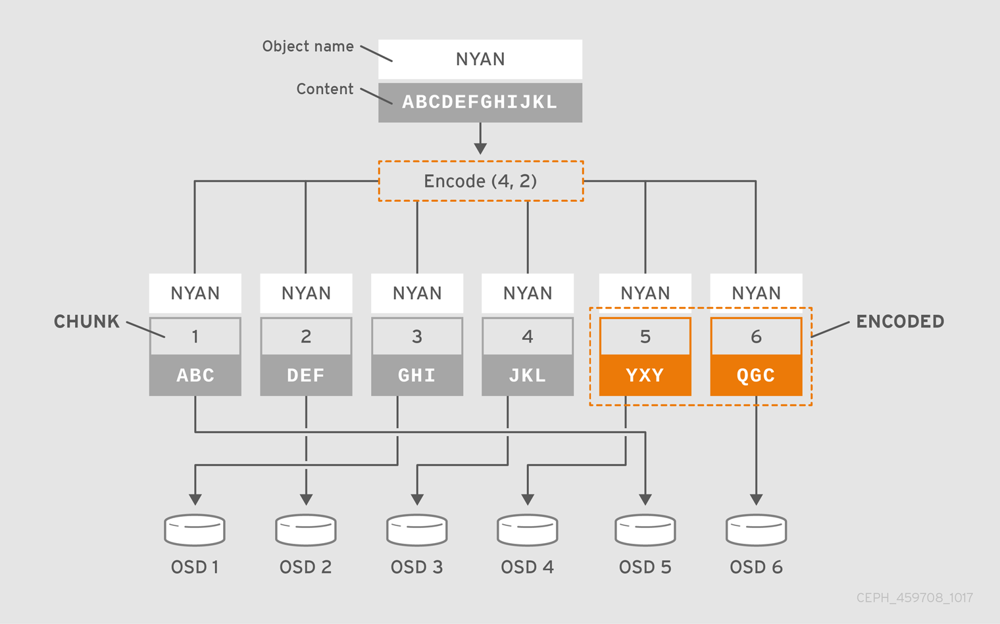
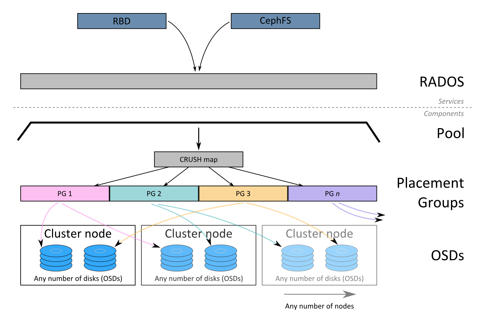

# overview

<!-- @import "[TOC]" {cmd="toc" depthFrom=1 depthTo=6 orderedList=false} -->
<!-- code_chunk_output -->

- [overview](#overview)
    - [概述](#概述)
      - [1.术语](#1术语)
      - [2.架构](#2架构)
        - [（1）RADOS](#1rados)
        - [（2）RBD（RADOS block device）](#2rbdrados-block-device)
        - [（3）file system](#3file-system)
        - [（4）librados](#4librados)
        - [（5）RADOSGW](#5radosgw)
      - [3.RADOS组件](#3rados组件)
        - [（1）ceph-osd（object storage device）](#1ceph-osdobject-storage-device)
        - [（2）ceph-mon（monitor）](#2ceph-monmonitor)
      - [4.其他基础组件](#4其他基础组件)
        - [（1）ceph-mgr（manager）](#1ceph-mgrmanager)
        - [（2）ceph-mds（metadata server）](#2ceph-mdsmetadata-server)
        - [（3）RGW（rados gateway）](#3rgwrados-gateway)
      - [4.目录规划](#4目录规划)
    - [RADOS](#rados)
      - [1.基础概念](#1基础概念)
        - [（1）bluestore（一个osd是一个bluestore）](#1bluestore一个osd是一个bluestore)
        - [（2）erasure code](#2erasure-code)
        - [（3）CRUSH map](#3crush-map)
      - [2.BlueStore](#2bluestore)
        - [(1) filestore vs bluestore](#1-filestore-vs-bluestore)
        - [(2) 存储结构（四个存储）](#2-存储结构四个存储)
      - [3.pool](#3pool)
        - [（1）两类pool](#1两类pool)
        - [（2）pool的相关参数](#2pool的相关参数)
        - [（3）pool需要与application关联](#3pool需要与application关联)
      - [4.placement group](#4placement-group)
        - [（1）原理](#1原理)
        - [（2）为什么需要pg](#2为什么需要pg)
        - [（3）pg数量的权衡](#3pg数量的权衡)
        - [（4）基础概念](#4基础概念)
        - [（5）acting set 和 up set：](#5acting-set-和-up-set)
        - [（5）pg的状态](#5pg的状态)
        - [（6）需要关注长时间处于down的pg](#6需要关注长时间处于down的pg)
        - [（6）需要保证pg都处于up的状态，才能看出数据的真实状态（否则数据丢失，可能看不出来）](#6需要保证pg都处于up的状态才能看出数据的真实状态否则数据丢失可能看不出来)
      - [5.OSD（提供存储服务）](#5osd提供存储服务)
        - [（1）OSD状态](#1osd状态)
        - [（2）OSD weight（决定了数据的分布）](#2osd-weight决定了数据的分布)
        - [（3）OSD宕机](#3osd宕机)

<!-- /code_chunk_output -->

### 概述

#### 1.术语
|简称|全称|说明|
|-|-|-|
|rados|reliable autonomic distributed object store（可靠的自治分布式对象存储）|ceph的存储系统|
|CRUSH|controlled replication under scalable hashing（可扩展散列下的受控复制）|用于计算 对象 存储的位置（替换需要维护查询表的方式）|
|OSD|object storage device|对象存储设备|
|RBD|RADOS block device|基于RADOS对外提供块存储|

#### 2.架构


##### （1）RADOS
是ceph的存储系统（对象存储）
* 对象存储的格式


##### （2）RBD（RADOS block device）
基于RADOS对外提供块存储
一个image就是一个块设备，image会被分成多个同等大小的chunks，每个chunk是一个对象，然后存储到RADOS中

##### （3）file system
基于RADOS对外提供文件系统
需要至少两个pool：一个pool用于存储data（可以有多个data pool），另一个pool用于存储metadata
数据的存取会被分成同等大小的chunks，每个chunk是一个object，存储在RADOS中，元数据存在另一个pool（通过MDS服务提供）


##### （4）librados
库，能够直接访问rados

##### （5）RADOSGW
基于bucket的网关，兼容s3和swift接口，对外提供对象存储服务

#### 3.RADOS组件

#####（1）ceph-osd（object storage device）
* 运行OSD服务，处理数据（包括存储、处理副本、恢复等等）
* 提供其他OSD的状态给ceph-mon和ceph-mgr

#####（2）ceph-mon（monitor）
* 是集群的 **controller**
  * 没有mon，集群无法工作
* 维护集群组件的映射（包括monitor的映射，manager的映射、OSD映射等）
  * 映射中存储各个组件的信息和状态
* 管理认证信息

#### 4.其他基础组件

#####（1）ceph-mgr（manager）
* 通过各种 **modules** 提供相应的能力，比如：
  * orchestrator module：提供集群的编排能力
  * dashboard module: 提供监控页面的能力
  * prometheus module: 通过ceph-exporter暴露监控指标
* 对外暴露接口，用于管理和查看ceph集群

#####（2）ceph-mds（metadata server）
* 给ceph **文件系统** 存储 **元数据**（块存储和对象存储不使用ceph-mds）
* 一个文件系统（metadata pool），会有一个单独的MDS（和指定数量的standby MDS）

#####（3）RGW（rados gateway）
* 对外提供对象存储接口，支持两种接口（S3和swift）

#### 4.目录规划
* 日志路径：`/var/log/ceph/`
* 数据路径：`/var/lib/ceph/`

***

### RADOS

#### 1.基础概念

##### （1）bluestore（一个osd是一个bluestore）
OSD使用的新的后端对象存储，以前的是filestore，即对象先写入文件系统，再存入块设备，现在bluestore是直接可以存入块设备，不需要经过文件系统，提高了性能

##### （2）erasure code
将一个对象分成多个data chunks（k）和coding chunks（m）,存放在不同的OSD上（`crush-failure-domain=host`存放在不同的host的OSD上，`crush-failure-domain=rack`存放在不同的rack上的OSD上），能够忍受m个OSD故障
恢复需要一定的时间，该时间是线性增长的



##### （3）CRUSH map
用于计算 对象 存储的位置，避免需要维护查询表的方式，从而提高性能



#### 2.BlueStore

[参考](https://docs.ceph.com/en/latest/rados/configuration/bluestore-config-ref/)

一个osd是一个bluestore

##### (1) filestore vs bluestore


##### (2) 存储结构（四个存储）

* 四个存储：
  * metadata（`/var/lib/ceph/osd/xx`）: A small partition formatted with XFS that contains basic metadata for the OSD.
    * 新版的不会弄一个新的分区，而是放在根文件系统上或者tmpfs上
  * data（`block`）: contains all the OSD data
  * WAL（`block.wal`）: BlueStore internal journal or write-ahead Log
  * DB（`block.db`）: BlueStore internal metadata
* WAL/DB使用ssd，能够提高性能
* WAL/DB可以没有（没有就是相关数据都放在data中）
* 大小
  * DB大小必须 > data的4%（当DB满了，相关数据会放到data中，但会影响性能）
  * WAL 2G就够了


#### 3.pool

存储对象的逻辑分组，定义一些存储的策略：pg、副本数量、CRUSH rule、snpashots等

##### （1）两类pool
* replicated pool（默认）
  * 通过副本object实现数据的高可用
  * 消耗磁盘

* erasure-coded pool
  * 通过纠删码实现数据的高可用
  * 消耗计算资源，读取性能低于replicated pool

##### （2）pool的相关参数

* 创建pool时设置的参数
```shell
<pg_num:int>    #该pool的placement group的数量
<pgp_num:int>   #Placement Group for Placement，有效的placement group的数量，比如当提高了pool的pg_num，此时并不会进行rebalance，直到提高了pgp_num才会进行rebalance

[replicated|erasure]  #该pool的类型，默认：replicated

[--autoscale-mode=<on,off,warn>]    #该pool是否开启自动调节pg数量，默认：on
```

* 修改pool的参数
```shell
ceph osd pool set <pool_name> <key> <value>

#size          副本的数量
#min_szie      当副本数量低于这个值，就不能读写该pool中的object
#allow_ec_overwrites true   将该pool设为erasure-coded pool
```

##### （3）pool需要与application关联
|存储类型|application名称|
|-|-|
|CephFS|cephfs|
|RBD|rbd|
|RGW|rgw|

```shell
#CephFS和RGW会自动关联，不需要明确执行这个命令
ceph osd pool application enable {pool-name} {application-name}
```

#### 4.placement group
实现数据的分发

##### （1）原理
每个placement group与多个OSDs关联
每个object会通过CRUSH算法映射到某个placement group
然后该object会被分发到与该pg关联的OSDs上（如果是replicated方式，则副本会被放在这些OSDs上，如果是erasure coded方式，chunks会放在这些OSDs上）

##### （2）为什么需要pg
这样当后端OSD增加或删除时，不会影响前面的hash
当OSDs变化后可以，会进行rebalance

##### （3）pg数量的权衡
**数据的持久化、数据的均匀分布** 和 **计算资源（CPU和内存）的消耗** 之前的权衡
* 当pg数量提升，数据恢复能力越强，因为当pg数量多，OSDs数量肯定也多，数据就会比较分散，当某个OSD挂掉，恢复也会较快
* 当pg数量提升，hash的结果会越分散，数据分布会越均匀
* 当pg数量提升，需要消耗更多的计算资源

##### （4）基础概念
* pgid：`<pool_id>.<hex>`
  * 比如：`1.1f`

##### （5）acting set 和 up set：
|osd集（即该pg关联了哪些osd）</br>对于replicated pool，一个pg中osd的数量=副本数|说明|
|-|-|
|acting set|pg当前关联的osd|
|up set|pg新关联的osd（需要将acting set关联的osd数据迁移过来），迁移完成后，acting set就会变为跟up set一样|

* osd集 命名：`<osd_list>p<pool_id>`
  * `[0,1,2]p1`表示该pg，与osd.0、osd.1和osd.2关联，与pool 1关联

* 当某个pg的 acting set 和 up set 不一样时，证明有数据正在进行迁移
  * 比如pg关联的osd变化了，此时读写使用的还是acting set，当up set中的osd将acting set中osd的状态都迁移了，此时acting set才会变得跟up set一样

##### （5）pg的状态
[状态参考](https://docs.ceph.com/en/latest/rados/operations/pg-states/)
[状态debug](https://docs.ceph.com/en/pacific/rados/operations/monitoring-osd-pg/)

* 正常的pg状态

|状态|说明|
|-|-|
|active|可以处理对pg的请求|
|clean|所有对象的副本数正常|
|remapped|active set变化了（可能某个osd out了）|

* 非正常状态

|状态|说明|可能问题|
|-|-|-|
|undersized|副本数没有达到设置的要求||
|degraded|数据存在，副本数不够</br>或者某一个或更多object找不到|可能某个osd挂掉（正好其中一个副本在上面）|
|down|某个副本down了||
|peering|该pg中的osd正在尝试通信，达成共识|osd之间无法通信，可能某个osd挂掉了|
|recovering|osd同步 对象和它的副本 的数据|osd因为宕机，导致某个副本或对象数据滞后，重新启动后，需要同步数据|
|backfill（需要进行backfill）|是一种特殊的recovering，同步该pg的全部内容|当有新的osd加入（或者剔除某一个osd）时，该osd所在pg的都会进行backfill|
|backfilling（正在进行backfill）|||
|backfill_toofull|磁盘容量快满了，导致没法backfill（可以调整osd的权重平衡所有osd的存储或者backfill_ratio提高阈值|
|stale|pg的状态没有更新，处于一种未知状态|osd集中的primary osd没有向mon汇报pg的状态</br>或者其他osd向mon汇报primary osd宕机了|
|inconsistent|对象和副本之间的数据不一致||
|incomplete（严重）|pg检测到数据不完整（即数据丢失），需要启动相应的osd来恢复数据|某几个osd宕机，导致对象和它的副本都无法获取，即数据丢失|

##### （6）需要关注长时间处于down的pg
因为pg处于down的状态，因为副本down了（即osd down了），当osd down超过一定的时间，osd会变为out，该pg会重新remapped，即不再是down的状态了
如果一直处于down的状态，可能是所有的副本都down了，即数据丢失了

##### （6）需要保证pg都处于up的状态，才能看出数据的真实状态（否则数据丢失，可能看不出来）

#### 5.OSD（提供存储服务）

每一个磁盘启动一个OSD服务，就可以提供存储服务了
pg与OSD关联，从而进行数据的分发

##### （1）OSD状态

* 运行状态

|运行状态|说明|
|-|-|
|up|该OSD服务正在运行|
|down|该OSD服务停止运行|

* 使用状态
  * 当osd宕机一段时间（10min），该osd状态会变成out，
  * 当out的osd再次启动，状态就会变成in

|使用状态|说明|
|-|-|
|in|该OSD正在集群中（即正在使用中）|
|out|该OSD不在集中中（即OSD没有在使用）|

##### （2）OSD weight（决定了数据的分布）
* 范围：0 - 1
* 作用：
  * 在一个pg内，OSD的权重的比例，决定了数据的分布
  * 当数据分布不均衡时（即有些磁盘快满了，有些确还有很多空间），需要调整OSD的权重值

* 有两种调整权重的方式：
  * 手动调整某个OSD的权重
  * 自动调整

##### （3）OSD宕机
当OSD宕机，不会立即发生数据迁移，会等10min，然后会将该OSD提出集群（即out状态），pg就会进行remapped和recovering
